# D01_Linux

## Содержание
1. [Установка ОС](#part-1-установка-ос)  
2. [Создание пользователя](#part-2-создание-пользователя)  
3. [Настройка сети ОС](#part-3-настройка-сети-ос)   
4. [Обновление ОС](#part-4-обновление-ос)  
5. [Использование команды  sudo](#part-5-использование-команды-sudo)  
6. [Установка и настройка службы времени](#part-6-установка-и-настройка-службы-времени)  
7. [Установка и использование текстовых редакторов](#part-7-установка-и-использование-текстовых-редакторов)  
8. [Установка и базовая настройка сервиса SSHD](#part-8-установка-и-базовая-настройка-сервиса-sshd)   
9. [Установка и использование утилит top, htop](#part-9-установка-и-использование-утилит-top-htop)   
10. [Использование утилиты fdisk](#part-10-использование-утилиты-fdisk)   
11. [Использование утилиты df](#part-11-использование-утилиты-df)    
12. [Использование утилиты du](#part-12-использование-утилиты-du)    
13. [Установка и использование утилиты ncdu](#part-13-установка-и-использование-утилиты-ncdu)    
14. [Работа с системными журналами](#part-14-работа-с-системными-журналами)     
15. [Использование планировщика заданий CRON](#part-15-использование-планировщика-заданий-cron)    

## Part 1. Установка ОС

- Версия операционной системы записана в файле  `/etc/issue`
- Посмотреть его содержимое можно командой `cat /etc/issue`

> Просмотр версии операционной системы:
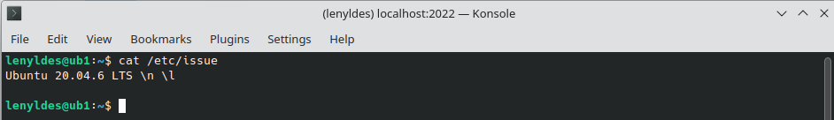

## Part 2. Создание пользователя

- Создать пользователя можно с помощью команды `sudo adduser user_name`

> Создание пользователя *user_for_part_2* \
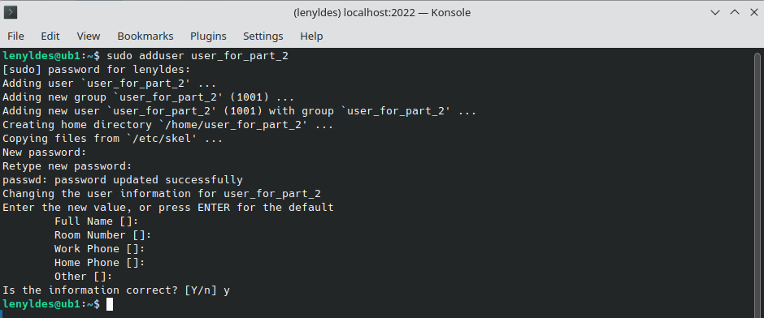

- Добавление пользователя в группу можно осуществлять с помощью команды `usermode` с флагами `-aG`
- Флаг `-a` используется для добавления пользователя в дополнительные группы, не удаляя его из уже существующих групп. Без этого флага пользователь будет удален из всех групп, кроме указанной. Используется только в связке с флагом `-G`
- Флаг `-G` указывает список групп, в которые мы хотим добавить пользователя. Группы перечисляются через запятую без пробелов

> Добавим пользователя *user_for_part_2* в группу *adm* \
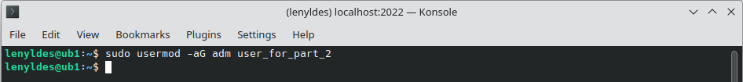

- Посмотреть список групп пользователя можно перейдя в соответвующий профиль командой `su user_name` и введя команду `groups`

> Просмотр групп пользователя *user_for_part_2* \
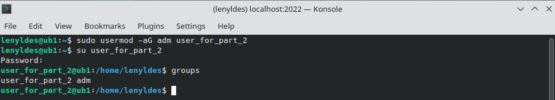

- Посмотреть информацию о пользователях системы можно в файле `/etc/passwd`
- Каждая строка в этом файле представляет собой запись о конкретном пользователе и состоит из нескольких полей, разделенных двоеточиями. `Имя_пользователя:пароль:UID:GID:описание:домашний_каталог:оболочка`
- Проверим соответсвующую информацию о новом пользователе *user_for_part_2* командой `cat /etc/passwd`

> Просмотр содержимого файла */etc/passwd*. Наш новый пользователь в конце списка \
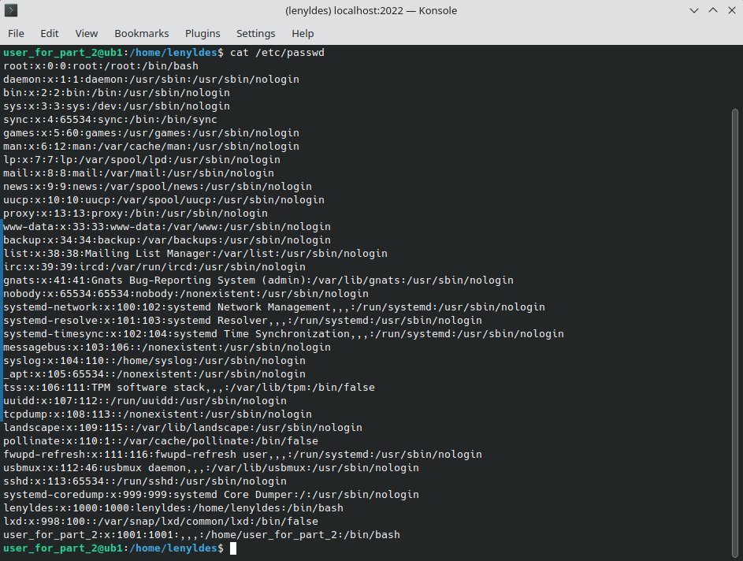

## Part 3. Настройка сети ОС

- Название машины содержится в файлах `/etc/hostname` и `/etc/hosts`
- Изменим название на *user-1* с помощью редактора *nano*. Чтобы изменения вступили в силу  надо перезагрузить машину командой `sudo reboot`

> Изменение название машины на *user-1* \
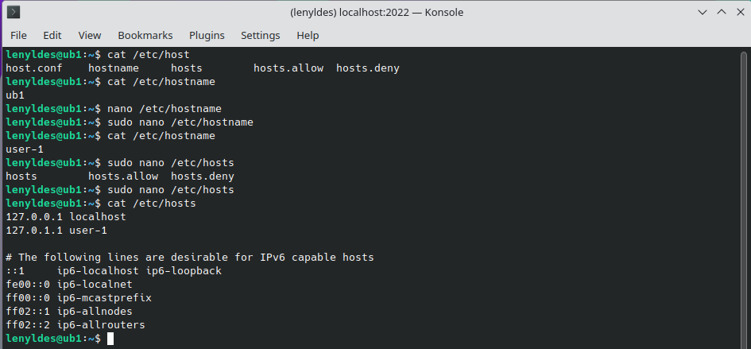

> Перезагрузка системы \
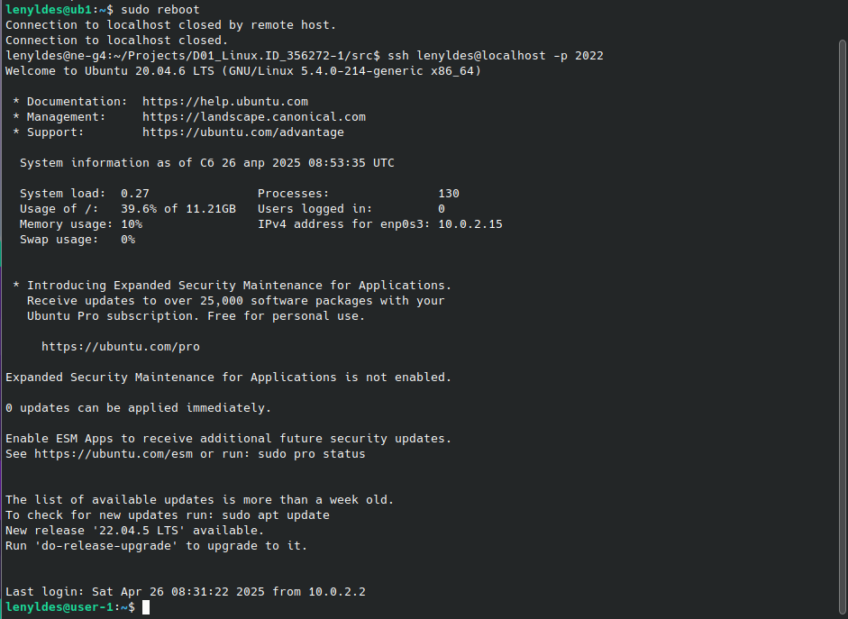

- Для установки временной зоны соответсвующей моего местоположению *(Нижний Новгород)* воспользуемся командой `timedatectl set-timezone Europe/Moscow`
- Проверить изменения и узнать текущее время можно командой `timedatectl`

> Установка и проверка временной зоны \
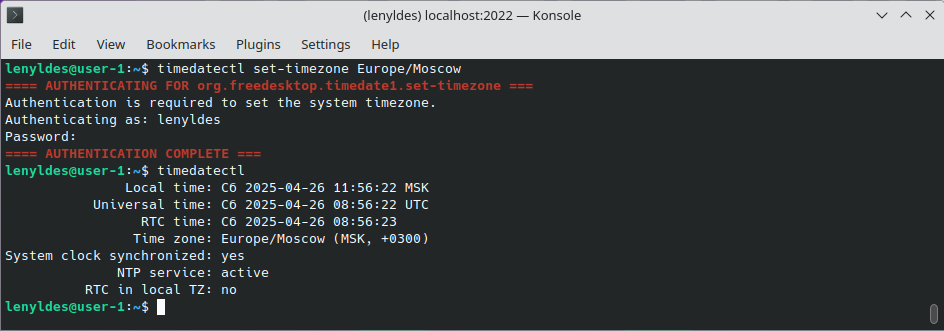

- Посмотреть список (названия) сетевых интерфейсов можно различными способами. Например с помощью команды `ip link show` или командой `ip addr show` *(для получения более подробной информации)*, также можно посмотреть содержимое файла `/proc/net/dev` или с помощью команды `ifcongig` из пакета *net-tools*. Воспользуемся последним.

> Установка пакета *net-tools* и просмотр сетевых интерфейсов \
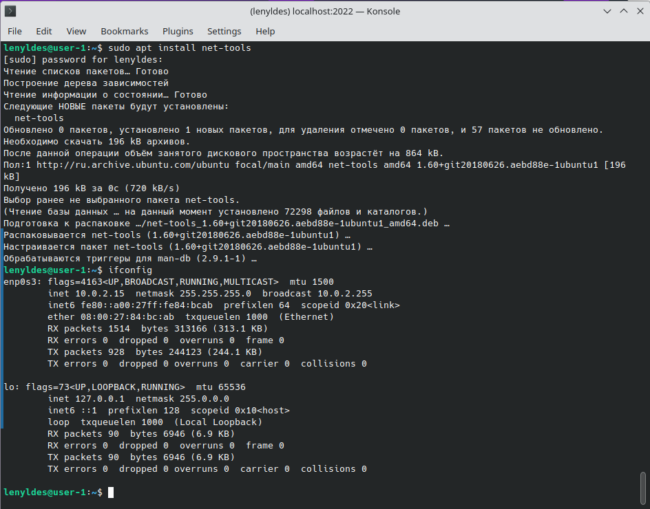

- Мы видим два сетевых интерфейса `enp0s3` и `lo`
- `enp0s3` - это имя Ethernet-интерфейса. Этот интерфейс обычно используется для подключения к сети (например, к локальной сети или интернету)
- `lo` - это интерфейс "loopback" (петлевое соединение). Он используется для связи внутри самой системы. Он часто используется для тестирования и отладки сетевых приложений, а также для обеспечения работы некоторых служб, которые могут обращаться к себе

- Получить ip адрес устройства можно указав его вручную или автоматически от DHCP-сервера.
- `DHCP` (Dynamic Host Configuration Protocol) — это сетевой протокол, который автоматически назначает IP-адреса и другие параметры конфигурации сетевым устройствам в локальной сети. Это позволяет устройствам подключаться к сети и получать необходимые настройки без необходимости ручной конфигурации.
- Получим ip адрес устройства автоматически. 
- Для этого сначала освободим существующий (уже присвоенный при старте системы) ip адрес с помощью команды `sudo dhclient -r enp0s3`, после чего удостоверимся в этом командой `ifcongig` описанной ранее
- Флаг `-r` в команде `dhclient` используется для указания, что мы хотите освободить (release) IP-адрес, который был назначен нашему сетевому интерфейсу DHCP-сервером

> Освобождение ip адреса \
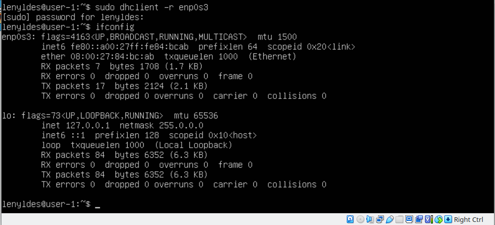

- Получить новый ip адрес можно командой `sudo dhclient enp0s3`

> Получение ip адреса \
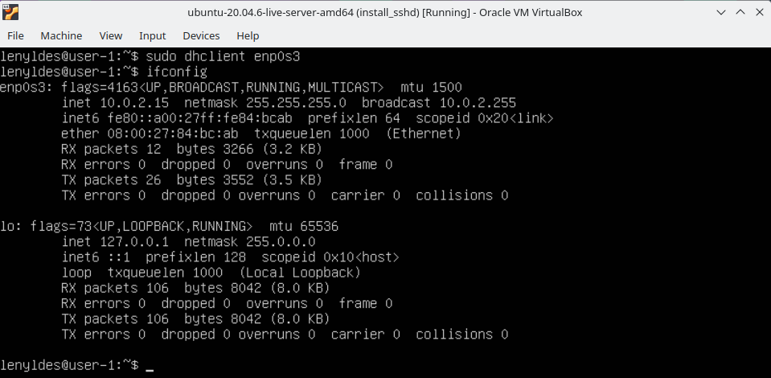

- Для получения ip-адрес шлюза (ip) и внутреннего IP-адрес шлюза, он же ip-адрес по умолчанию (gw) воспользуемся командами `curl ifcongig.me` и `ip route` соответсвенно.
- Команда  `curl ifcongig.me` отправляет HTTP-запрос к ifconfig.me, и сервер отвечает, возвращая наш внешний IP-адрес
- Команда `ip route` выводит текущую таблицу маршрутизации. Мы можем увидить, что для доступа к адресам, не входящим в локальную сеть, используется шлюз `10.0.2.2` через интерфейс *enp0s3*

> Получение внешнего и внутренного ip адреса шлюза \
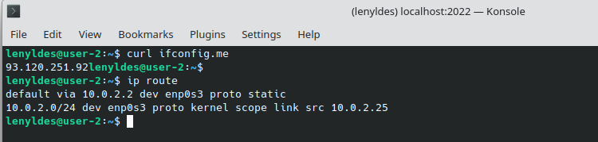

- Задать статичные (заданные вручную, а не полученные от DHCP-сервера) настройки ip, gw, dns можно вручную отредактировав файл в папке /etc/netplat/***.yaml или воспользовавшись утилитой nmtui из пакета network-manager
- Отрекдактируем файл */etc/netplan/00-installer-config.yaml* задав свободный ip адрес, gw, а также публичные DNS-серверы, например 1.1.1.1 или 8.8.8.8

> Редактируем файл */etc/netplan/00-installer-config.yaml* \
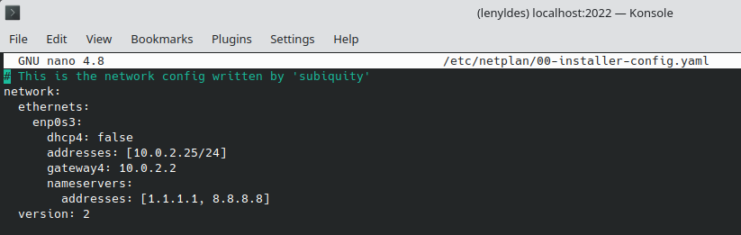

- Для применения изменений воспользуемся командой `sudo netplan apply` и перезапустим виртуальную машину. Убедится в применений изменений можно повторно вызвав команду `ifconfig`

> Применение изменений, перезагрузка системы и проверка изменений \
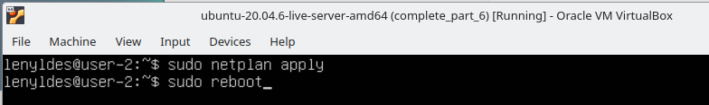
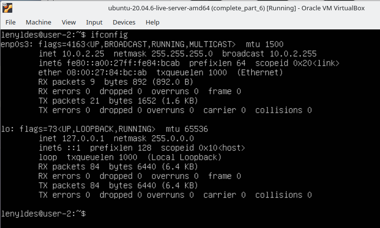

- Проверяем что мы ничего сломали пропинговав хосты `1.1.1.1` и `ya.ru`

> Пингуем удаленные хосты \
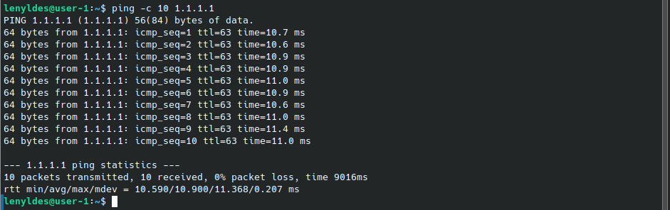
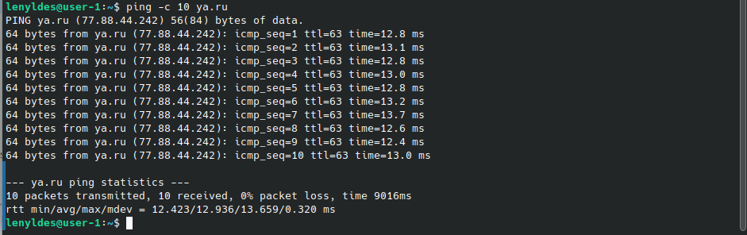

## Part 4. Обновление ОС

- Чтобы обновить систему сначала нужно обновить список доступных пакетов командой `sudo apt update` после чего обновить доступные пакеты командой `sudo apt upgrade`

> Обновление системы и проверка сообщения о том, что новые обновления отсутствуют \
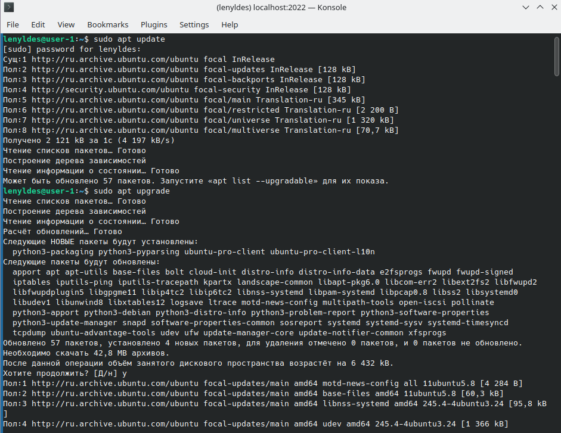
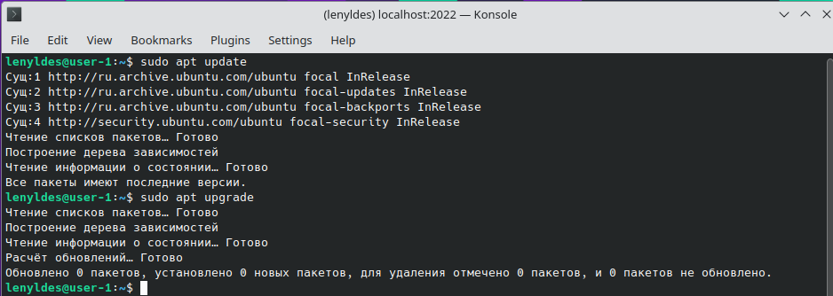

## Part 5. Использование команды **sudo**

- `sudo` — программа для системного администрирования UNIX-систем, позволяющая делегировать те или иные привилегированные ресурсы пользователям с ведением протокола работы. Основная идея — дать пользователям как можно меньше прав, при этом достаточных для решения поставленных задач. Программа поставляется для большинства UNIX и UNIX-подобных операционных систем. Команда sudo предоставляет возможность пользователям выполнять команды от имени суперпользователя root.
- Для того, чтобы наш пользователь созданный в [Part 2](#part-2-создание-пользователя), мог выполнять команду `sudo` его необходимо наделить соответсвующими права.
- Для этого воспользуемся уже известной нам командой `usermod`

> Выдаем пользователю *user_for_part_2* права *sudo* и проверяем что он может например обновить список пакетов \
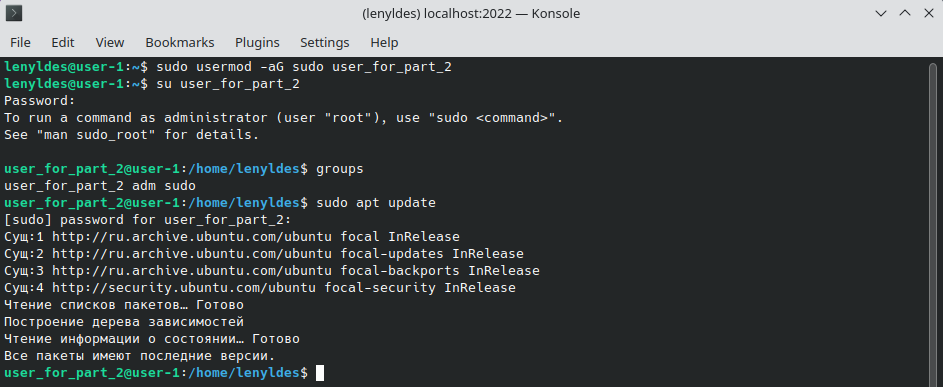

- Воспользуемся полученными правами о меняем hostname ОС от нашего второго пользователя используя sudo. Подобную операцию мы уже проводили в [Part 3](#part-3-настройка-сети-ос)

> Редактирование hostname ОС \
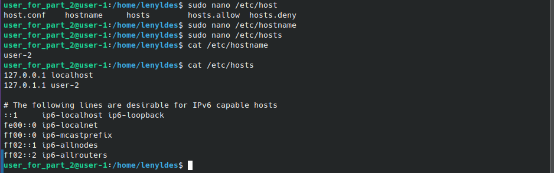

- Перезагружаем систему для проверки изменений

> Перезагрузка системы \
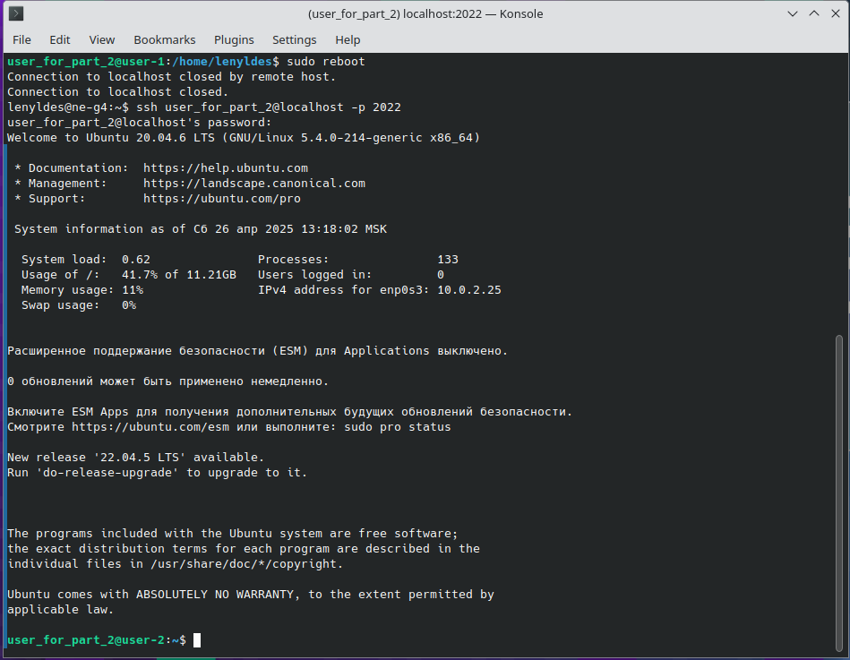

## Part 6. Установка и настройка службы времени

- В Linux существует несколько служб и протоколов для синхронизации времени. Среди наиболее распространенных имеются `ntpd` и `systemd-timesyncd`.
- `ntpd` это основной демон для синхронизации времени с использованием протокола NTP. Он поддерживает синхронизацию времени с удаленными NTP-серверами и может также работать как сервер для других клиентов
- `systemd-timesyncd` это легковесный клиент для синхронизации времени, который является частью системы `systemd`. Он автоматически синхронизирует системное время с NTP-серверами, если они указаны в конфигурации
- Воспользуемся и настроим последнего, так как он уже был установлен в системе по умолчанию 😛

- Для начала проверим что служба `systemd-timesyncd` активна командой `systemctl status systemd-timesyncd`

> Проверка состояния службы `systemd-timesyncd` \
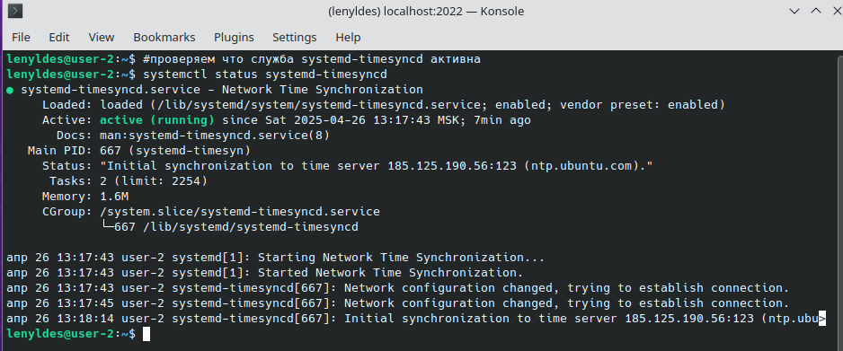

- После чего зададим необходимую конфигурацию в файле `/etc/systemd/timesyncd.conf`

> Редактирование файла `/etc/systemd/timesyncd.conf` \
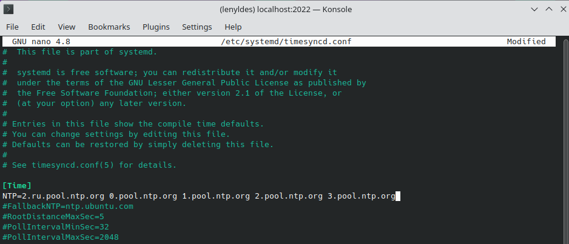

- Выведем время часового пояса, в котором мы сейчас находимся командой `timedatectl show`, а также удостоверимя что вывод содержит строчку `NTPSynchronized=yes`

> Выполнение команды `timedatectl show` \

## Part 7. Установка и использование текстовых редакторов 

- В качестве подопытных будем использовать редакторы VIM, nano и joe. Первые два уже поставляются установленные вместе нашим с дистрибутивом, а последнего надо установить дополнительно `sudo apt install joe`
- Для создания файла в редакторе `vim` воспользуемся командой `vim test_vim.txt`, который создаст файл `test_vim.txt` в текущей директории.
- Чтобы внести изменения надо сначала нажать клавишу `i (insert)`, провести необходимые действия и сохранить изменения сначала выйдя из режима ввода нажав `Esc`, после чего ввести `:wq` и подтвердить ввод клавишей `Enter`

> Интерфейс редактора vim \
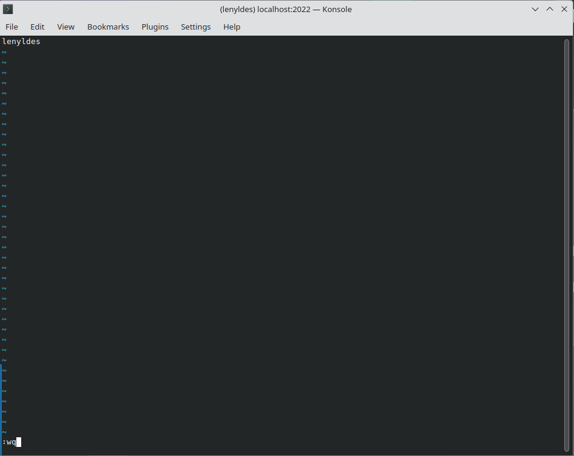

- Для создания файла в редакторе `nano` воспользуемся командой `nano test_nano.txt`, который создаст файл `test_nano.txt` в текущей директории.
- Просто вносим необходимые изменения и выходим из программы с помощью комбинации клавиш `ctrl+X` попутно подтверждая внесенные изменения (или можно сначала сохранить изменения комбинацией `ctrl+O`).

> Интерфейс редактора nano \
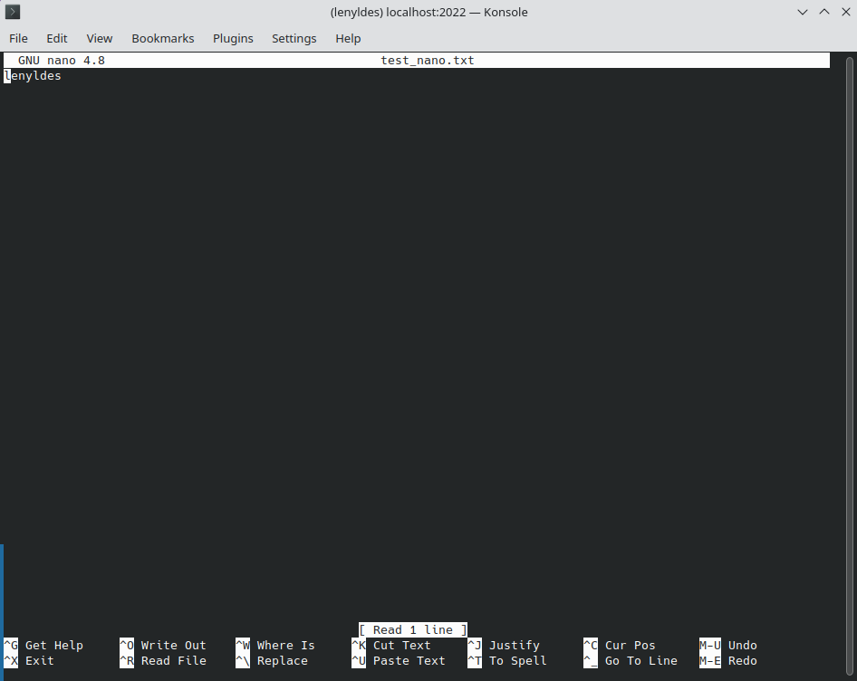

- Для создания файла в редакторе `joe` воспользуемся командой `joe test_joe.txt`, который создаст файл `test_joe.txt` в текущей директории.
- Просто вносим необходимые изменения и выходим из программы с помощью комбинации клавиш `ctrl+K Q` попутно подтверждая внесенные изменения.

> Интерфейс редактора joe \
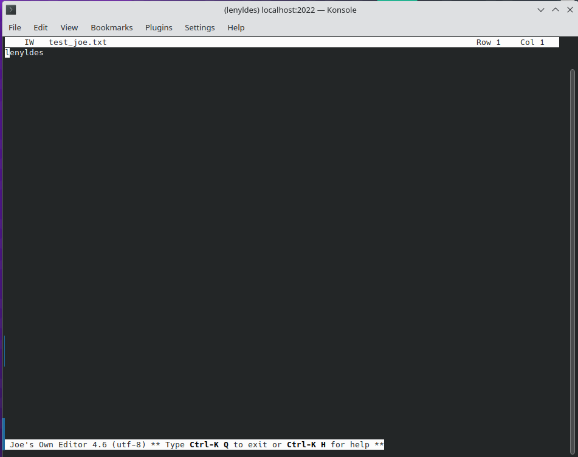

- Для выхода из редактора `VIM` без сохранения, необходимо выйти из режима ввода `Esc` (если мы в нем), набрать `:q!` и подтвердить ввод клавишей `Enter`

> Выход без изменений из редактора VIM \
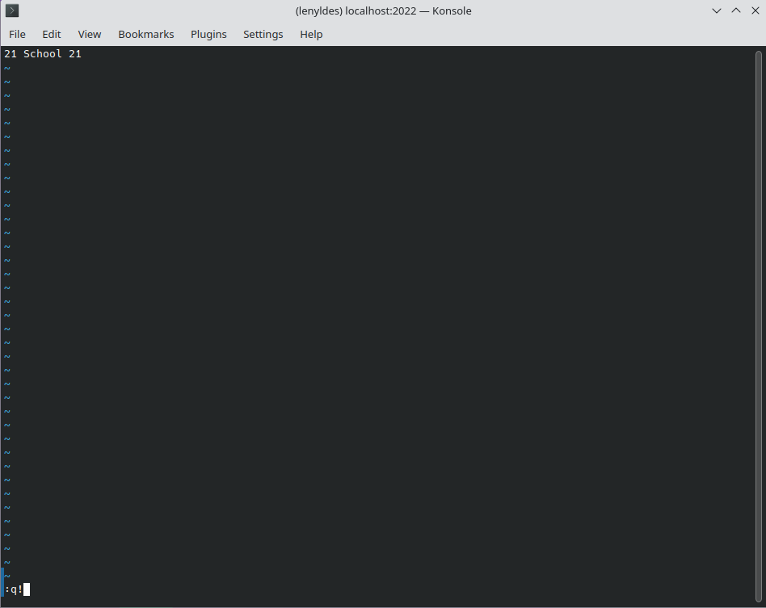

- Для выхода из редактора `nano` без сохранения, необходимо выйти из него с помощью комбинации клавиш `ctrl+X` НЕ подтверждая внесенные изменения (`n`)

> Выход без изменений из редактора nano \
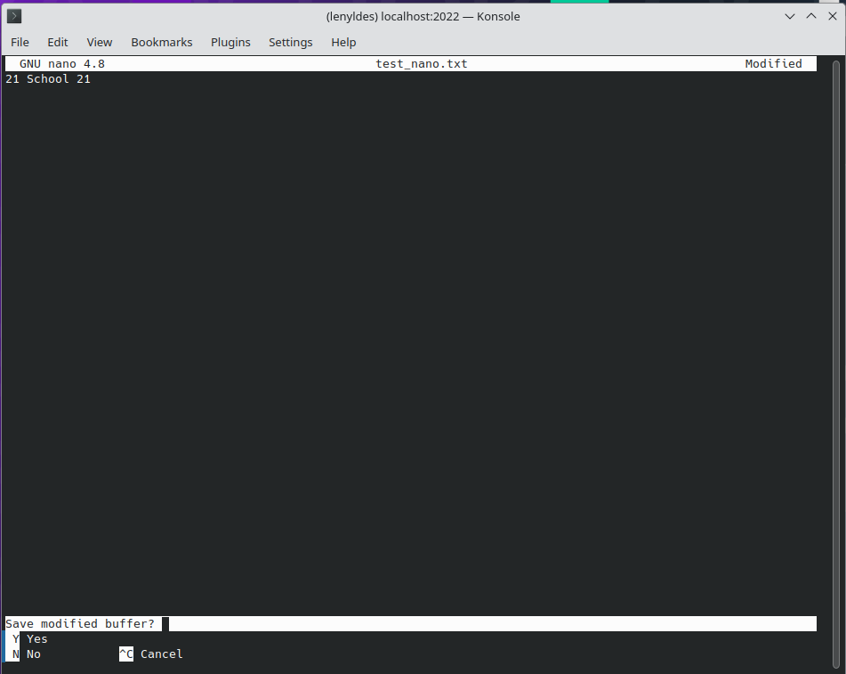

- Для выхода из редактора `joe` без сохранения, необходимо выйти из него с помощью комбинации клавиш `ctrl+K Q` НЕ подтверждая внесенные изменения (`n`)

> Выход без изменений из редактора joe \
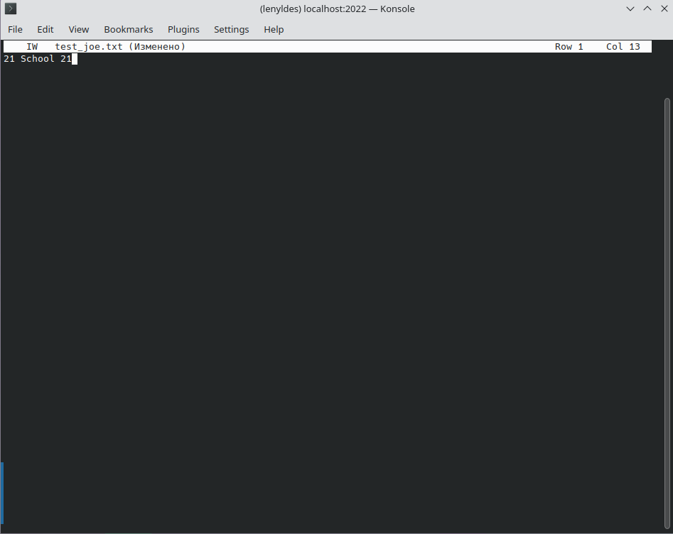

- Для поиска слова в редакторе `VIM` вводим команду `:\word`, а для его замены команду `:$s/word/new_word`

> Поиск и замена слова в редакторе VIM \
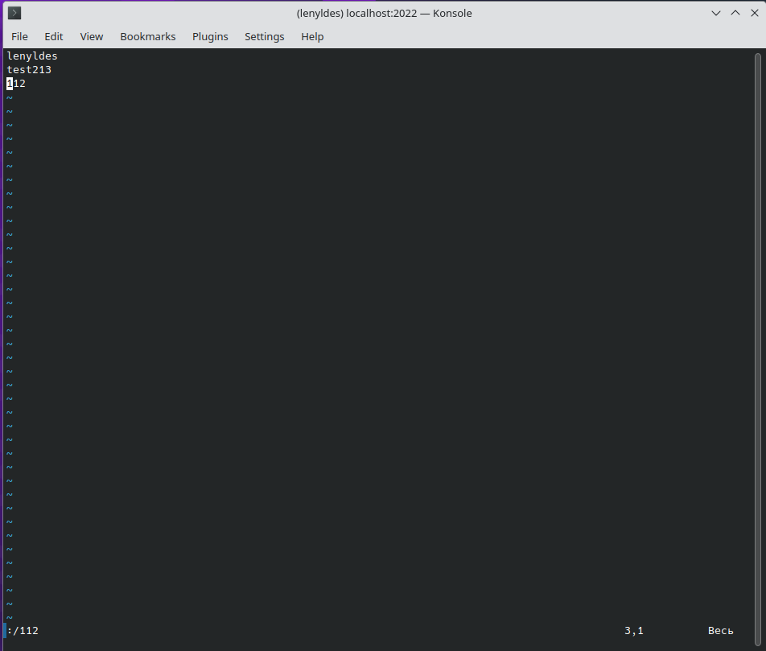
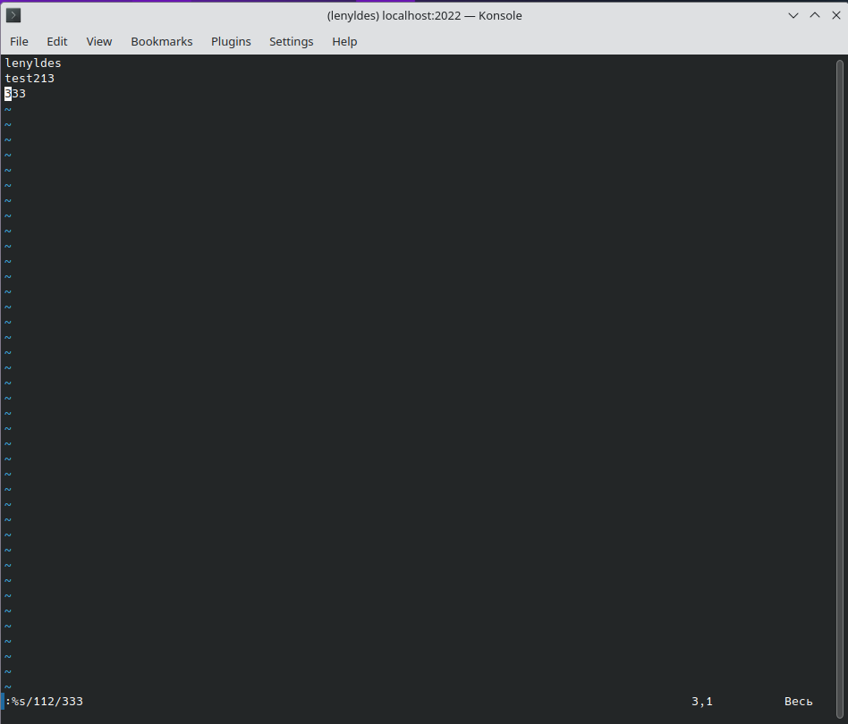

- Для поиска слова в редакторе `nano` применяем комбинацию клавиш `ctrl+W`. Чтобы заменить слово используем комбинацию `ctrl+\` и следуем подсказкам на экране.

> Поиск и замена слова в редакторе nano \
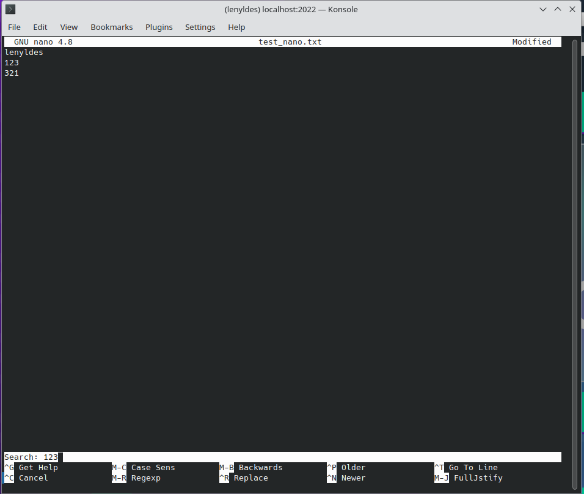
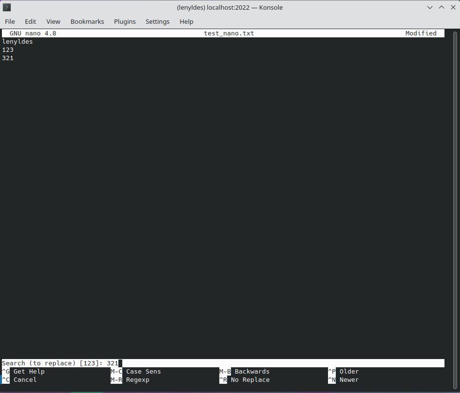

- Для поиска слова в редакторе `joe` применяем комбинацию клавиш `ctrl+K F`. Чтобы заменить слово после ввода комбинации нажимаем клавишу `R` и следуем подсказкам на экране.

> Поиск и замена слова в редакторе joe \
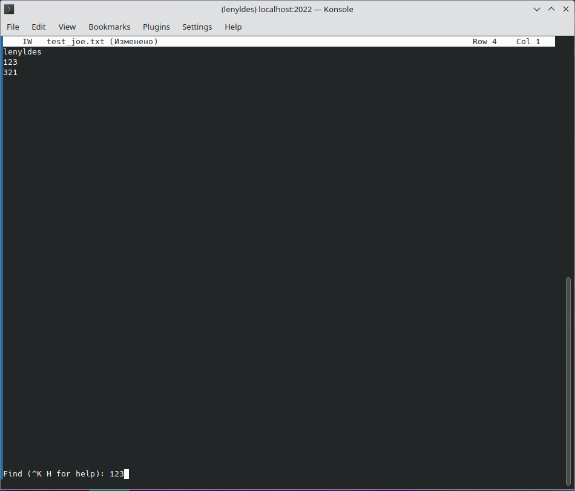
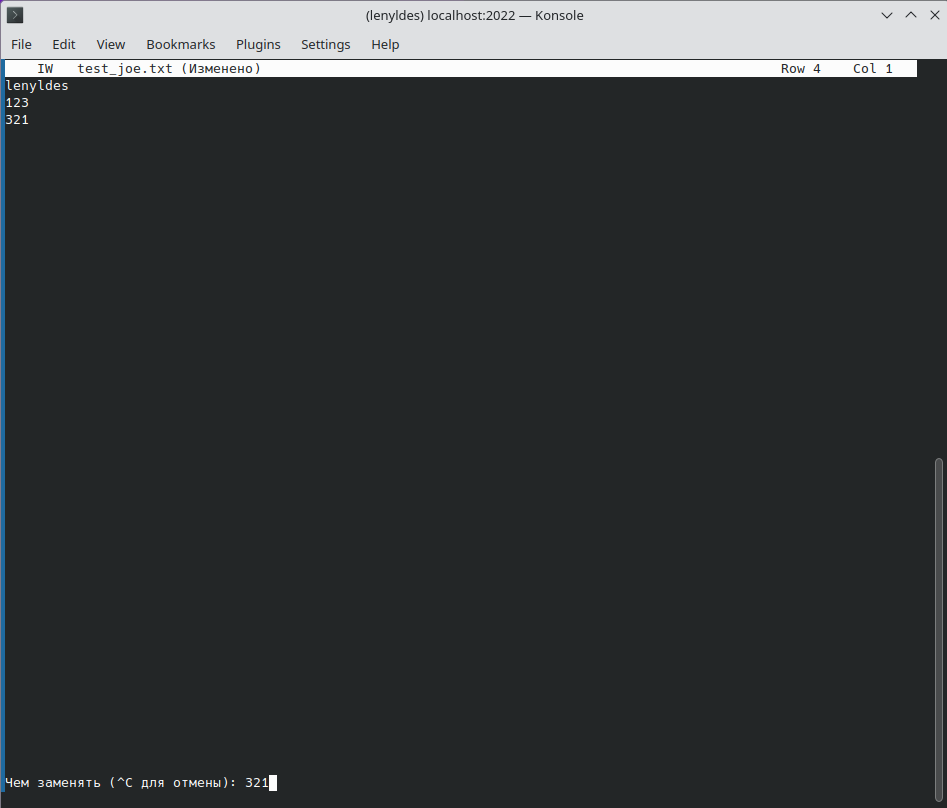

## Part 8. Установка и базовая настройка сервиса **SSHD**

- Служба `sshd` уже установлена по умолчанию в нашем дистрибутиве о чем можно убедиться командой `sudo systemctl status sshd`. Если она не установлена, то устанавливаем командой `sudo apt install openssh-server` (входит в пакет `openssh-server`, который предлагается установить вместе с установкой операционной системы).

> Проверка работоспособности службы sshd \
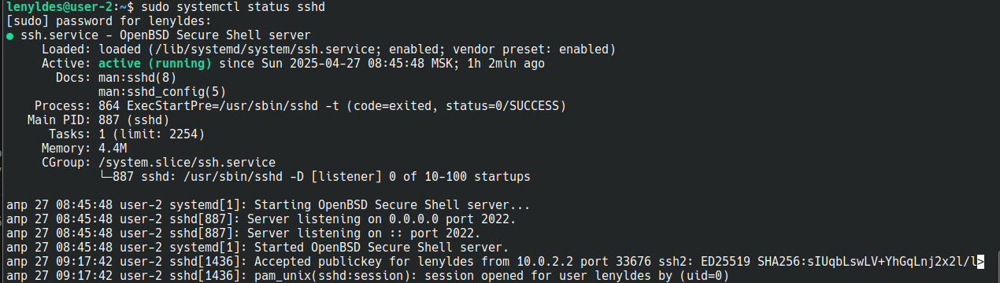

- Для проверки что служба запускается автоматически при старте системы воспользуемся командой `sudo systemctl is-enabled sshd`. Если получим значение `disabled`, то необходимо вручную установить автозапуск командой `sudo systemctl enable sshd`

> Проверка автозапуска службы sshd \
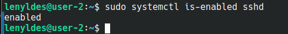

- Для перенастройки службы на порт 2022 необходимо в файле конфигурации (`/etc/ssh/sshd_config`) раскоментировать строку `#Port 22` и заменить значение `22` на нужное нам (в данном случае `2022`)

> Редактирование файла `sshd_config` \
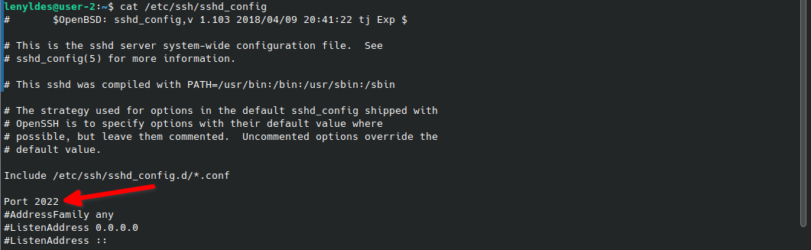

- Также незабываем, что соответсвующий порт необходимо пробросить в настройках самой виртуальной машины `Settings -> Network -> Advanced -> Port Forwarding` 

> Настройка виртуальной машины \
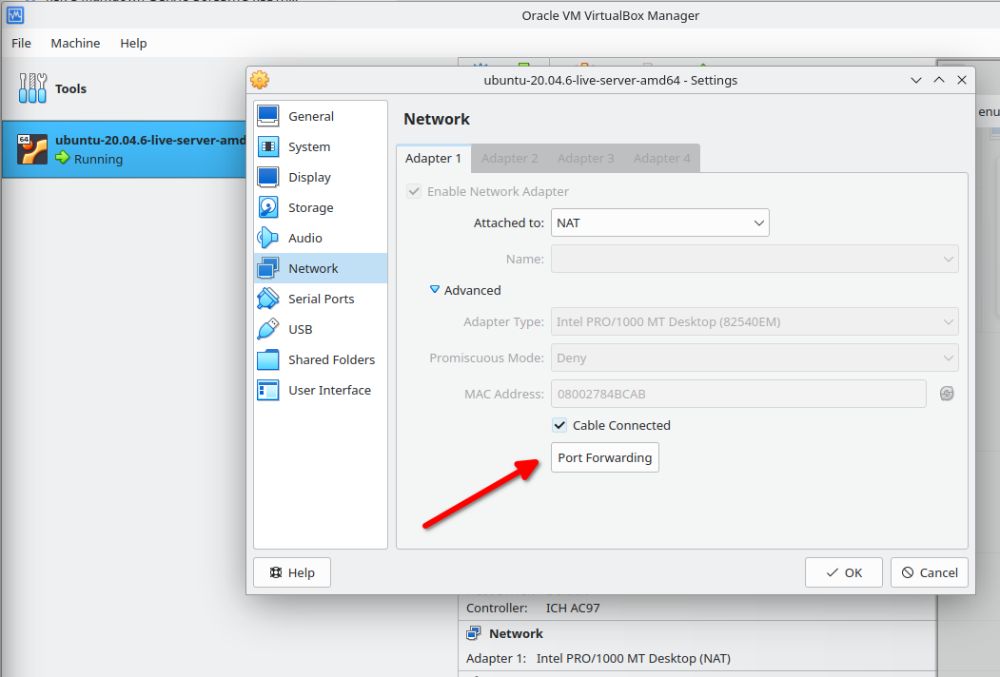 \
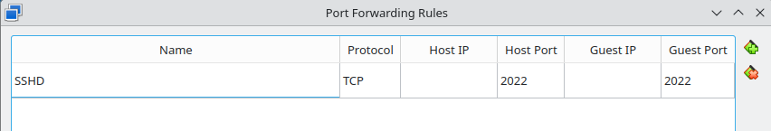 

- После всех манипуляций не забываем перезагрузить систему `sudo reboot`

- Посмотреть наличие процесса `sshd` можно командой `ps aux | grep sshd`

> Вывод команды `ps aux | grep sshd` \

- В данном случае команда `ps` (process status) используется для отображения текущих процессов, работающих в системе. Она предоставляет информацию о запущенных процессах, таких как их идентификаторы (PID), состояние, использование ресурсов и т.д.
- Параметры `aux`:
- `a`: Показывает процессы всех пользователей, а не только текущего пользователя. Это позволяет увидеть процессы, запущенные другими пользователями
- `u`: Выводит информацию в удобочитаемом формате, включая имя пользователя, использующий процесс, и использование ресурсов (CPU и память)
- `x`: Показывает процессы, не привязанные к терминалу. Это полезно для отображения фоновых процессов, таких как демоны
- Символ `|` (пайп) используется для передачи вывода одной команды в качестве ввода для другой команды. В данном случае вывод команды `ps aux` передается в команду `grep`
- Команда `grep` используется для поиска строк, соответствующих заданному шаблону. В данном случае `grep sshd` ищет строки, содержащие `sshd` в выводе команды `ps aux`

- Для получения информации о сетевых соединениях воспользуемся командой `netstat -tan`

> Вывод команды `netstat -tan` \
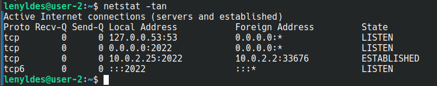

- `netstat` (network statistics) — это утилита командной строки, которая отображает сетевую статистику, включая активные соединения, таблицы маршрутизации, интерфейсы и т.д.
- Параметр `-tan`:
- `t`: Этот параметр указывает `netstat` отображать только TCP-соединения
- `a`: Этот параметр указывает отображать все соединения и прослушивающие порты (LISTEN)
- `n`: Этот параметр указывает выводить адреса и номера портов в числовом формате, а не разрешать их в имена хостов и сервисов. Это ускоряет вывод и делает его более понятным, особенно в случае, если DNS-серверы недоступны

Полученный вывод содежит в себе заголовок **Active Internet connections (servers and established)**.  Он указывает, что вывод содержит активные интернет-соединения, включая серверные и установленные соединения и содержит следующие столбцы:
- `Proto`: Протокол, используемый для соединения (например, tcp или tcp6 для IPv6).
- `Recv-Q`: Количество байтов, ожидающих обработки в очереди получения. Если это значение больше нуля, это может указывать на проблемы с производительностью.
- `Send-Q`: Количество байтов, ожидающих отправки в очереди отправки. Если это значение больше нуля, это может указывать на проблемы с сетью или перегрузку.
- `Local Address`: Локальный адрес и порт, на котором работает служба. Формат: IP:PORT.
- `Foreign Address`: Удаленный адрес и порт, с которым установлено соединение. Если соединение прослушивает, здесь будет *.
- `State`: Состояние соединения. Возможные состояния **LISTEN**: Служба прослушивает входящие соединения на указанном порту и **ESTABLISHED**: Соединение установлено и активно
- Значение 0.0.0.0 (любой адрес) указывает что служба, работающая на этом порту (2022), настроена для прослушивания входящих соединений от любых клиентов

## Part 9. Установка и использование утилит **top**, **htop**

- Утилита `top` в linux предназначена для отображения динамической информации о текущих процессах, работающих в системе. Она предоставляет в реальном времени информацию о загрузке системы, использовании ресурсов и состоянии процессов
- Воспользуемся ей для сбора некоторой статистики:

> Вывод команды `top` \

- Мы можем наблюдать следующие значения:
- `uptime`: 27 min
- `количество авторизованных пользователей`: 1
- `среднюю загрузку системы`: load average 0.00, 0.00, 0.00 (Эти три числа представляют собой среднюю загрузку системы за последние 1, 5 и 15 минут соответственно)
- `общее количество процессов`: 109
- `загрузку cpu`: 0
- `загрузку памяти`: 1971,3
- `pid процесса занимающего больше всего памяти`: 1 (на скриншоте)
- `pid процесса, занимающего больше всего процессорного времени`: 1570 (на скриншоте)

- Утилита `htop` в Linux — это интерактивный монитор ресурсов системы, который позволяет пользователям отслеживать и управлять процессами в реальном времени. Она является более удобной и функциональной альтернативой стандартной утилите `top`

- Воспользуемся ей и посмотрим некоторые из выводов:
> Вывод отсортированный по PID \
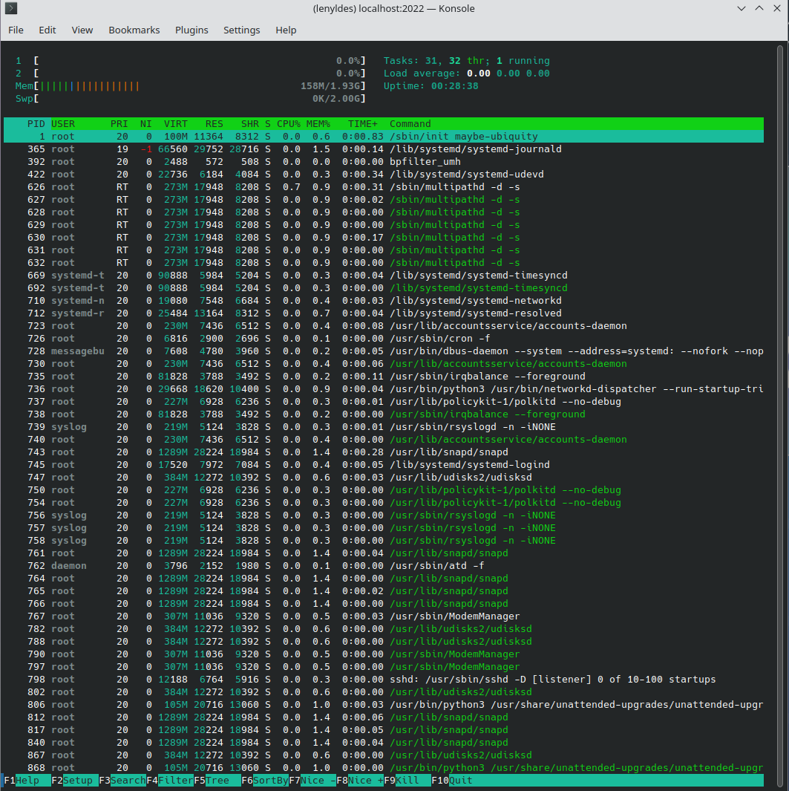

> Вывод отсортированный по PERCENT_CPU \
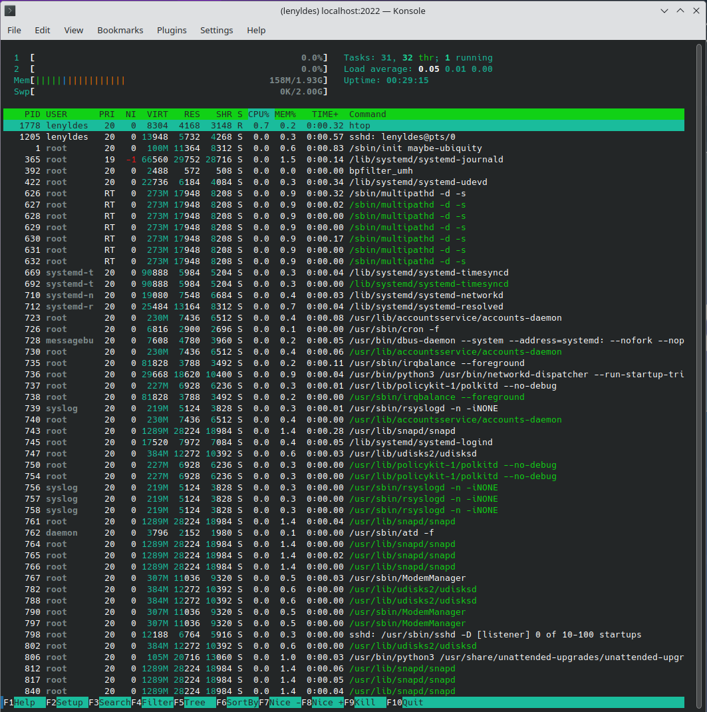

> Вывод отсортированный по PERCENT_MEM \
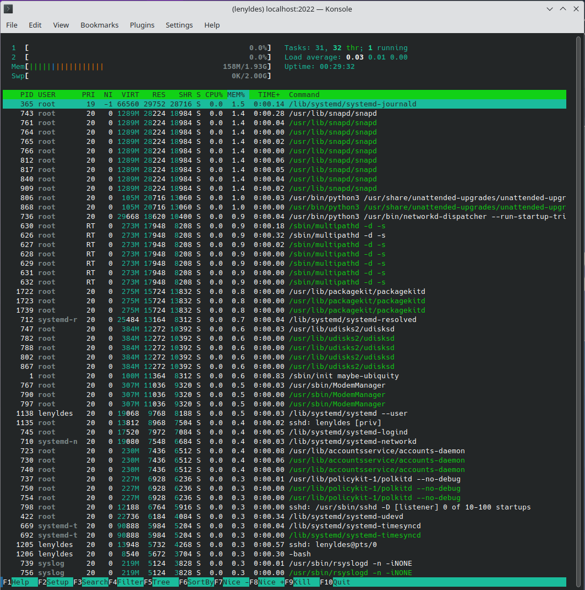

> Вывод отсортированный по TIME \
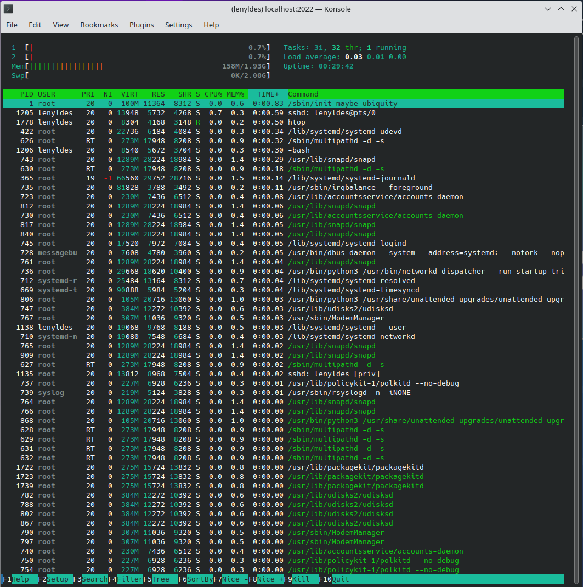

> Вывод отсортированный для процесса sshd \
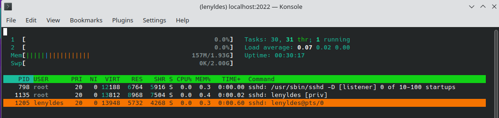

> Вывод с процессом syslog, найденным, используя поиск \
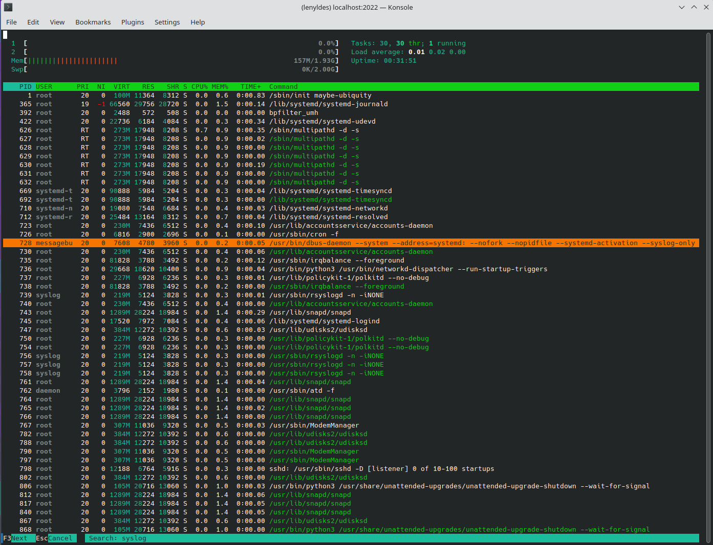

> Вывод с добавленным выводом hostname, clock и uptime \
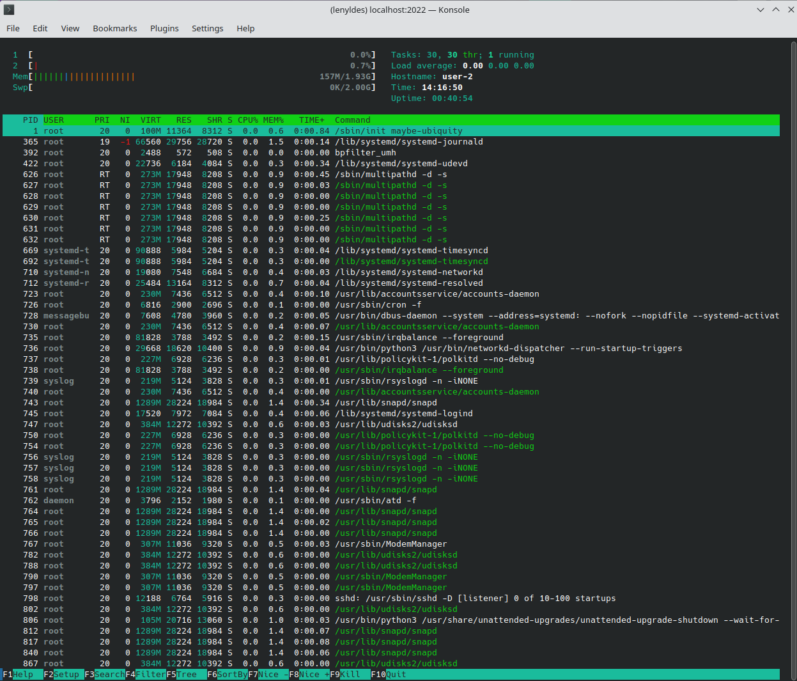

## Part 10. Использование утилиты **fdisk**

- Для отображения информации о всех доступных дисках и их разделах на системе воспользуемся командой `fdisk -l`
- Флаг `-l` используется для показа информации о всех подключенных дисках и их разделах, включая их размеры, типы и другие параметры
- Для отображения размера файла подкачки воспользуемся командой `sudo swapon --show`

> Вывод команды `fdisk -l` и `swapon --show` \
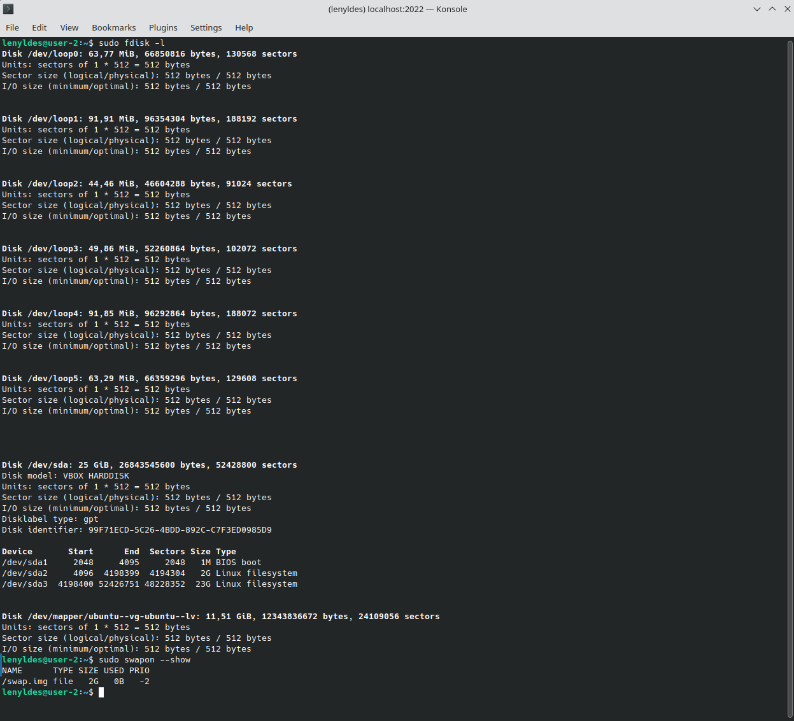

- Из него мы можем узнать следующую информацию о жестком диске:
- `Название`: sda
- `Его размер`: 25 GiB
- `Количество секторов`: 52428800 
- `Размер swap`: 2G

## Part 11. Использование утилиты **df** 

- Для отображения информации о том сколько места доступно и занято на различных файловых системах воспользуемся командой `df`

> Вывод команды `df /` для корневого раздела \

- Из него мы можем узнать:
- `размер раздела`: 11758760
- `размер занятого пространства`: 4902164
- `размер свободного пространства`: 6237488
- `процент использования`: 45%
- `единица измерения в выводе`: 1K-blocks (Это количество блоков, где каждый блок равен 1 килобайту или 1024 байта). 

> Вывод команды `df -Th` \

- Из него мы можем узнать:
- `размер раздела`: 12G,
- `размер занятого пространства`: 4,7G
- `размер свободного пространства`: 6,0G
- `процент использования`: 45%
- `единица измерения в выводе`: G гигабайт. 
- `тип файловой системы для раздела`: ext4. 
- Флаги `-Th` указывают:
- `-T`: Этот флаг указывает команде `df` выводить тип файловой системы для каждой смонтированной файловой системы.
`-h`: Этот флаг означает "человеко-читаемый" формат. Он позволяет выводить размеры в удобных единицах, таких как килобайты (K), мегабайты (M) и гигабайты (G).

## Part 12. Использование утилиты **du**

- Для отображения объема дискового пространства, занимаемого файлами и директориями воспользуемся командой `du`. Для вывода в человекочитаемом формате необходимо воспользоваться флагами `-bh`.
- `b`: Этот флаг указывает утилите du выводить размеры в байтах. Это означает, что размеры файлов и каталогов будут отображаться в абсолютных единицах, без преобразования в более крупные единицы (килобайты, мегабайты и т.д.).
- `h`: Этот флаг означает "человеко-читаемый" формат. Он позволяет выводить размеры в удобочитаемом формате, автоматически выбирая подходящие единицы (килобайты, мегабайты, гигабайты и т.д.) в зависимости от размера

> Вывод команды `du -bh` для папок /home и /var \

> Вывод команды `du -bh` для папки /var/log \

> Вывод команды `du -bh` для всего содержимого в /var/log \

## Part 13. Установка и использование утилиты **ncdu**

- Утилита `ncdu` (NCurses Disk Usage) — это интерактивный инструмент для анализа использования дискового пространства в Linux и других Unix-подобных системах. Она предоставляет удобный интерфейс для просмотра и управления дисковым пространством, используя библиотеку `ncurses` для отображения информации в терминале

> Вывод утилиты `ncdu` для папки /home \
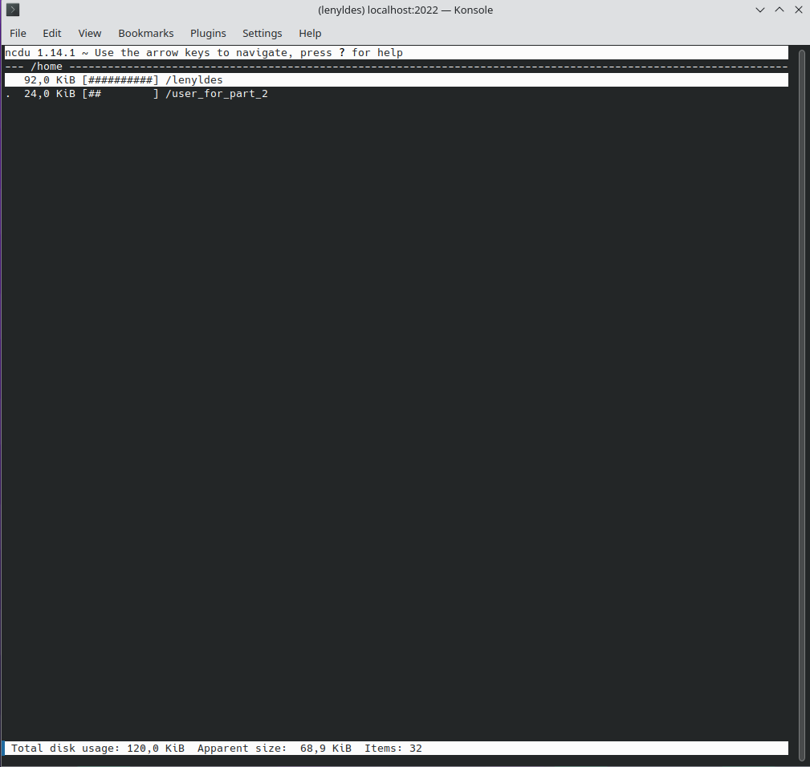

> Вывод утилиты `ncdu` для папки /var \
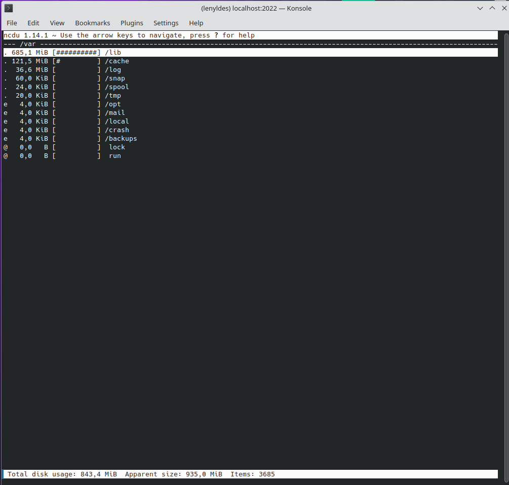

> Вывод утилиты `ncdu` для папки /var/log \
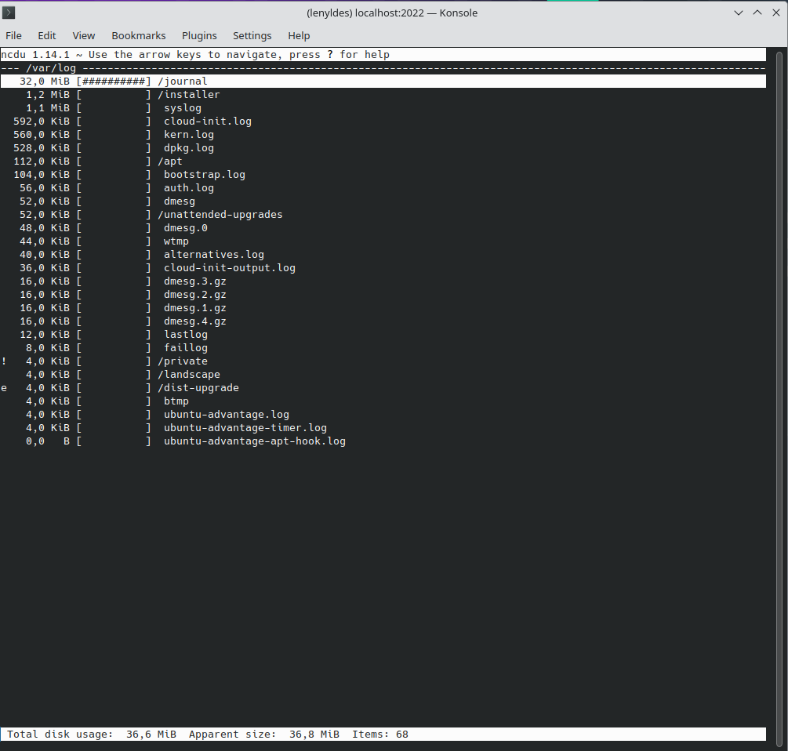

## Part 14. Работа с системными журналами

- Чтобы узнать доступны ли для просмотра файлы можно вызвать команду `ls -l filename`
- Чтобы открыть файл для просмотра нужно воспользоваться командой `chmod +r filename`
- В нашем случае все файлы уже имели права на просмотр. Заглянем же в них.
- Для просмотра времени последней успешной авторизации, имя пользователя и метод входа в систему прочитаем файл /var/log/auth.log  

> Открытие файла /var/log/auth.log
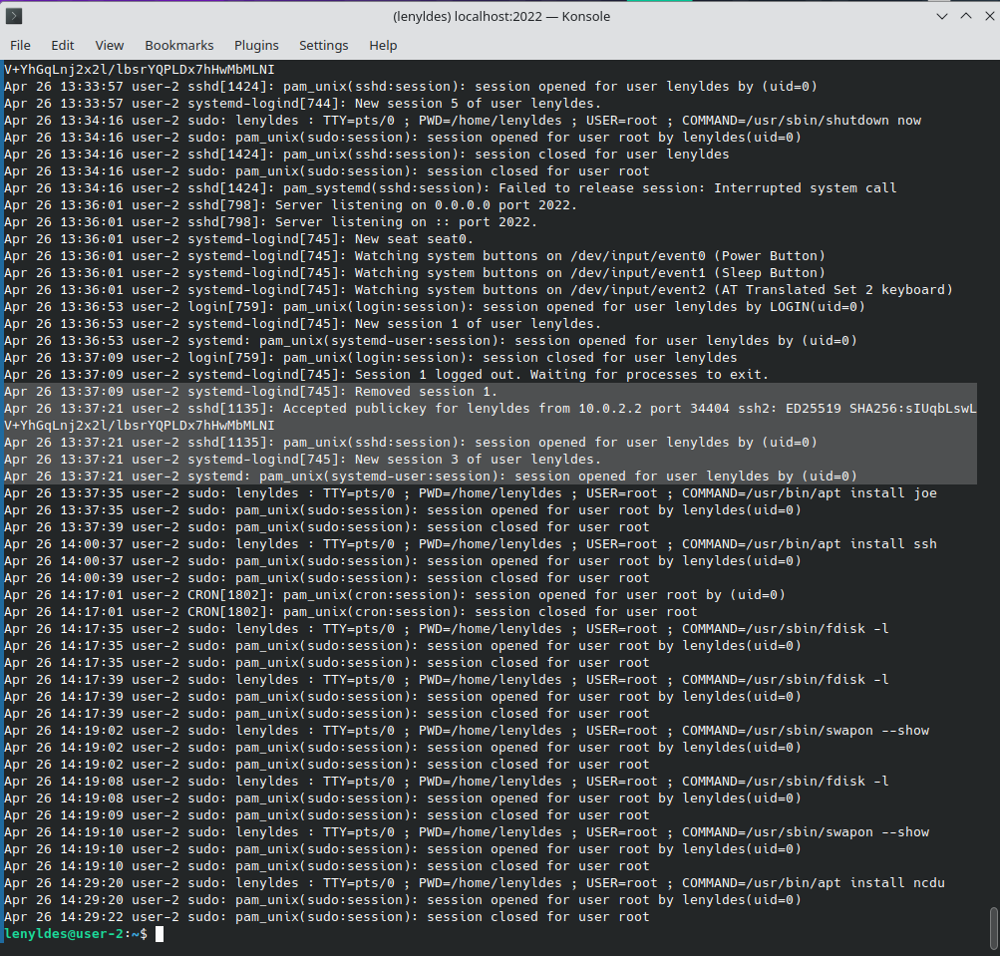

- Из него мы видим:
- `время последней успешной авторизации`: Apr 26 13:37:27
- `имя пользователя`: lenyldes
- `метод входа`: sshd:session

- Для поиска информации о службе `SSHd` сначала сделаем рестарт службы командой `sudo systemctl restart sshd`, после чего заглянем в файл /var/log/syslog где увидим соответствующий отчет

> Открытие файла /var/log/syslog
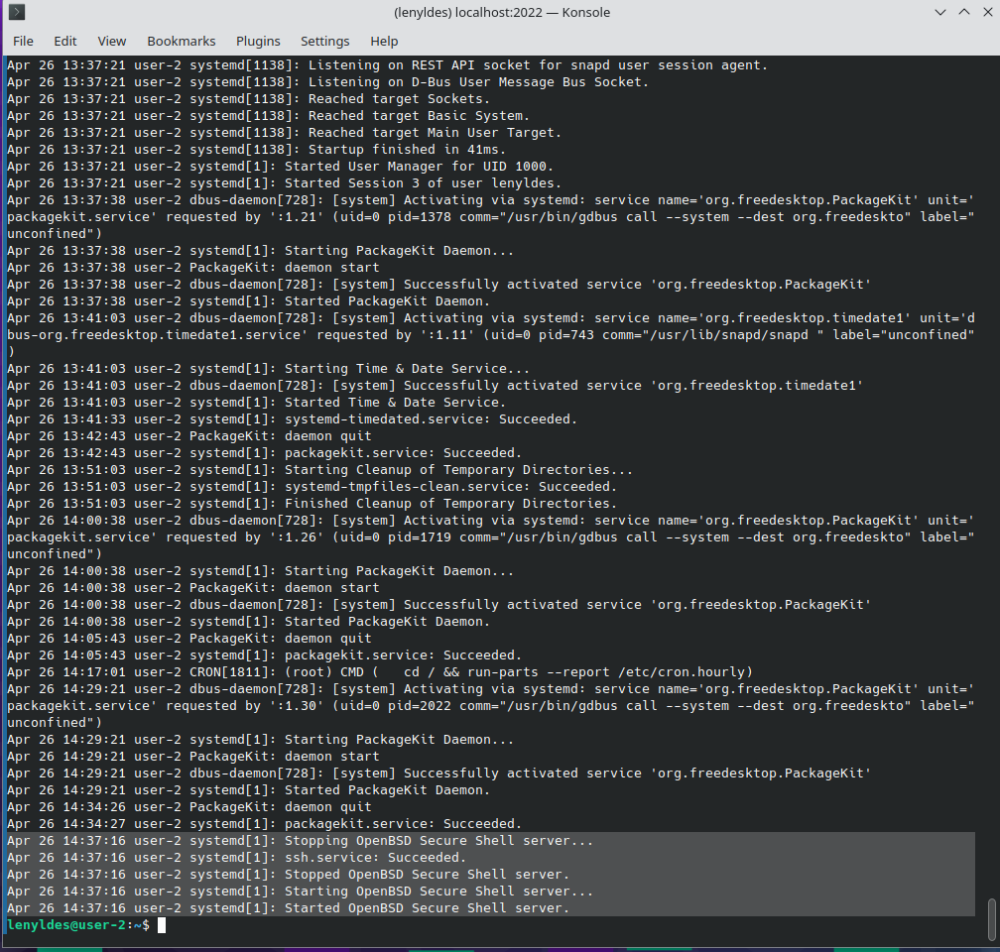

## Part 15. Использование планировщика заданий **CRON**

- Для запуска команды `uptime` через каждые 2 минуты с помощью `cron` сначала откроем файл конфигурации для редактирования с помощью команды `crontab -e` где добавим строчку `*/2 * * * * uptime | wall`
- `wall` позволить выводить информацию на экран терминала каждого пользователя

> Редактирование файла с помощью команды crontab -e \
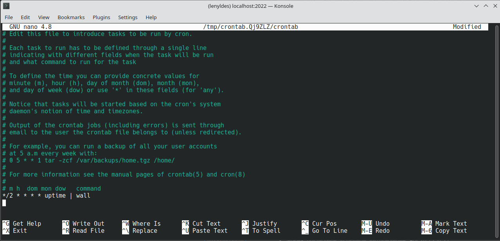

> Запись в журнале о выполнении команды 2 раза \
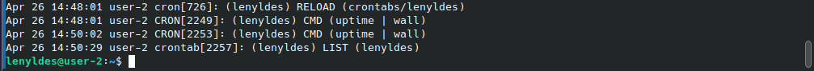

- Проверяем список текущих заданий для CRON с помощью команды crontab -l

> Проверяем список текущих заданий для CRON \
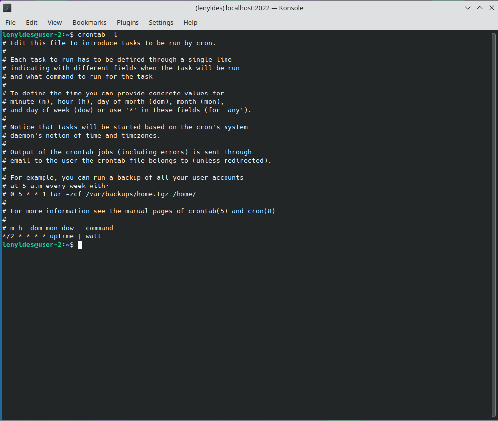

> Строчки о выполнении \
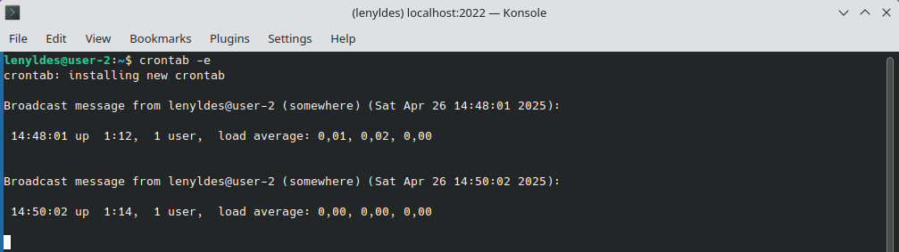

- Повторно изменяем файл командой `crontab -e` удаляя ранее добавленную задачу.
- Проверяем командой `crontab -l`

> Проверка что запуск команды `uptime` отключен (закомментирован)

