# Сети в Linux

## Оглавление

1. [Part 1. Инструмент ipcalc](#part-1-инструмент-ipcalc) 
2. [Part 2. Статическая маршрутизация между двумя машинами](#part-2-статическая-маршрутизация-между-двумя-машинами) 
3. [Part 3. Утилита iperf3](#part-3-утилита-iperf3) 
4. [Part 4. Сетевой экран](#part-4-сетевой-экран) 
5. [Part 5. Статическая маршрутизация сети](#part-5-статическая-маршрутизация-сети) 
6. [Part 6. Динамическая настройка IP с помощью DHCP](#part-6-динамическая-настройка-ip-с-помощью-dhcp) 
7. [Part 7. NAT](#part-7-nat) 
8. [Part 8. Допополнительно. Знакомство с SSH Tunnels](#part-8-дополнительно-знакомство-с-ssh-tunnels)

## Part 1. Инструмент **ipcalc**

### 1.1. Сети и маски

- Адрес сети *192.167.38.54/13* \
Network: `192.160.0.0/13` или `11000000.10100000.00000000.00000000`

- Перевод маски *255.255.255.0* в префиксную и двоичную запись \
Префиксная: `/24` \
Двоичная: `11111111.11111111.11111111.00000000` 

- Перевод маски */15* в обычную и двоичную \
Обычная: `255.254.0.0` \
Двоичная: `11111111.11111110.00000000.00000000` 

- Перевод маски *11111111.11111111.11111111.11110000* в обычную и префиксную \
Обычная: `255.255.255.240` \
Префиксная: `/28` 

- Минимальный и максимальный хост в сети *12.167.38.4* при масках: */8*, *11111111.11111111.00000000.00000000*, *255.255.254.0* и */4* \
*/8* min: `12.0.0.1` \
*/8* max: `12.255.255.254` \
*11111111.11111111.00000000.00000000* min: `12.167.0.1` \
*11111111.11111111.00000000.00000000* max: `12.167.255.254` \
*255.255.254.0* min: `12.167.38.1` \
*255.255.254.0* max: `12.167.38.1` \
*/4* min: `0.0.0.1` \
*/4* max: `15.255.255.254` 

### 1.2. localhost

- `localhost` (так называемый, «местный» от англ. local, или «локальный хост», по смыслу — этот компьютер) — в компьютерных сетях, стандартное, официально зарезервированное доменное имя для частных IP-адресов (в диапазоне `127.0.0.1 — 127.255.255.254`, RFC 2606). Для сети, состоящей только из одного компьютера, как правило, используется всего один адрес — 127.0.0.1, который устанавливается на специальный сетевой интерфейс «внутренней петли» (англ. loopback) в сетевом протоколе TCP/IP. В Unix-подобных системах данный интерфейс обычно именуется «loN», где N — число, либо просто «lo». 
- `127.0.0.1` и все адреса в диапазоне `127.0.0.0/8` (то есть от `127.0.0.0` до `127.255.255.255`) являются адресами локальной петли (loopback). Это значит, что любые адреса в этом диапазоне могут обращаться к localhost.
- Таким образом к сети (приложению) работающему на `127.0.0.1` (localhost) можно обратиться с адресов: `127.0.0.2`, `127.1.0.1` и нельзя обратиться с адресов: `194.34.23.100`, `128.0.0.1`

### 1.3. Диапазоны и сегменты сетей
- Следующие диапазоны определены IANA как адреса, выделенные локальным сетям: \
`10.0.0.0 — 10.255.255.255` (маска подсети для бесклассовой (CIDR) адресации: 255.0.0.0 или /8); \
`100.64.0.0 — 100.127.255.255` (маска подсети 255.192.0.0 или /10). Данная подсеть рекомендована согласно RFC 6598 для использования в качестве адресов для CGN (Carrier-Grade NAT); \
`172.16.0.0 — 172.31.255.255` (маска подсети: 255.240.0.0 или /12); \
`192.168.0.0 — 192.168.255.255` (маска подсети: 255.255.0.0 или /16); \
`127.0.0.0 — 127.255.255.255` (маска подсети: 255.0.0.0 или /8). Для петлевых интерфейсов (не используется для обмена между узлами сети). \
Таким образом получаем: \
*10.0.0.45* - `частный`, \
*134.43.0.2* - `публичный`, \
*192.168.4.2* - `частный`, \
*172.20.250.4* - `частный`, \
*172.0.2.1* - `публичный`, \
*192.172.0.1* - `публичный`, \
*172.68.0.2* - `публичный`, \
*172.16.255.255* - `частный`, \
*10.10.10.10* - `частный`, \
*192.169.168.1* - `публичный`.

- Для определения какие из перечисленных IP-адресов шлюза возможны у сети `10.10.0.0/18`: *10.0.0.1*, *10.10.0.2*, *10.10.10.10*, *10.10.100.1*, *10.10.1.255* сначала нужно сначала понять, какие адреса входят в эту подсеть. \
Network:   `10.10.0.0/18` \
HostMin:   `10.10.0.1` \
HostMax:   `10.10.63.254` \
Broadcast: `10.10.63.255` \
Таким образом в качестве шлюза могут выступать адреса: `10.10.0.2, 10.10.10.10, 10.10.1.255`. \
При этом последний является широковещательным адресом для своей подсети.

## Part 2. Статическая маршрутизация между двумя машинами

- С помощью команды `ip a` просматриваем существующие интерфейсы
> Вызов команды `ip a` для машины ws1 \
 

> Вызов команды `ip a` для машины ws2 \
 

- Задаем новую конфигурацию интерфесов для машин изменяя файл *etc/netplan/00-installer-config.yaml*
> Содержание файла *etc/netplan/00-installer-config.yaml* для машины ws1 \
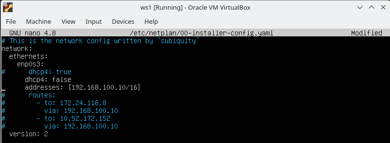 \

> Вывод команды `netplan apply` и просмотр обновленного сетевого интерфейса для машины ws1 \
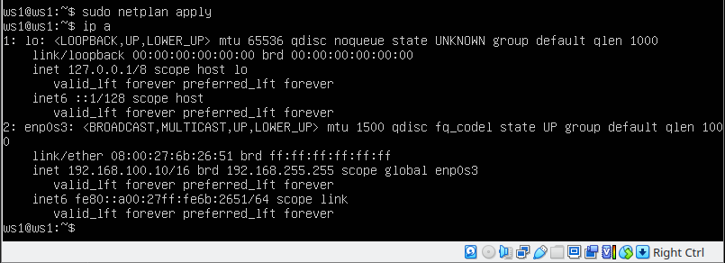 \


> Содержание файла *etc/netplan/00-installer-config.yaml* для машины ws2 \
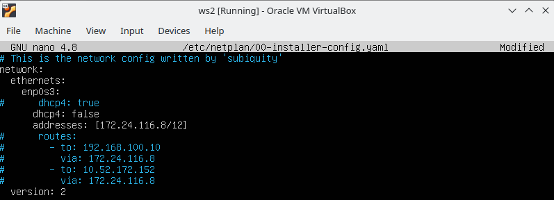 \

> Вывод команды `netplan apply` и просмотр обновленного сетевого интерфейса для машины ws2 \
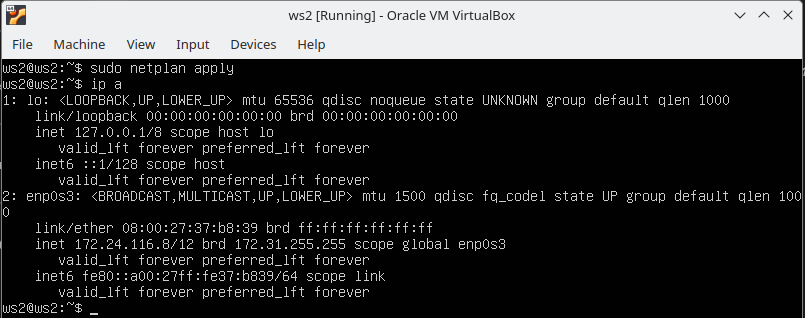 

### 2.1. Добавление статического маршрута вручную

- С помощью команды `ip r add` создадим статические маршрутны. \
Для этого на машине ws1 (192.168.100.10) добавим маршрут к машине ws2 (172.24.116.8) командой: \
`sudo ip route add 172.24.116.8 via 192.168.100.10` \
Аналогичным образом на машине ws2 (172.24.116.8) добавим маршрут к ws1 (192.168.100.10):
`sudo ip route add 192.168.100.10 via 172.24.116.8` 

> Добавление маршрута к машине ws2 на машине ws1 \
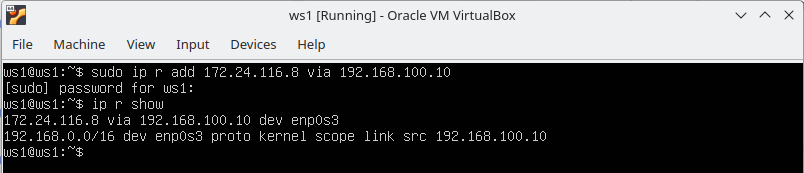 

> Добавление маршрута к машине ws1 на машине ws2 \
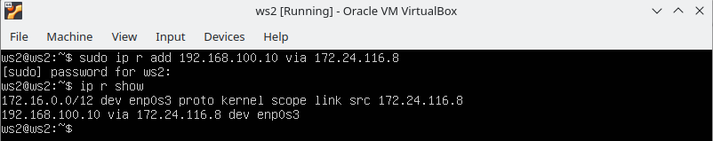 

- Пропингуем соединение между машинами и убедимся что они видят друг друга.
> ping до машины ws2 и обратно \
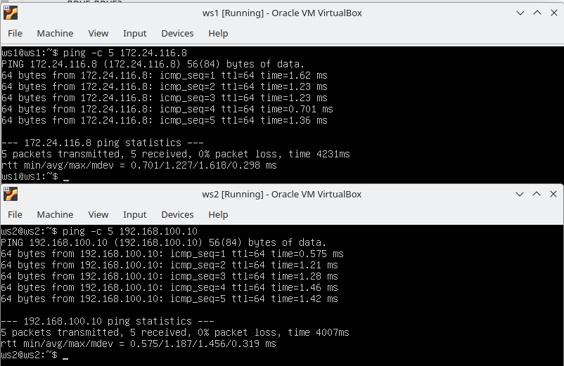 

- !!! Данные параметры стираются при перезапуске машин. \
Для сохранения статического маршрута необходимо явно прописать его в */etc/netplan/00-installer-config.yaml*
- Откорректируем файл *00-installer-config.yaml* на обеих машинах и повторно пропингуем соединение после перезагрузки

> Измененный файл *00-installer-config.yaml* на машине ws1 \
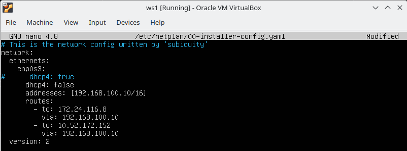

> Измененный файл *00-installer-config.yaml* на машине ws2 \
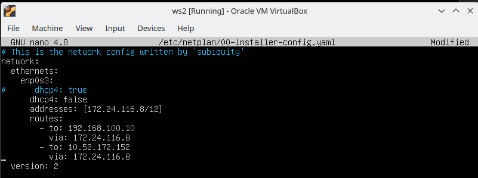

> ping до машины ws2 и обратно после перезагрузки машин и внесения изменений в config \
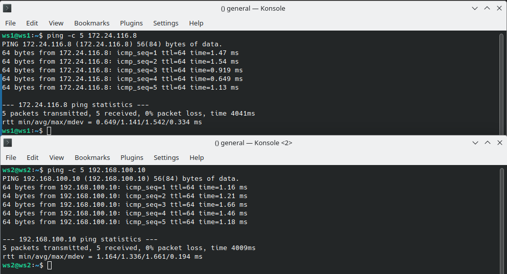 

## Part 3. Утилита **iperf3**

### 3.1. Скорость соединения
- 8 Mbps это `1 MB/s` 
- 100 MB/s это `100000 Kbps` 
- 1 Gbps это `1000 Mbps`.

### 3.2. Утилита **iperf3**

- Для измерения скорости соединения между машиными ws1 и ws2 воспользуемся утилитой `iperf3`.
- Машину ws2 будем использовать в качестве сервера, а машину ws1 в качестве клиента. \
Для этого на машине ws2 выполним команду `iperf3 -s` \
А на машине ws1 команду `iperf3 -c 172.24.116.8 -t 5` (-t используется для задания времени проведения измерения скорости, в данном случае 5 секунд.)

> Измерение скорости соединения между машинами \
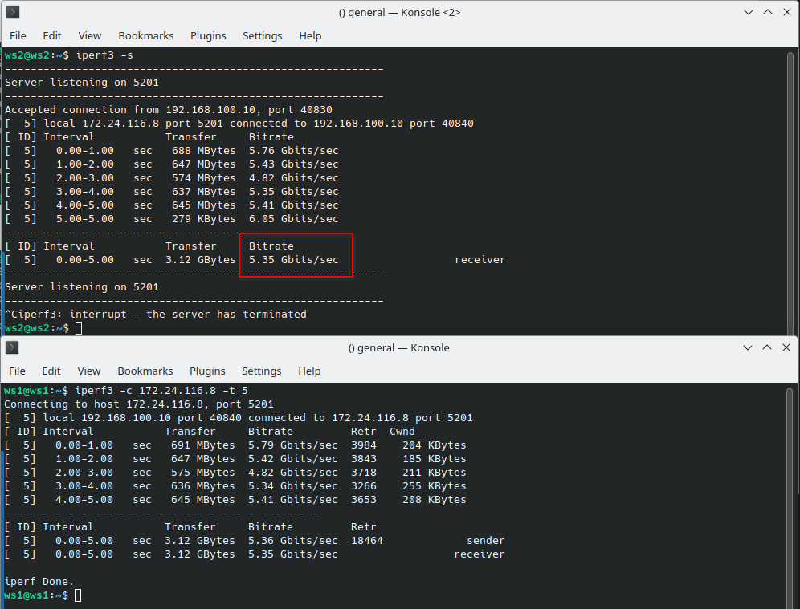

## Part 4. Сетевой экран

### 4.1. Утилита **iptables**

- Создадим файл */etc/firewall.sh*, имитирующий файрвол, на ws1 и ws2.

> Файл */etc/firewall.sh* на ws1 \
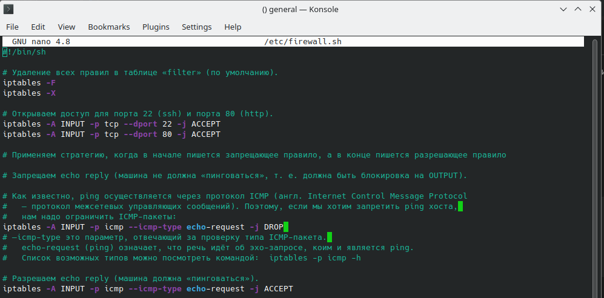

> Файл */etc/firewall.sh* на ws2 \
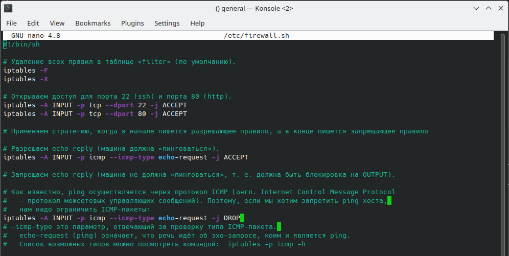

- Запустим файлы на обеих машинах командами `chmod +x /etc/firewall.sh` и `/etc/firewall.sh`.

> Запуск файлов на машинах ws1 и ws2 \
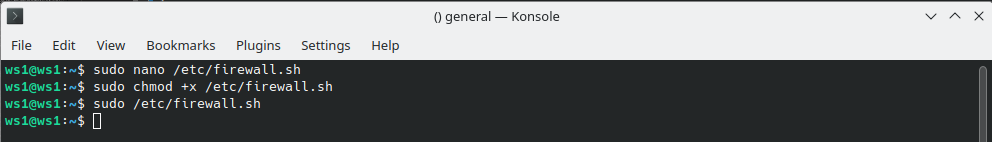
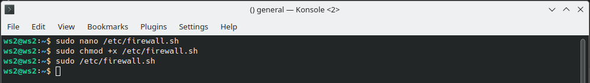

- Разница между стратегиями, применёнными в файлах `/etc/firewall.sh` на виртуальных машинах ws1 и ws2, заключается в порядке применения правил `iptables`, что влияет на то, как обрабатывается сетевой трафик.\
Стратегия на ws1 начинается с запрещающего правила, блокирующего ICMP Echo Request, что делает машину недоступной для пинга, и затем разрешает трафик. В отличие от этого, стратегия на ws2 изначально разрешает весь входящий трафик, включая пинги, а затем блокирует ICMP Echo Request, что позволяет машине отвечать на пинги до применения запрета.

### 4.2. Утилита **nmap**

- Проверим примененные правила. Для этого командой `ping` найдем машину, которая не «пингуется».

> Поиск машины недоступной для команды `ping` \


- Как и следовало ожидать машина ws1 (192.168.100.10) не «пингуется».\
Утилитой `nmap` проверим, что хост машины запущен.

> Проверка хоста машины утилитой `nmap` \
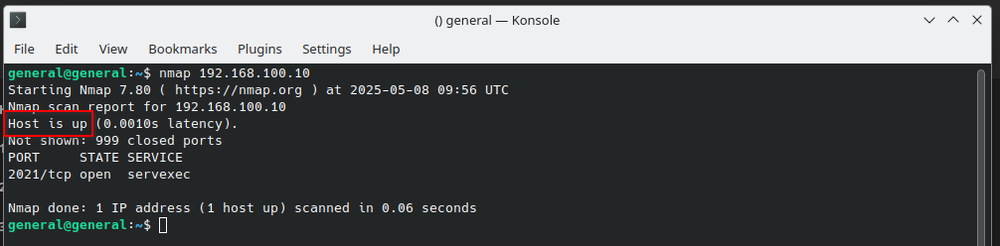

## Part 5. Статическая маршрутизация сети

- Для выполнения задания поднимем 5 виртуальных машин (3 рабочие станции (ws11, ws21, ws22) и 2 роутера (r1, r2)).

### 5.1. Настройка адресов машин

- После чего настроим конфигурацию каждой из них. \
Настройки конфигурации выполняем редактируя файл *etc/netplan/00-installer-config.yaml* на каждой из машин

> Содержание файла *etc/netplan/00-installer-config.yaml* для машины ws11 \
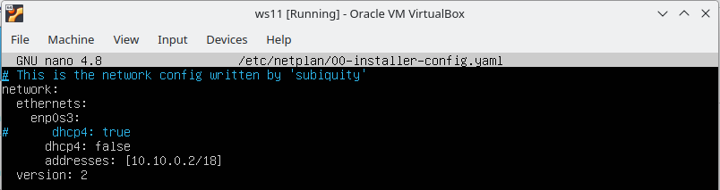

> Содержание файла *etc/netplan/00-installer-config.yaml* для машины ws21 \
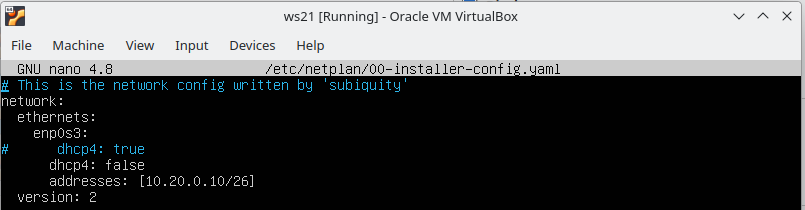

> Содержание файла *etc/netplan/00-installer-config.yaml* для машины ws22 \
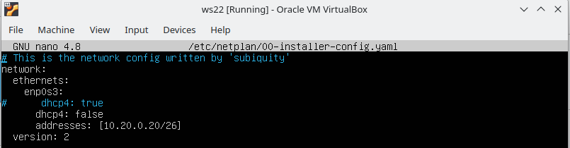

> Содержание файла *etc/netplan/00-installer-config.yaml* для машины r1 \
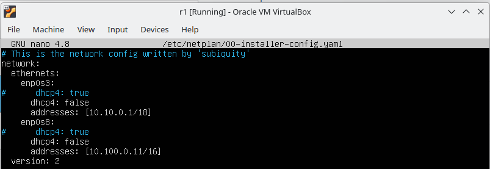

> Содержание файла *etc/netplan/00-installer-config.yaml* для машины r2 \
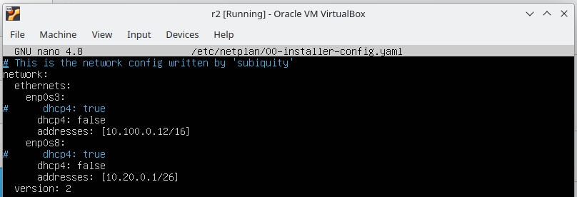

- Принимаем изменения (перезапускаем сервис) командой `sudo netplan apply`. \ 
После чего командой `ip -4 a` проверяем настройки сети.

> Проверка адреса машины ws11 \
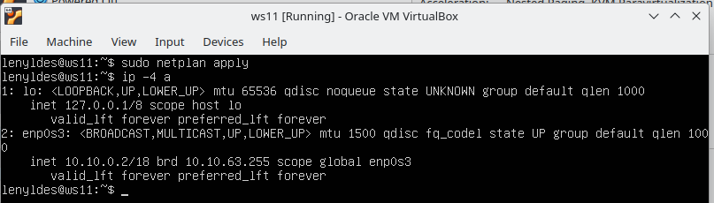

> Проверка адреса машины ws21 \
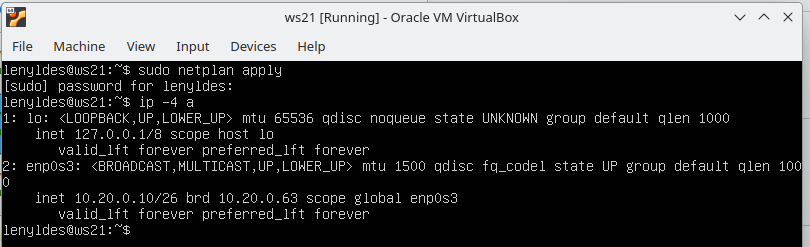

> Проверка адреса машины ws22 \
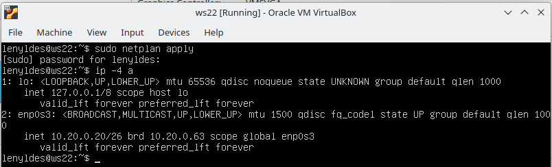

> Проверка адреса машины r1 \
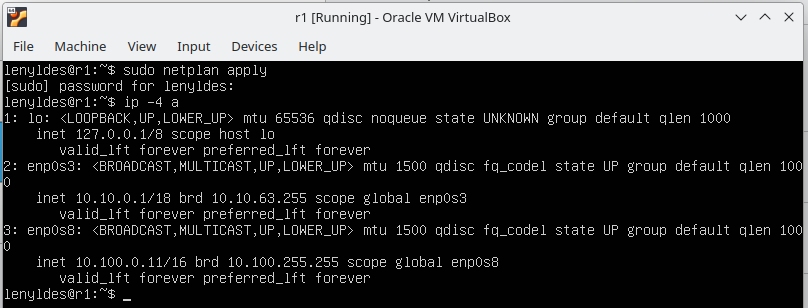

> Проверка адреса машины r2 \
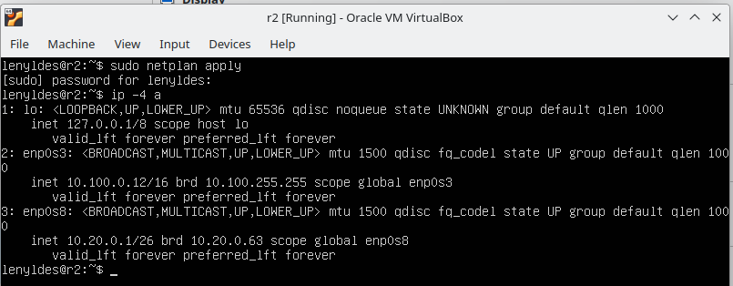

- Пропингуем ws22 с ws21 и r1 с ws11.

> ping ws22 с ws21 \
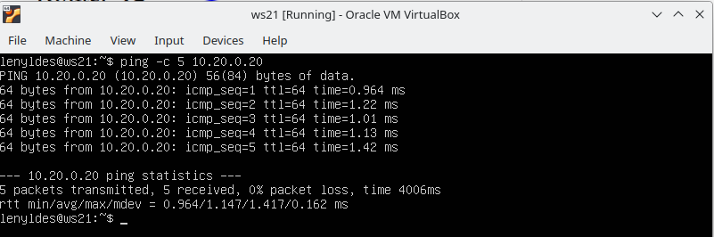

> ping r1 с ws11 \
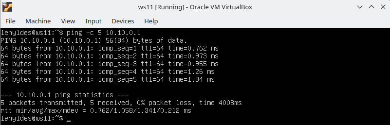

### 5.2. Включение переадресации IP-адресов

- Включим переадресацию IP на роутерах r1 и r2. \
Для этого выполним команду `sysctl -w net.ipv4.ip_forward=1` на каждом из них. \
*При таком подходе переадресация не будет работать после перезагрузки системы.*

> Вызов команды `sysctl -w net.ipv4.ip_forward=1` на роутерах r1 и r2. \


- Чтобы настроить IP-переадресацию на постоянной основе необходимо в файл */etc/sysctl.conf* добавить (раскомментировать) строчку `net.ipv4.ip_forward = 1` \
*При использовании этого подхода, IP-переадресация включена на постоянной основе.*

> Содержание изменённого файла */etc/sysctl.conf* на роутерах r1 и r2. \
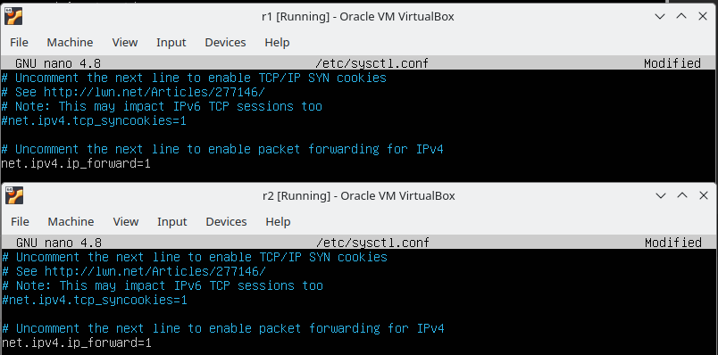

### 5.3. Установка маршрута по умолчанию

- Настраиваем маршрут по умолчанию (шлюз) для рабочих станций. \
Для этого редактируем файл *etc/netplan/00-installer-config.yaml* и прописываем туда маршруты. Не забываем применить изменения командой `sudo netplan apply`

> Конфигурация файла *etc/netplan/00-installer-config.yaml* для машины ws11 \
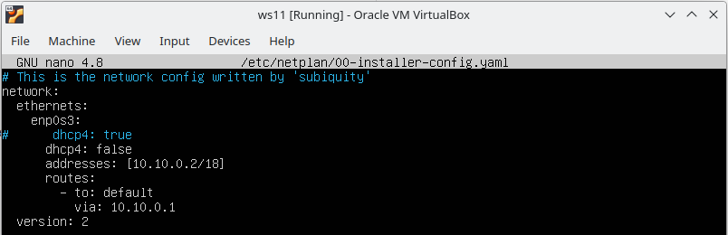

> Конфигурация файла *etc/netplan/00-installer-config.yaml* для машины ws21 \
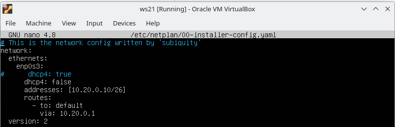

> Конфигурация файла *etc/netplan/00-installer-config.yaml* для машины ws22 \


- Проверим принятые настройки (маршрут в таблице маршрутизации) командой `ip r`

> Вывод команды `ip r` для машин \
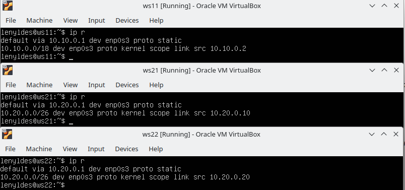

- Убедимся в правильности выполнения пропингуя соединение между машинами ws11 и r2.\
Для этого на машине r2 будем использовть команду `tcpdump -tn -i eth0` для отслеживания запросов

> Проверка отправки пакетов с между машинами ws11 и r2 
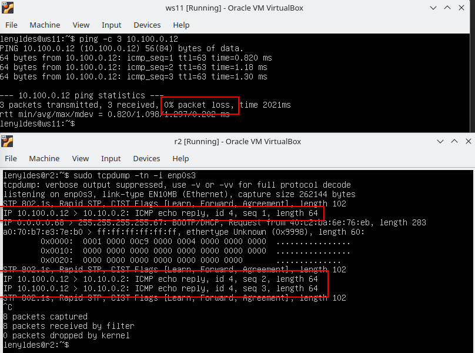

### 5.4. Добавление статических маршрутов

- Добавим статические маршруты в файлы конфигураций r1 и r2.

> Конфигурация файла *etc/netplan/00-installer-config.yaml* для роутера r1 \
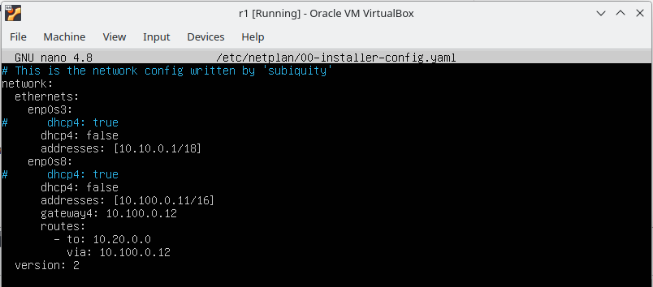

> Конфигурация файла *etc/netplan/00-installer-config.yaml* для роутера r2 \
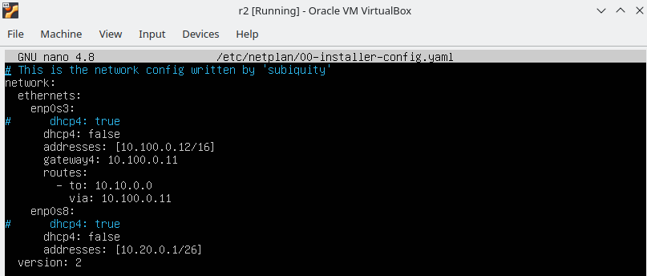

- Посмотрим таблицу маршрутизации на обеих машинах.

> Вызов команды `ip r` на обоих роутерах.\


- Вызовем команду `ip r list 10.10.0.0/18` и `ip r list 0.0.0.0/0` на машине ws11 для отображения информации о маршрутах в таблице маршрутизации для указанной сети или подсети.

> Вызов команды `ip r list 10.10.0.0/18` и `ip r list 0.0.0.0/0` на машине ws11.\


- Мы видим что для сети `10.10.0.0/18` был выбран маршрут, отличный от `0.0.0.0/0`, хотя он попадает под маршрут по умолчанию. \
Это объясняется тем, что когда мы запрашиваем маршрут для `10.10.0.0/18`, система находит маршрут, который точно соответствует этому адресу. В нашем случае:\
У ws11 есть маршрут `10.10.0.0/18 dev eth0 proto kernel scope link src 10.10.0.2`, который указывает, что все пакеты, адресованные к сети `10.10.0.0/18`, должны отправляться через интерфейс `enp0s3` с IP-адресом `10.10.0.2`.
Поскольку этот маршрут более специфичен, чем маршрут по умолчанию (`0.0.0.0/0`), он будет использоваться для всех пакетов, адресованных к сети `10.10.0.0/18`.

### 5.5. Построение списка маршрутизаторов

- Получим список маршрутизаторов на пути от ws11 до ws21.\
Для этого запустим на r1 команду дампа: `tcpdump -tnv -i enp0s3`, а на машине ws11 команду `traceroute` до сети ws21.

> Вызов команд `tcpdump` и `traceroute` \


- Команда `traceroute` используется для определения маршрута, по которому пакеты проходят от одного узла к другому в сети. Она работает, отправляя пакеты с постепенно увеличивающимся значением поля *Time to Live (TTL)*, что позволяет отслеживать каждый промежуточный узел (хоп) на пути к конечному адресу. \
`traceroute` отправляет пакеты (обычно UDP или ICMP) к целевому адресу, начиная с TTL, равного 1. Это означает, что пакет может пройти только один хоп (один маршрутизатор) перед тем, как будет отброшен.\
Когда пакет достигает маршрутизатора, у которого TTL равен 1, маршрутизатор уменьшает TTL на 1 (в данном случае до 0) и отправляет обратно ICMP-сообщение к исходному узлу (в данном случае к ws11).
`traceroute` получает это ICMP-сообщение и записывает IP-адрес маршрутизатора, который его отправил. Затем он увеличивает TTL на 1 и повторяет процесс, отправляя новый пакет.\
Этот процесс продолжается, пока не будет достигнут конечный узел (ws21).\
Когда мы запускаем `tcpdump -tnv -i enp0s3` на r1, мы начинаем захватывать и отображать сетевой трафик, проходящий через интерфейс `enp0s3`. Мы можем увидеть пакеты, которые приходят и уходят через этот интерфейс, включая ICMP-сообщения и UDP-пакеты, отправляемые ws11 в процессе выполнения `traceroute`.

### 5.6. Использование протокола **ICMP** при маршрутизации

- Запустим на r1 перехват сетевого трафика, проходящего через enp0s3 с помощью команды:
`tcpdump -n -i enp0s3 icmp`
- После чего пропингуем с ws11 несуществующий IP (например, *10.30.0.111*) с помощью команды:
`ping -c 1 10.30.0.111`

> Вывод команд `tcpdump -n -i enp0s3 icmp` и `ping -c 1 10.30.0.111`\
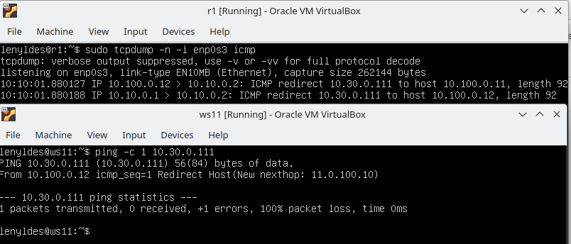

## Part 6. Динамическая настройка IP с помощью **DHCP**

- Потренируемся пользоваться динамической настройкой IP с помощью **DHCP**.
- Для этого сначала настроим роутер r2 на выдачу ip адресов.
- В качестве примера зададим следующие настройки сети в файле */etc/dhcp/dhcpd.conf* конфигурацию службы **DHCP**:
```shell
subnet 10.100.0.0 netmask 255.255.0.0 {}

subnet 10.20.0.0 netmask 255.255.255.192
{
    range 10.20.0.2 10.20.0.50;
    option routers 10.20.0.1;
    option domain-name-servers 10.20.0.1;
}
```
- И в файле */etc/resolv.conf* пропишем следующий публичный DNS сервер (Google) для разрешения доменных имен в IP-адреса:
`nameserver 8.8.8.8`

> Содержимое файлов */etc/dhcp/dhcpd.conf* и */etc/resolv.conf* для роутера r2.
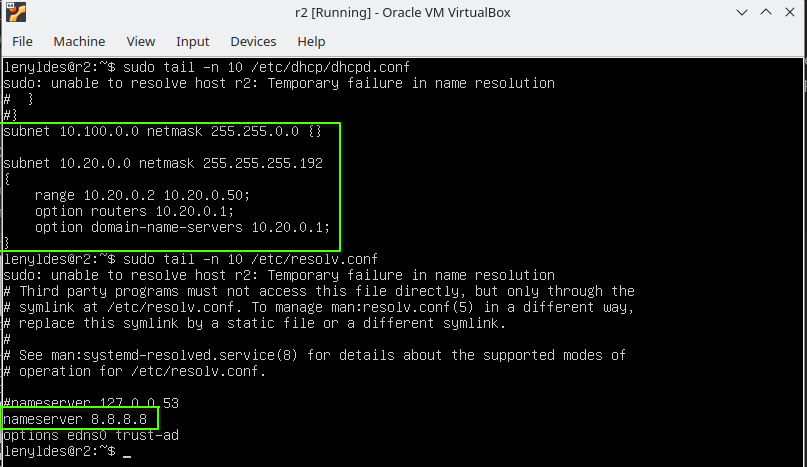

- Перезапустим службу **DHCP** командой `systemctl restart isc-dhcp-server` для применения изменений.

> Перезапуск службы **DHCP**\
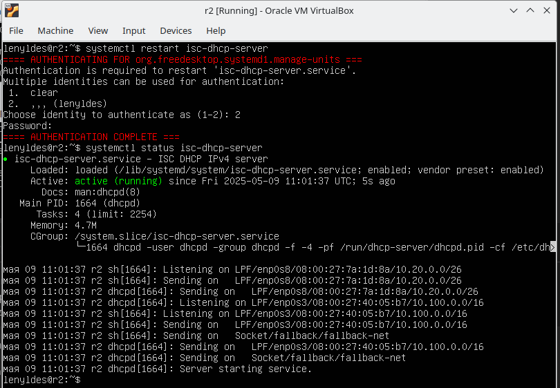

- Далее перезагрузим машину ws21 и удостоверимся, что она получила новый ip адрнес (не забываем настроить получиние ip адреса через службы dhcp в файле конфигурации) и пропингуем ws22.

> Старый ip адрес машины ws21\
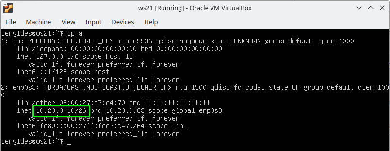

> Новый ip адрес машины ws21 и пинг до машины ws22\
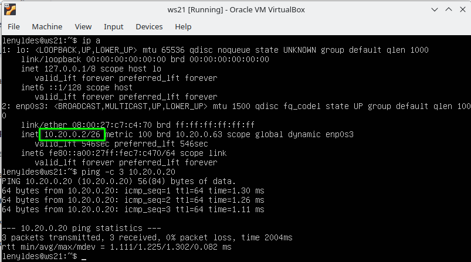

- Для сети 10.10.0.0/18 настроим выдачу ip адреса с жесткой привязкой к MAC-адресу.

- Для этого сначала узнаем MAC-адресу машины ws11 через команду ip a.

> Текущий МАС адрес (красный) и ip адрес (зеленый) машины ws11.
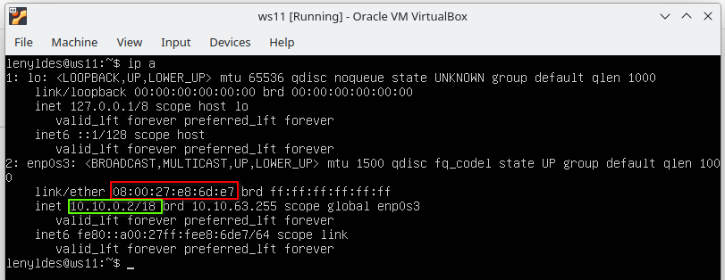

- Укажем соответствующий MAC-адрес у ws11 в *etc/netplan/00-installer-config.yaml*, а также не забудем настроить автоматическое получение ip адреса `dhcp4: true`.

> Файл конфигурации *etc/netplan/00-installer-config.yaml* у ws11
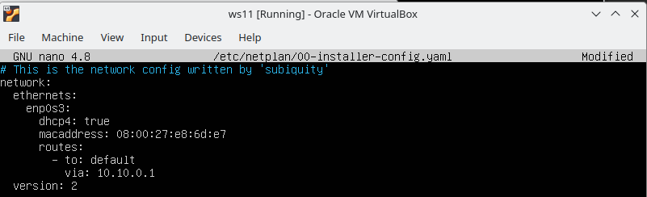

- Настроим r1 аналогично r2, но с выдачей адресов с жесткой привязкой к MAC-адресу для машины ws11 и динамически для всех остальных.

> Содержимое файлов */etc/dhcp/dhcpd.conf* и */etc/resolv.conf* для роутера r1.
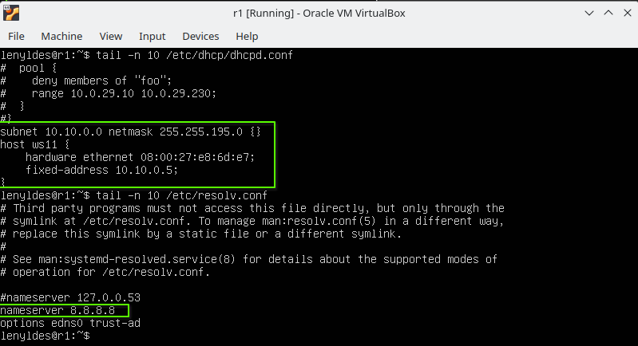

- После чего перезапустим службу **DHCP** для применения изменений.
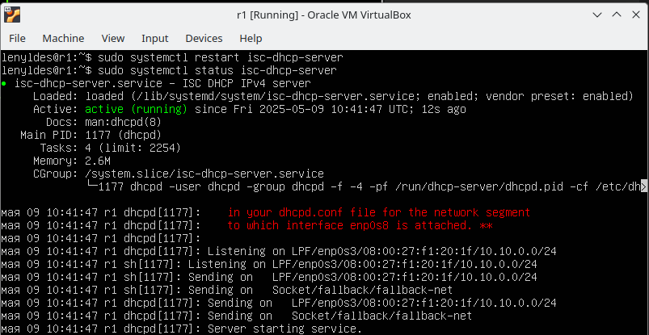

- Далее перезагрузим машину ws11 и удостоверимся, что она получила новый ip адрес (не забываем настроить получиние ip адреса через службы dhcp в файле конфигурации).

> Старый ip адрес машины ws11\


> Новый ip адрес машины ws11\
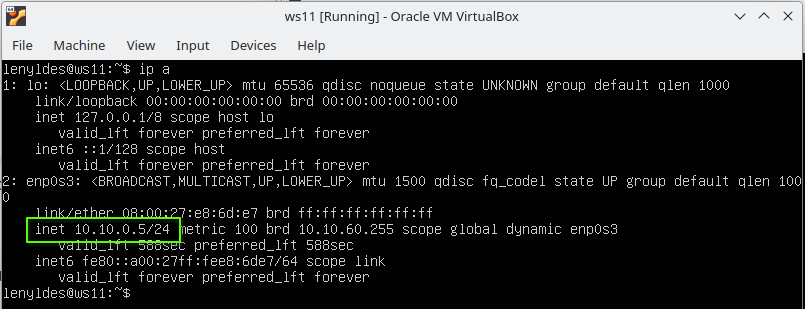

- Запросим с ws21 обновление IP-адреса командами: 
```
sudo dhclient -r enp0s3 # Освобождает текущий IP-адрес
sudo dhclient # Получаем новый ip адрес
```

> Обновление ip адреса машины ws21\
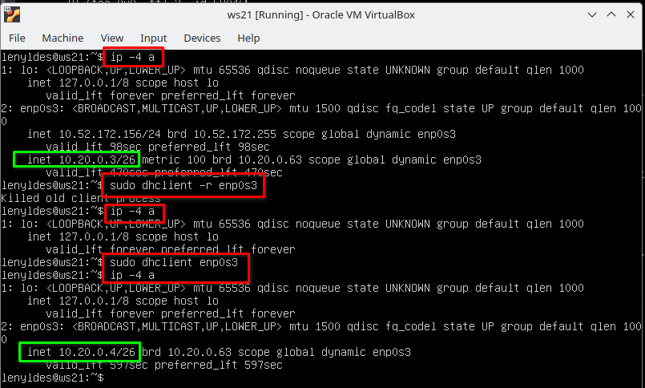

## Part 7. **NAT**

- В файле */etc/apache2/ports.conf* на ws22 и r1 изменяем строку `Listen 80` на `Listen 0.0.0.0:80`, то есть делаем сервер Apache2 общедоступным.

> Содержание файла */etc/apache2/ports.conf* на ws22 (на r1 он аналогичный)\
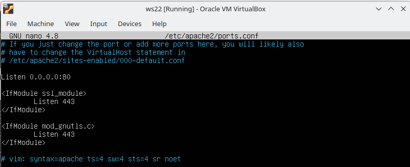

- Запускаем сервер Apache2 `service apache2 start` на ws22 и r1.

> Запуск сервера Apache2 и проверка его статуса на ws22 (вывод на r1 аналогичный)\
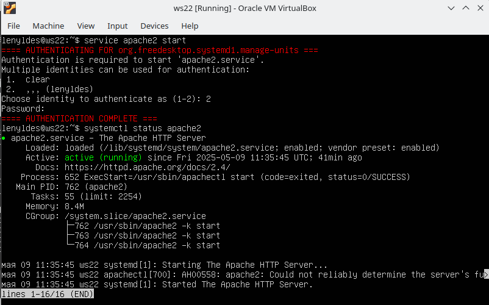

- Добавим в фаервол, созданный по аналогии с фаерволом из Части 4, на r2 следующие правила:
```
iptables -F # Удаление правил в таблице filter
iptables -F -t nat # Удаление правил в таблице «NAT»
iptables --policy FORWARD DROP # Отбрасывать все маршрутизируемые пакеты
```
- После чего запустим файл и проверим что ws22 не должна «пинговаться» с r1.

> Правила таблицы iptables\
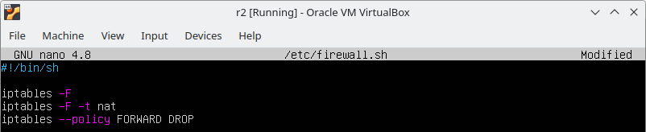

> Запуск команды\
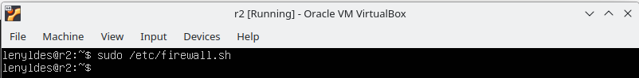

> Проверка `ping` между ws22 и r1\


- Добавим ещё правила, разрешающие маршрутизацию всех пакетов протокола **ICMP**.\
После этого ws22 должна «пинговаться» с r1.

> Новые правила таблицы iptables\
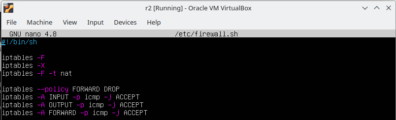

> Запуск команды\


> Проверка `ping` между ws22 и r1. Пакеты успешно доходят до адресата\


- Включим **SNAT**, а именно маскирование всех локальных IPиз локальной сети, находящейся за r2 (по обозначениям из Части 5 — сеть 10.20.0.0).
- Включим **DNAT** на 8080 порт машины r2 и добавить к веб-серверу Apache, запущенному на ws22, доступ извне сети.
- Для этого добавим ещё несколько правил и запустим файл:

> Новые правила для **SNAT** и **DNAT**.\
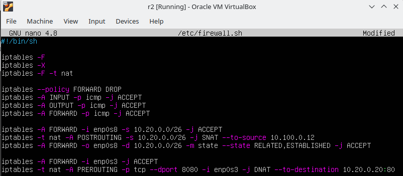

> Запуск команды\


- Проверим соединение по TCP для **SNAT**: для этого с ws22 подключимся к серверу Apache на r1 командой:
`telnet 10.100.0.11 80`

> Проверка соединения по TCP для **SNAT**\
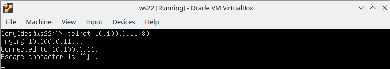

- Проверим соединение по TCP для **DNAT**: для этого с r1 подключимся к серверу Apache на ws22 командой `telnet` (обращаться по адресу r2 и порту 8080).

> Проверка соединения по TCP для **DNAT**\
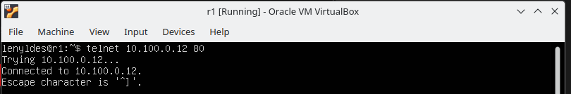


## Part 8. Дополнительно. Знакомство с **SSH Tunnels**

- Запустим на r2 фаервол с правилами из Части 7.

> Правила из Части 7.\


> Запуск команды\


- Запустим веб-сервер **Apache** на ws22 только на localhost (то есть в файле */etc/apache2/ports.conf* меняем строку `Listen 80` на `Listen localhost:80`).

> Откорректированный файл */etc/apache2/ports.conf* \
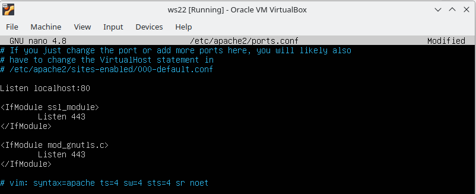

- Перезапустим сервер командой `systemctl restart apache2` для применения настроек

> Перезапуск сервера\
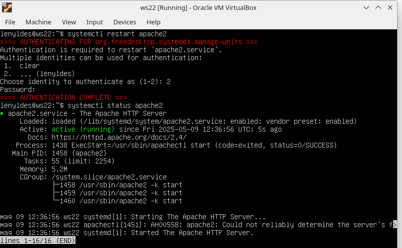

- Воспользуемся *Local TCP forwarding* с ws21 до ws22, чтобы получить доступ к веб-серверу на ws22 с ws21.
- Сделаем это с помощью команды `ssh -L 8080:localhost:80 user_name@10.20.0.20`

> Подключение по ssh -L\
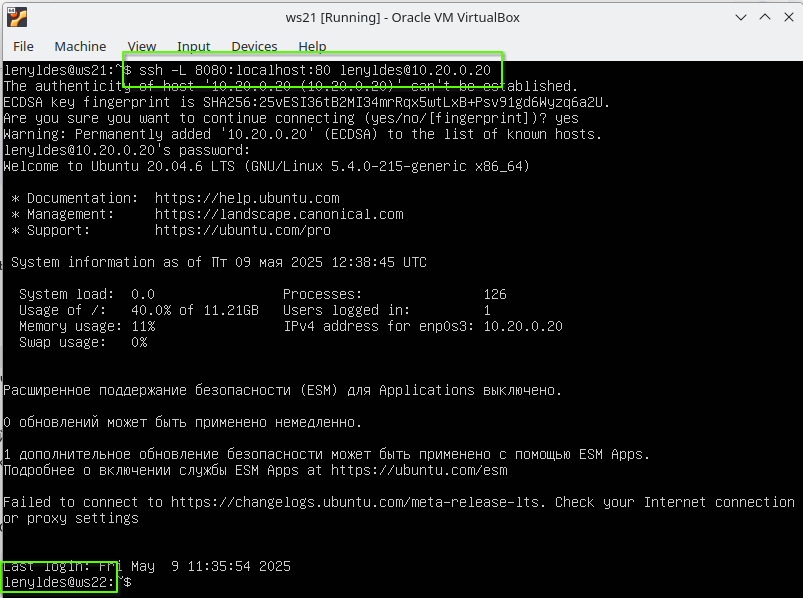

- Потом перейдем во второе окно чтобы проверить, сработало ли подключение (переходим во второй терминал клавишами Alt + F2) и выполняем команду `telnet 127.0.0.1 80`

> Проверка подключения\
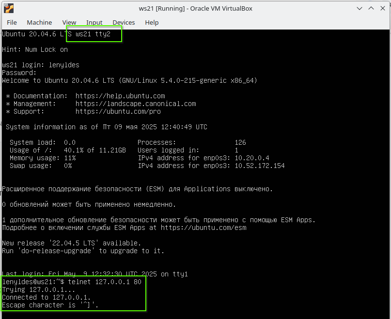

- Аналогичным образом воспользуемся *Remote TCP forwarding* c ws11 до ws22, чтобы получить доступ к веб-серверу на ws22 с ws11.

> Подключение по ssh -R\
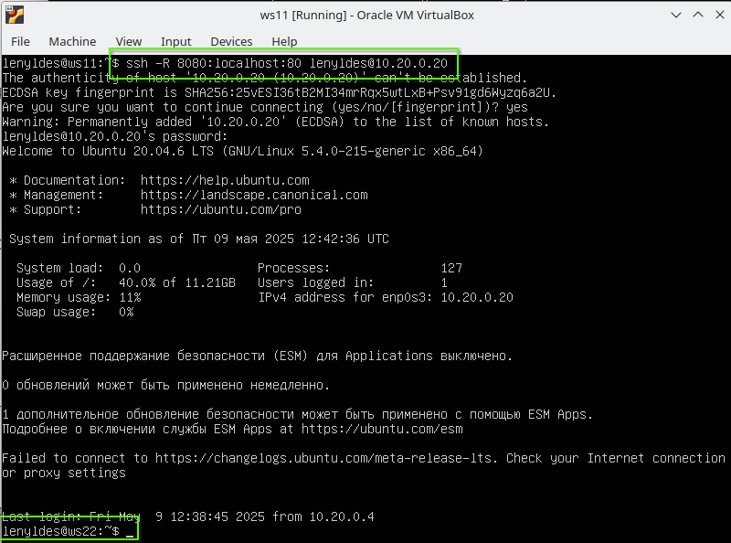

> Проверка подключения\
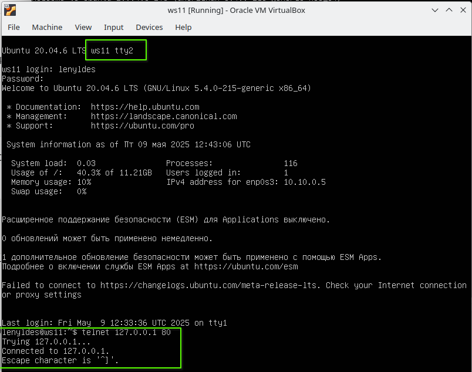
