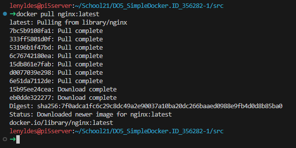
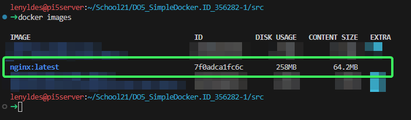
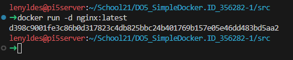
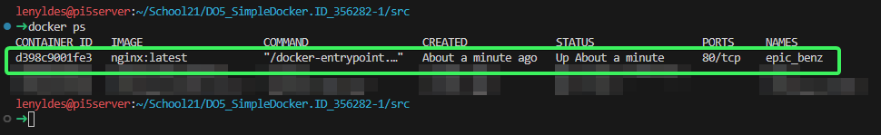
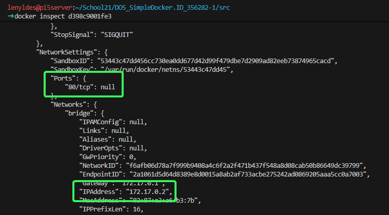
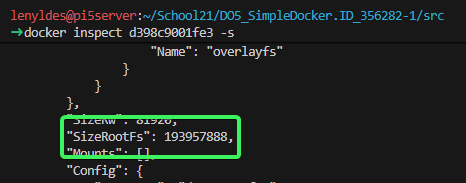
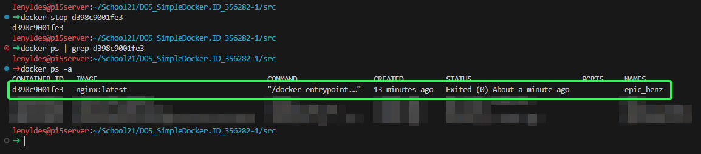
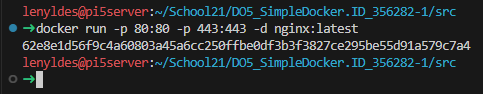
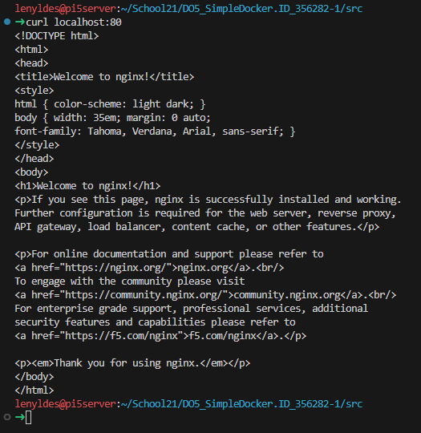
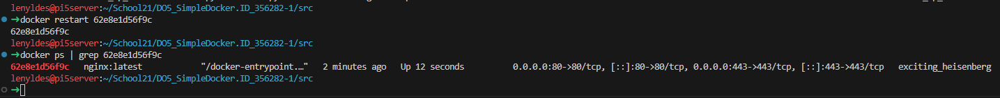

# Part 1. Готовый докер

## Содержание

- [1. Возьми официальный докер-образ с nginx и выкачай его при помощи docker pull](#1-возьми-официальный-докер-образ-с-nginx-и-выкачай-его-при-помощи-docker-pull)
- [2. Проверь наличие докер-образа через docker images](#2-проверь-наличие-докер-образа-через-docker-images)
- [3. Запусти докер-образ через docker run -d [image_id|repository]](#3-запусти-докер-образ-через-docker-run--d-image_idrepository)
- [4. Проверь, что образ запустился через docker ps](#4-проверь-что-образ-запустился-через-docker-ps)
- [5. Посмотри информацию о контейнере через docker inspect [container_id|container_name]](#5-посмотри-информацию-о-контейнере-через-docker-inspect-container_idcontainer_name)
- [6. Останови докер контейнер через docker stop [container_id|container_name]](#6-останови-докер-контейнер-через-docker-stop-container_idcontainer_name)
- [7. Запусти докер с портами 80 и 443 в контейнере, замапленными на такие же порты на локальной машине](#7-запусти-докер-с-портами-80-и-443-в-контейнере-замапленными-на-такие-же-порты-на-локальной-машине)
- [8. Проверь, что в браузере по адресу localhost:80 доступна стартовая страница nginx](#8-проверь-что-в-браузере-по-адресу-localhost80-доступна-стартовая-страница-nginx)
- [9. Перезапусти докер контейнер через docker restart [container_id|container_name]](#9-перезапусти-докер-контейнер-через-docker-restart-container_idcontainer_name)

## 1. Возьми официальный докер-образ с **nginx** и выкачай его при помощи `docker pull`

Официальный образ с **nginx** можно найти в Docker Hub: http://hub.docker.com/_/nginx

Загрузим последнюю версию с помощью команды:

```bash
docker pull nginx:latest
```

> **Примечание:** Команда `docker pull` загружает (выгружает) образ из реестра Docker. Если не указывать тег, по умолчанию используется `latest`.



## 2. Проверь наличие докер-образа через `docker images`

Чтобы проверить наличие образа, выполним команду:

```bash
docker images
```

Эта команда отображает список всех локальных образов Docker, включая:
- **IMAGE** — имя образа
- **ID** — уникальный идентификатор



## 3. Запусти докер-образ через `docker run -d [image_id|repository]`

Чтобы запустить докер-образ, выполним команду:

```bash
docker run -d nginx:latest
```

Флаг `-d` (detached mode) означает запуск контейнера в фоновом режиме. Контейнер запускается как демон и не блокирует терминал. Это позволяет продолжать работу в терминале после запуска контейнера.

> **Полезные флаги команды `docker run`:**
> - `-d` — запуск в фоновом режиме (detached)
> - `--name` — задать имя контейнеру
> - `-p` — пробросить порты
> - `-v` — примонтировать том
> - `-e` — установить переменную окружения



## 4. Проверь, что образ запустился через `docker ps`

Чтобы проверить, что образ запустился, выполним команду:

```bash
docker ps
```

Команда `docker ps` отображает список запущенных контейнеров с информацией:
- **CONTAINER ID** — идентификатор контейнера
- **IMAGE** — имя образа
- **COMMAND** — запущенная команда
- **CREATED** — время создания
- **STATUS** — текущий статус
- **PORTS** — проброшенные порты
- **NAMES** — имя контейнера

> **Примечание:** Для отображения всех контейнеров (включая остановленные) используй флаг `-a`: `docker ps -a`



## 5. Посмотри информацию о контейнере через `docker inspect [container_id|container_name]`. По выводу команды определи и помести в отчёт размер контейнера, список замапленных портов и ip контейнера.

Чтобы посмотреть информацию о контейнере, выполним команду:

```bash
docker inspect d398c9001fe3
```

В выводе обратим внимание на следующие поля:
- **`.NetworkSettings.Ports`** — список замапленных портов
- **`.NetworkSettings.IPAddress`** — IP-адрес контейнера



Чтобы узнать размер контейнера, нужно дополнительно указать флаг `-s` (--size):

```bash
docker inspect d398c9001fe3 -s
```

Размер контейнера можно увидеть в строке (в байтах):
- **`SizeRootFs`** — общий размер корневой файловой системы контейнера (включая базовый образ)



## 6. Останови докер контейнер через `docker stop [container_id|container_name]`

Остановить контейнер можно командой:

```bash
docker stop d398c9001fe3
```

Проверить, что он остановился, можно командой:

```bash
docker ps | grep d398c9001fe3
```

(ожидаем пустой вывод)

Или командой:

```bash
docker ps -a
```

(покажет все контейнеры, включая остановленные)

> **Примечание:** Команда `docker stop` отправляет контейнеру сигнал `SIGTERM`, давая ему время на корректное завершение работы. Если контейнер не останавливается, можно использовать `docker kill` для принудительной остановки.



## 7. Запусти докер с портами 80 и 443 в контейнере, замапленными на такие же порты на локальной машине

Чтобы запустить докер с портами 80 и 443 в контейнере, замапленными на такие же порты на локальной машине, нужно выполнить команду:

```bash
docker run -p 80:80 -p 443:443 nginx:latest
```

где:
- `-p <порт_хоста>:<порт_контейнера>` — пробрасывает порт из контейнера на хост
- `80:80` — порт 80 контейнера мапится на порт 80 хоста
- `443:443` — порт 443 контейнера мапится на порт 443 хоста

> **Важно:** Если порты 80 и 443 уже заняты на хосте, можно использовать другие порты, например: `-p 8080:80 -p 8443:443`



## 8. Проверь, что в браузере по адресу *localhost:80* доступна стартовая страница **nginx**

Проверим, что стартовая страница по адресу *localhost:80* доступна с помощью команды `curl` (так как работа ведется на серверной ОС без GUI):

```bash
curl localhost:80
```

> **Примечание:** Команда `curl` отправляет HTTP-запрос на указанный адрес. Если nginx запущен корректно, в ответе будет содержаться HTML-код приветственной страницы nginx.



## 9. Перезапусти докер контейнер через `docker restart [container_id|container_name]`. Проверь любым способом, что контейнер запустился.

Перезапустим контейнер командой:

```bash
docker restart 62e8e1d56f9c
```

и проверим, что он запустился командой:

```bash
docker ps | grep 62e8e1d56f9c
```

> **Примечание:** Команда `docker restart` эквивалентна последовательному выполнению `docker stop` и `docker start`. Она полезна для перезапуска контейнера без изменения его конфигурации.


