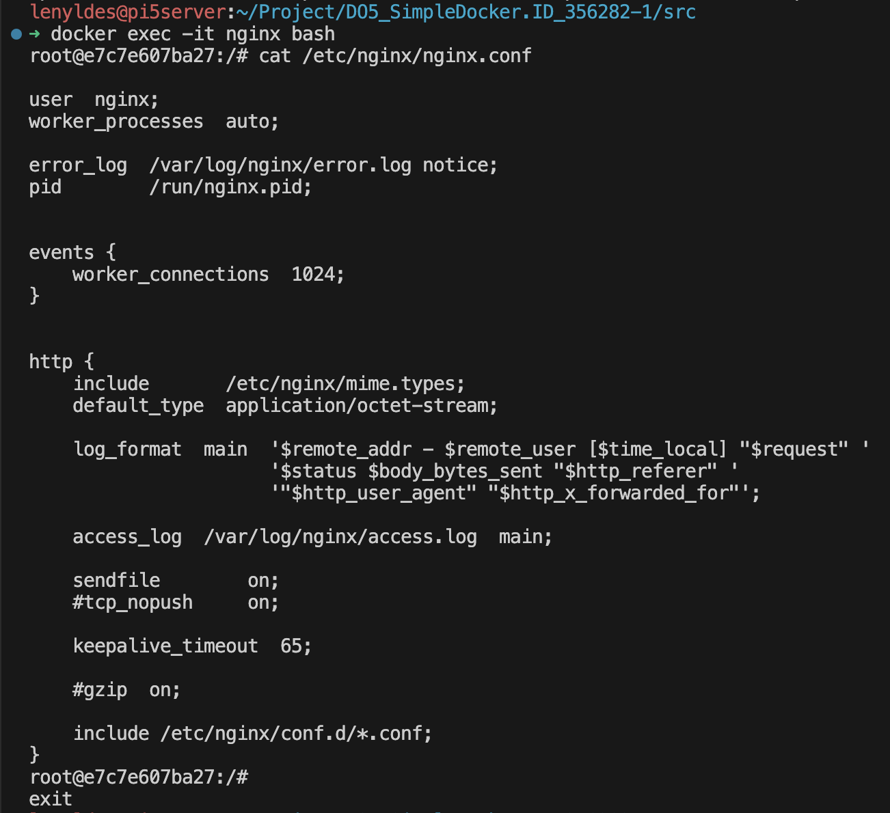
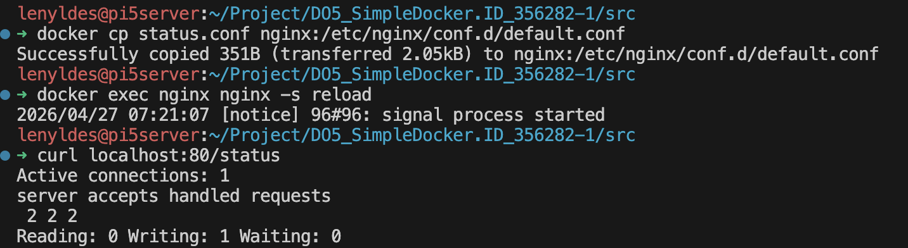
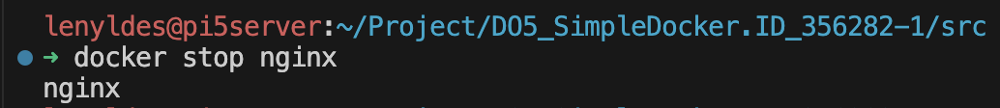
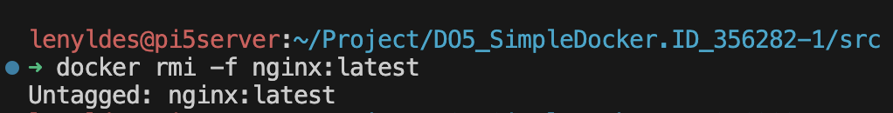
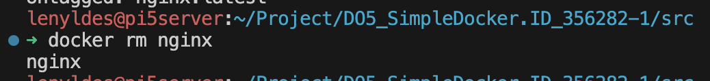
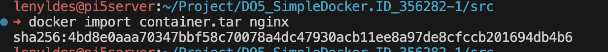
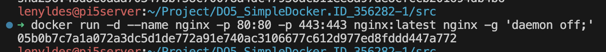
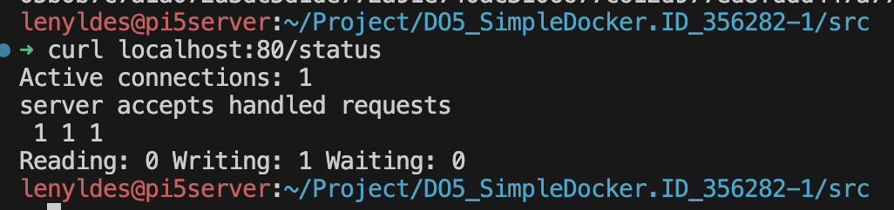

# Part 2. Операции с контейнером

## Содержание

- [1. Прочитай конфигурационный файл *nginx.conf* внутри докер контейнера через команду *exec*](#1-прочитай-конфигурационный-файл-nginxconf-внутри-докер-контейнера-через-команду-exec)
- [2. Создай и настрой файл *nginx.conf*, скопируй его в контейнер через `docker cp`, перезапусти **nginx** и проверь доступность */status*](#2-создай-и-настрой-файл-nginxconf-скопируй-его-в-контейнер-через-docker-cp-перезапусти-nginx-и-проверь-доступность-status)
- [3. Экспортируй контейнер в файл *container.tar* через команду *export*. Останови контейнер](#3-экспортируй-контейнер-в-файл-containertar-через-команду-export-останови-контейнер)
- [4. Удали образ через `docker rmi [image_id|repository]`, не удаляя перед этим контейнеры](#4-удали-образ-через-docker-rmi-image_idrepository-не-удаляя-перед-этим-контейнеры)
- [5. Удали остановленный контейнер](#5-удали-остановленный-контейнер)
- [6. Импортируй контейнер обратно через команду *import*](#6-импортируй-контейнер-обратно-через-команду-import)
- [7. Запусти импортированный контейнер](#7-запусти-импортированный-контейнер)
- [8. Проверь, что по адресу *localhost:80/status* отдается страничка со статусом сервера **nginx**](#8-проверь-что-по-адресу-localhost80status-отдается-страничка-со-статусом-сервера-nginx)

## 1. Прочитай конфигурационный файл *nginx.conf* внутри докер контейнера через команду *exec*

Для начала запустим контейнер, если он ещё не запущен:

```bash
docker run -d --name nginx -p 80:80 -p 443:443 nginx:latest
```

Зайдём внутрь контейнера в интерактивном режиме:

```bash
docker exec -it nginx bash
```

И прочитаем конфигурационный файл:

```bash
cat /etc/nginx/nginx.conf
```



Или можно прочитать файл, не заходя в контейнер:

```bash
docker exec nginx cat /etc/nginx/nginx.conf
```

> **Примечание:** Команда `docker exec -it` запускает процесс внутри уже работающего контейнера. Флаги `-it` означают интерактивный режим с подключением псевдотерминала (TTY), что позволяет работать с bash-сессией контейнера.

## 2. Создай и настрой файл *nginx.conf*, скопируй его в контейнер через `docker cp`, перезапусти **nginx** и проверь доступность */status*

Создадим конфигурационный файл следующего содержания:

```nginx
server {
    listen       80;
    listen  [::]:80;
    server_name  localhost;

    location / {
        root   /usr/share/nginx/html;
        index  index.html index.htm;
    }

    location /status {
        stub_status;
    }

    error_page   500 502 503 504  /50x.html;
    location = /50x.html {
        root   /usr/share/nginx/html;
    }
}
```

> **Примечание:** `stub_status` — директива модуля `ngx_http_stub_status_module`, которая включает отображение базовой статистики nginx: количество активных соединений, принятых и обработанных запросов.

Запишем его в файл `default.conf`, так как основной `nginx.conf` подключает все конфигурации из каталога `/etc/nginx/conf.d/` через директиву `include`, а конфигурация виртуального хоста по умолчанию хранится именно в `default.conf`.

Скопируем файл в контейнер:

```bash
docker cp default.conf nginx:/etc/nginx/conf.d/default.conf
```

Перезапустим nginx внутри контейнера, чтобы применить новую конфигурацию:

```bash
docker exec nginx nginx -s reload
```

Команда состоит из двух частей:
- `docker exec nginx` — выполнить команду внутри уже запущенного контейнера с именем `nginx`, не перезапуская его
- `nginx -s reload` — вызов бинарника nginx внутри контейнера с флагом `-s reload`, который отправляет сигнал мастер-процессу nginx перечитать конфигурацию: nginx запускает новые worker-процессы с обновлённым конфигом и плавно завершает старые после обработки текущих запросов (graceful reload — соединения не обрываются)

Проверим, что по адресу `/status` отдаётся страница статуса:

```bash
curl localhost:80/status
```



## 3. Экспортируй контейнер в файл *container.tar* через команду *export*. Останови контейнер

Экспортируем файловую систему контейнера в архив:

```bash
docker export nginx > container.tar
```

Остановим контейнер:

```bash
docker stop nginx
```



> **Примечание:** Команда `docker export` сохраняет файловую систему контейнера в `.tar`-архив. В отличие от `docker save` (которая экспортирует образ вместе с историей слоёв), `export` сохраняет только текущее состояние файловой системы контейнера без метаданных.

## 4. Удали образ через `docker rmi [image_id|repository]`, не удаляя перед этим контейнеры

Удалим образ принудительно:

```bash
docker rmi -f nginx:latest
```

Флаг `-f` (force) позволяет удалить образ, даже если на его основе существуют контейнеры (включая остановленные).



> **Примечание:** Без флага `-f` команда `docker rmi` завершится с ошибкой, если на основе образа есть контейнеры. Образ при этом удаляется, но его теги «отвязываются» от контейнеров — сами контейнеры остаются.

## 5. Удали остановленный контейнер

Удалим остановленный контейнер:

```bash
docker rm nginx
```



> **Примечание:** Команда `docker rm` удаляет только остановленные контейнеры. Для удаления работающего контейнера используй флаг `-f`.

## 6. Импортируй контейнер обратно через команду *import*

Импортируем архив как новый образ:

```bash
docker import container.tar nginx
```



> **Примечание:** Команда `docker import` создаёт новый образ из `.tar`-архива файловой системы. В отличие от `docker load`, импортированный образ не содержит истории слоёв и метаданных, поэтому при запуске необходимо явно указывать команду запуска.

## 7. Запусти импортированный контейнер

Запустим импортированный контейнер:

```bash
docker run -d --name nginx -p 80:80 -p 443:443 nginx nginx -g 'daemon off;'
```



> **Примечание:** Параметр `nginx -g 'daemon off;'` необходим, чтобы nginx не уходил в фоновый режим. Docker ожидает, что главный процесс контейнера работает на переднем плане: если nginx запустится как демон, Docker решит, что процесс завершился, и остановит контейнер.

## 8. Проверь, что по адресу *localhost:80/status* отдается страничка со статусом сервера **nginx**

Проверим, что страница статуса доступна:

```bash
curl localhost:80/status
```


