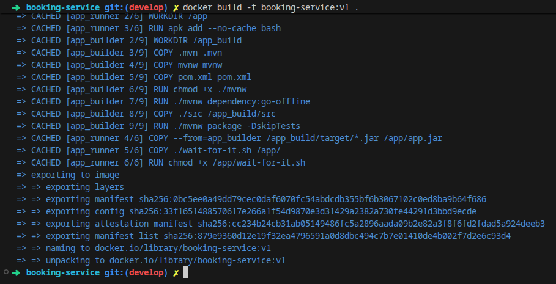
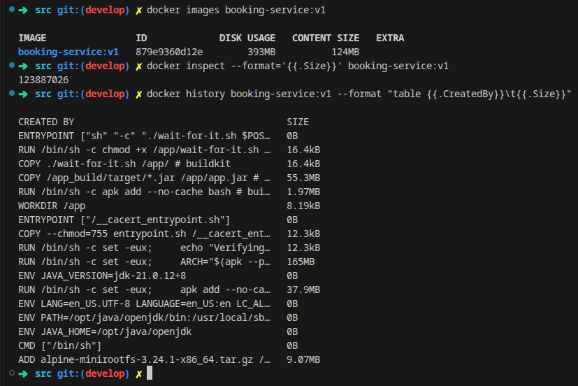
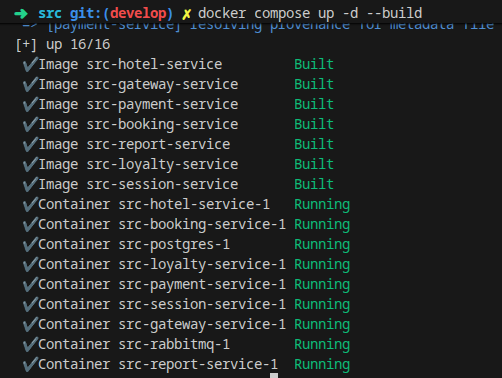
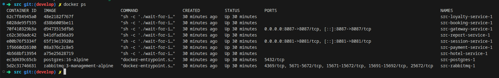
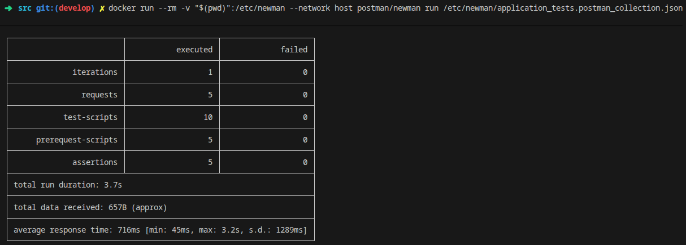

# Основы оркестрации контейнеров

Использование инструментов Docker Compose и Docker Swarm для совместного запуска контейнеров и их простейшей оркестрации.

## Оглавление

1. [Part 1. Запуск нескольких Docker-контейнеров с использованием Docker Compose](#part-1-запуск-нескольких-docker-контейнеров-с-использованием-docker-compose) 
2. [Part 2. Создание виртуальных машин](#part-2-создание-виртуальных-машин) 
3. [Part 3. Создание простейшего Docker Swarm](#part-3-создание-простейшего-docker-swarm)

## Part 1. Запуск нескольких Docker-контейнеров с использованием Docker Compose

### 1.1. Написание Dockerfile для каждого микросервиса

- Для каждого микросервиса был написан `Dockerfile` с использованием многоэтапной сборки (**multi-stage build**). Это позволяет разделить среду компиляции и сборки приложения от среды исполнения, исключив из финального образа тяжеловесный JDK и Maven, тем самым существенно уменьшив размер итогового контейнера и повысив безопасность.

Пример `Dockerfile` для сервиса **booking-service**:

```dockerfile
# Этап сборки (Build Stage)
FROM eclipse-temurin:21-jdk-alpine AS app_builder

WORKDIR /app_build

# Копирование файлов Maven Wrapper и pom.xml для кэширования зависимостей
COPY .mvn .mvn
COPY mvnw mvnw
COPY pom.xml pom.xml

RUN chmod +x ./mvnw

# Предварительная загрузка зависимостей проекта
RUN ./mvnw dependency:go-offline

# Копирование исходного кода и сборка приложения
COPY ./src /app_build/src

RUN ./mvnw package -DskipTests 

# Этап запуска (Run Stage)
FROM eclipse-temurin:21-jre-alpine AS app_runner

WORKDIR /app

# Установка bash, необходимого для работы скрипта wait-for-it.sh
RUN apk add --no-cache bash

# Копирование скомпилированного jar-файла и скрипта ожидания
COPY --from=app_builder /app_build/target/*.jar /app/app.jar
COPY ./wait-for-it.sh /app/

RUN chmod +x /app/wait-for-it.sh

# Запуск с ожиданием готовности базы данных PostgreSQL
ENTRYPOINT ["sh", "-c", "./wait-for-it.sh $POSTGRES_HOST:$POSTGRES_PORT -- java -jar app.jar"]
```

> ⚠ **Возможная ошибка при первичной сборке сервисов (Git LFS)** \
> **Симптом:** \
> При сборке или выполнении команды `./mvnw dependency:go-offline` возникает ошибка: \
> `Error: Could not find or load main class org.apache.maven.wrapper.MavenWrapperMain` \
> **Причина:** \
> Бинарные архивы Maven Wrapper (`.mvn/wrapper/maven-wrapper.jar`) хранятся в репозитории с использованием расширения Git LFS (Large File Storage). Если репозиторий был склонирован в системе без предварительно настроенного `git-lfs`, вместо исполняемых `.jar`-файлов загружаются 130-байтные текстовые указатели (pointer files). В результате виртуальная машина Java не может обнаружить главный класс обертки. \
> **Решение:** \
> Установить расширение `git-lfs` в систему, инициализировать его в Git и выкачать оригинальные бинарные файлы: \
> ```sh
> sudo apt update && sudo apt install -y git-lfs
> git lfs install
> git lfs pull
> ```

- Собираем образ микросервиса с помощью команды:
  `docker build -t booking-service:v1 .` \
  где:
  - `-t booking-service:v1` — присвоение тега (имени) создаваемому образу;
  - `.` — указание контекста сборки (текущая директория).

> Сборка Docker-образа для booking-service \


- **Особенности и различия в Dockerfile других микросервисов:**
  - Микросервисы `hotel-service`, `loyalty-service`, `payment-service`, `report-service` и `session-service` имеют аналогичную структуру и ожидают доступности базы данных PostgreSQL по адресу `$POSTGRES_HOST:$POSTGRES_PORT`.
  - В сервисе **gateway-service** точка входа изменена, так как шлюз ожидает готовности сервиса управления сессиями (`session-service`), а не PostgreSQL напрямую:
    ```dockerfile
    ENTRYPOINT ["sh", "-c", "./wait-for-it.sh $SESSION_SERVICE_HOST:$SESSION_SERVICE_PORT -- java -jar app.jar"]
    ```

- **Отображение размера собранного образа различными способами:**

  1. С помощью команды `docker images` / `docker image ls` (общий список образов с размером на диске):
     ```sh
     docker images booking-service:v1
     ```
     *Вывод:*
     ```text
     IMAGE                ID             DISK USAGE   CONTENT SIZE
     booking-service:v1   879e9360d12e        393MB          124MB
     ```
     

  2. С помощью команды `docker inspect` с форматированием (точное значение размера образа в байтах):
     ```sh
     docker inspect --format='{{.Size}}' booking-service:v1
     ```
     *Вывод:* `123887026` байт (~124 МБ)

  3. С помощью команды `docker history` (просмотр размеров каждого отдельного слоя образа):
     ```sh
     docker history booking-service:v1 --format "table {{.CreatedBy}}\t{{.Size}}"
     ```

> Отображение размера собранного образа различными способами \



### 1.2. Написание Docker Compose файла

- Для совместного запуска всех микросервисов и инфраструктурных компонентов (PostgreSQL и RabbitMQ) был подготовлен файл `docker-compose.yml`.
- В конфигурации определены все зависимости между сервисами (`depends_on`), прописаны переменные окружения для подключения к БД и очереди сообщений.
- В соответствии с заданием, наружу (на хост-машину) проброшены порты только для **gateway-service** (`8087:8087`) и **session-service** (`8081:8081`). Остальные сервисы изолированы внутри создаваемой Docker-сети.

Фрагмент файла `docker-compose.yml`:

```yaml
services:
  postgres:
    image: postgres:16-alpine
    restart: always
    environment:
      POSTGRES_USER: postgres
      POSTGRES_PASSWORD: postgres
      POSTGRES_DB: users_db
    volumes:
      - ./services/database/init.sql:/docker-entrypoint-initdb.d/init.sql:ro

  rabbitmq:
    image: rabbitmq:3-management-alpine
    restart: always

  session-service:
    build: ./services/session-service
    depends_on:
      - postgres
      - rabbitmq
    environment:
      POSTGRES_HOST: postgres
      POSTGRES_PORT: 5432
      POSTGRES_USER: postgres
      POSTGRES_PASSWORD: "postgres"
      POSTGRES_DB: users_db
    ports:
      - 8081:8081

  gateway-service:
    build: ./services/gateway-service
    depends_on:
      - postgres
      - rabbitmq
    environment:
      SESSION_SERVICE_HOST: session-service
      SESSION_SERVICE_PORT: 8081
      HOTEL_SERVICE_HOST: hotel-service
      HOTEL_SERVICE_PORT: 8082
      BOOKING_SERVICE_HOST: booking-service
      BOOKING_SERVICE_PORT: 8083
      PAYMENT_SERVICE_HOST: payment-service
      PAYMENT_SERVICE_PORT: 8084
      LOYALTY_SERVICE_HOST: loyalty-service
      LOYALTY_SERVICE_PORT: 8085
      REPORT_SERVICE_HOST: report-service
      REPORT_SERVICE_PORT: 8086
    ports:
      - 8087:8087

  booking-service:
    build: ./services/booking-service
    depends_on:
      - postgres
      - rabbitmq
    environment:
      POSTGRES_HOST: postgres
      POSTGRES_PORT: 5432
      POSTGRES_USER: postgres
      POSTGRES_PASSWORD: "postgres"
      POSTGRES_DB: reservations_db
      RABBIT_MQ_HOST: rabbitmq
      RABBIT_MQ_PORT: 5672
      RABBIT_MQ_USER: guest
      RABBIT_MQ_PASSWORD: guest
      RABBIT_MQ_QUEUE_NAME: messagequeue
      RABBIT_MQ_EXCHANGE: messagequeue-exchange
      HOTEL_SERVICE_HOST: hotel-service
      HOTEL_SERVICE_PORT: 8082
      PAYMENT_SERVICE_HOST: payment-service
      PAYMENT_SERVICE_PORT: 8084
      LOYALTY_SERVICE_HOST: loyalty-service
      LOYALTY_SERVICE_PORT: 8085

  # Аналогичным образом описаны hotel-service, loyalty-service, payment-service, report-service
```

### 1.3. Сборка и развертывание веб-сервиса

- Выполняем сборку образов и запуск всех сервисов с помощью Docker Compose:
  ```sh
  docker compose up -d --build
  ```
  где:
  - `-d` (detached) — запуск контейнеров в фоновом режиме;
  - `--build` — сборка (или пересборка) образов перед запуском контейнеров.

> Сборка и запуск сервисов с помощью команды `docker compose up -d --build` \


- Проверяем статус работы запущенных контейнеров командой `docker ps`:
  ```sh
  docker ps
  ```
  Все контейнеры (PostgreSQL, RabbitMQ и 7 микросервисов) успешно запущены и находятся в статусе `Up`.

> Просмотр запущенных контейнеров с помощью команды `docker ps` \


### 1.4. Тестирование с помощью Postman (Newman)

- Для запуска заготовленной коллекции тестов в консольном режиме воспользуемся Docker-образом утилиты **Newman** (CLI-раннер для Postman):
  ```sh
  docker run --rm -v "$(pwd)":/etc/newman --network host postman/newman run /etc/newman/application_tests.postman_collection.json
  ```
  где:
  - `--rm` — автоматическое удаление контейнера Newman после завершения тестов;
  - `-v "$(pwd)":/etc/newman` — монтирование текущей рабочей директории внутрь контейнера по пути `/etc/newman`;
  - `--network host` — использование сетевого пространства хоста для доступа к портам локально запущенных сервисов (`8087` и `8081`);
  - `run /etc/newman/application_tests.postman_collection.json` — запуск выполнения коллекции тестов.

> Результаты выполнения тестов Postman через Newman \


- В результате прогона все 5 запросов и 5 проверок (assertions) завершились успешно (`failed: 0`), веб-сервис полностью работоспособен.

## Part 2. Создание виртуальных машин

### 2.1. Инициализация и запуск виртуальной машины

- На официальном портале [Vagrant Cloud](https://portal.cloud.hashicorp.com/vagrant/discover) выбираем подходящий образ операционной системы. Выбран базовый бокс `bento/ubuntu-24.04` (версия `202510.26.0`).
- В директории проекта инициализируем конфигурацию Vagrant командой:
  ```sh
  vagrant init bento/ubuntu-24.04 --box-version 202510.26.0
  ```
- Для переноса исходного кода веб-сервиса в рабочую директорию виртуальной машины настраиваем общую папку в сгенерированном файле `Vagrantfile`:
  ```ruby
  Vagrant.configure("2") do |config|
    config.vm.box = "bento/ubuntu-24.04"
    config.vm.box_version = "202510.26.0"
    config.vm.synced_folder ".", "/vagrant_data"
  end
  ```
- Запускаем виртуальную машину командой `vagrant up`:
  ```sh
  vagrant up
  ```

> Запуск виртуальной машины командой `vagrant up` \


### 2.2. Подключение к виртуальной машине и проверка директории

- Подключаемся к запущенной виртуальной машине по SSH:
  ```sh
  vagrant ssh
  ```
- Переходим в директорию `/vagrant_data` и проверяем наличие перенесенных исходных кодов с помощью команды `ls -la`:
  ```sh
  cd /vagrant_data/
  ls -la
  ```
  Все файлы проекта (включая директорию с сервисами, `docker-compose.yml`, `REPORT.md` и коллекцию тестов) успешно смонтированы в гостевую систему.

> Подключение по SSH и проверка наличия файлов проекта в директории /vagrant_data \


- Завершаем сессию SSH и выходим из виртуальной машины командой `exit` (или сочетанием клавиш `Ctrl+D`).

### 2.3. Остановка и уничтожение виртуальной машины

> **Справка: `vagrant halt` vs `vagrant destroy`**
> - `vagrant halt` (*Graceful Shutdown*) — отправляет операционной системе сигнал на корректное завершение работы (аналог `shutdown -h now`). Состояние виртуального диска и настройки ВМ сохраняются. При следующем `vagrant up` машина включится обратно.
> - `vagrant destroy` — полностью удаляет виртуальную машину и её виртуальные диски из гипервизора. Проект возвращается в исходное состояние (`not created`). При следующем `vagrant up` виртуальная машина будет создана заново с нуля по правилам из `Vagrantfile`.
> 
> *Примечание:* флаг `-f` (`--force`) при уничтожении позволяет пропустить интерактивный запрос подтверждения удаления (*Are you sure...?*).

- Уничтожаем созданную виртуальную машину и проверяем её текущий статус:
  ```sh
  vagrant destroy
  vagrant status
  ```
  Статус `default not created (virtualbox)` подтверждает, что виртуальная машина успешно удалена из системы.

> Уничтожение виртуальной машины и проверка статуса командой `vagrant status` \


## Part 3. Создание простейшего Docker Swarm

### 3.1. Настройка кластера из трех машин и развертывание Docker Swarm

- Создаем shell-скрипт `script/docker-install.sh` для автоматической установки Docker Engine, CLI, containerd, Docker Compose и добавления пользователя `vagrant` в группу `docker`:

```bash
#!/bin/bash

# Добавление официального GPG ключа Docker:
sudo apt update
sudo apt install -y ca-certificates curl
sudo install -m 0755 -d /etc/apt/keyrings
sudo curl -fsSL https://download.docker.com/linux/ubuntu/gpg -o /etc/apt/keyrings/docker.asc
sudo chmod a+r /etc/apt/keyrings/docker.asc

# Добавление репозитория в источники Apt:
sudo tee /etc/apt/sources.list.d/docker.sources <<EOF
Types: deb
URIs: https://download.docker.com/linux/ubuntu
Suites: $(. /etc/os-release && echo "${UBUNTU_CODENAME:-$VERSION_CODENAME}")
Components: stable
Architectures: $(dpkg --print-architecture)
Signed-By: /etc/apt/keyrings/docker.asc
EOF

sudo apt update

# Установка пакетов Docker:
sudo apt install -y docker-ce docker-ce-cli containerd.io docker-buildx-plugin docker-compose-plugin

# Добавление пользователя vagrant в группу docker для работы без sudo:
sudo usermod -aG docker vagrant
```

- Модифицируем `Vagrantfile` для создания трех виртуальных машин: `manager01` (2 CPU, 2048 MB RAM) и двух воркеров `worker01`, `worker02` (1 CPU, 1024 MB RAM) с выделенной приватной сетью `192.168.10.0/24`:

```ruby
Vagrant.configure("2") do |config|
  config.vm.box = "bento/ubuntu-24.04"
  config.vm.box_version = "202510.26.0"

  config.vm.define "manager01" do |node|
    node.vm.hostname = "manager01"
    node.vm.network "private_network", ip: "192.168.10.10"
    node.vm.provider "virtualbox" do |vb|
      vb.memory = 2048
      vb.cpus = 2
    end
    node.vm.synced_folder ".", "/vagrant_data"
    node.vm.provision "shell", path: "script/docker-install.sh"
  end

  config.vm.define "worker01" do |node|
    node.vm.hostname = "worker01"
    node.vm.network "private_network", ip: "192.168.10.11"
    node.vm.provider "virtualbox" do |vb|
      vb.memory = 1024
      vb.cpus = 1
    end
    node.vm.provision "shell", path: "script/docker-install.sh"
  end

  config.vm.define "worker02" do |node|
    node.vm.hostname = "worker02"
    node.vm.network "private_network", ip: "192.168.10.12"
    node.vm.provider "virtualbox" do |vb|
      vb.memory = 1024
      vb.cpus = 1
    end
    node.vm.provision "shell", path: "script/docker-install.sh"
  end
end
```

- Запускаем виртуальные машины командой `vagrant up` и проверяем их статус:

> Проверка статуса виртуальных машин командой `vagrant status` \


- Проверяем корректность установки Docker на всех созданных машинах:

> Проверка установки Docker на узлах кластера \


> **Справка: Зачем нужен флаг `--advertise-addr`?** \
> В виртуальных машинах Vagrant настроено несколько сетевых интерфейсов: \
> • `eth0` (дефолтный NAT от Vagrant для выхода в интернет, например `10.0.2.15`); \
> • `eth1` (наша статическая приватная сеть `192.168.10.10`). \
> Если не указать `--advertise-addr`, Docker Swarm может выбрать интерфейс NAT, и тогда рабочие узлы (worker-ноды) не смогут подключиться к менеджеру. Поэтому мы явно указываем статический IP менеджера (`192.168.10.10`).

- Подключаемся к `manager01` через `vagrant ssh manager01` и инициализируем кластер Docker Swarm:
  ```sh
  docker swarm init --advertise-addr 192.168.10.10
  ```

> Инициализация Docker Swarm на manager01 и получение токена присоединения \


- Подключаем рабочие узлы `worker01` и `worker02` к кластеру, выполнив полученную команду с токеном:
  ```sh
  docker swarm join --token <SWARM_JOIN_TOKEN> 192.168.10.10:2377
  ```

> Подключение worker01 и worker02 к Docker Swarm \


- На узле `manager01` проверяем состав и готовность всех узлов кластера командой `docker node ls`:

> Просмотр списка узлов кластера с помощью команды `docker node ls` \


---

### 3.2. Сборка образов, отправка на Docker Hub и настройка Nginx Proxy

- Собираем мультиплатформенные образы микросервисов и пушим их в реестр Docker Hub с помощью `docker buildx`:
  ```sh
  docker buildx build --platform linux/amd64,linux/arm64 -t lenyldes/booking-service:1 --push ./services/booking-service
  # Аналогично собираются и пушатся gateway-service, hotel-service, loyalty-service, payment-service, report-service, session-service
  ```

- Для маршрутизации трафика и сокрытия сервисов настраиваем обратный прокси **Nginx**:
  - Файл конфигурации `services/nginx/nginx.conf`:
    ```nginx
    server {
        listen 8081;
        location / {
            proxy_pass http://session-service:8081;
        }
    }

    server {
        listen 8087;
        location / {
            proxy_pass http://gateway-service:8087;
        }
    }
    ```
  - `Dockerfile` для Nginx:
    ```dockerfile
    FROM nginx:1.31.4-alpine-slim
    COPY nginx.conf /etc/nginx/conf.d/default.conf
    ```
  - Сборка и отправка образа прокси на Docker Hub:
    ```sh
    docker buildx build --platform linux/amd64,linux/arm64 -t lenyldes/nginx:1 --push ./services/nginx
    ```

- Модифицируем `docker-compose.yml`:
  1. Заменяем блоки локальной сборки `build:` на удаленные образы с Docker Hub `image: lenyldes/<service>:1`.
  2. Добавляем сервис `nginx-proxy`, пробрасывающий порты `8081:8081` и `8087:8087`.
  3. Убираем прямое пробрасывание портов из `gateway-service` и `session-service`, делая их доступными только внутри оверлейной сети через Nginx.

Фрагмент модифицированного `docker-compose.yml`:

```yaml
services:
  nginx-proxy:
    image: lenyldes/nginx:1
    ports:
      - 8081:8081
      - 8087:8087

  postgres:
    image: postgres:16-alpine
    restart: always
    environment:
      POSTGRES_USER: postgres
      POSTGRES_PASSWORD: postgres
      POSTGRES_DB: users_db
    volumes:
      - ./services/database/init.sql:/docker-entrypoint-initdb.d/init.sql:ro

  rabbitmq:
    image: rabbitmq:3-management-alpine
    restart: always

  session-service:
    image: lenyldes/session-service:1
    depends_on:
      - postgres
      - rabbitmq
    environment:
      POSTGRES_HOST: postgres
      POSTGRES_PORT: 5432
      POSTGRES_USER: postgres
      POSTGRES_PASSWORD: "postgres"
      POSTGRES_DB: users_db

  gateway-service:
    image: lenyldes/gateway-service:1
    depends_on:
      - postgres
      - rabbitmq
    environment:
      SESSION_SERVICE_HOST: session-service
      SESSION_SERVICE_PORT: 8081
      HOTEL_SERVICE_HOST: hotel-service
      HOTEL_SERVICE_PORT: 8082
      BOOKING_SERVICE_HOST: booking-service
      BOOKING_SERVICE_PORT: 8083
      PAYMENT_SERVICE_HOST: payment-service
      PAYMENT_SERVICE_PORT: 8084
      LOYALTY_SERVICE_HOST: loyalty-service
      LOYALTY_SERVICE_PORT: 8085
      REPORT_SERVICE_HOST: report-service
      REPORT_SERVICE_PORT: 8086

  # Аналогично подключены остальные микросервисы через образы lenyldes/<service>:1
```

---

### 3.3. Развертывание стека сервисов в Docker Swarm

- Подключаемся к `manager01`, переходим в директорию `/vagrant_data` со смонтированным проектом и разворачиваем стек:
  ```sh
  docker stack deploy -c docker-compose.yml hotel_app
  ```

> Развертывание стека hotel_app в Docker Swarm \


- Проверяем состояние всех сервисов стека командой `docker service ls` и дожидаемся готовности всех реплик (`1/1`):

> Просмотр статуса запущенных сервисов стека командой `docker service ls` \


---

### 3.4. Тестирование работоспособности с помощью Postman (Newman)

- Запускаем заготовленную коллекцию тестов через консольный Newman в Docker, передавая переменную `API_HOST=127.0.0.1` для гарантированного обращения по протоколу IPv4 к проксированному шлюзу:
  ```sh
  docker run --rm -v "$(pwd)":/etc/newman --network host postman/newman run /etc/newman/application_tests.postman_collection.json --env-var API_HOST=127.0.0.1
  ```

> Результаты выполнения тестов Newman в Docker Swarm \


- Все 5 запросов и assertions завершились успешно (`failed: 0`), сервисы корректно взаимодействуют через оверлейную сеть и Nginx.

---

### 3.5. Отображение распределения контейнеров по узлам с помощью команд Docker

- Отображаем полную историю и текущее распределение контейнеров стека по узлам кластера с помощью команды:
  ```sh
  docker stack ps hotel_app
  ```

> Просмотр распределения задач стека командой `docker stack ps hotel_app` \


- Для вывода только актуальных (работающих) задач используем механизм фильтрации `--filter` (`-f`):

  - **Вариант 1: Активные задачи всего стека:**
    ```sh
    docker stack ps --filter "desired-state=running" hotel_app
    ```
  - **Вариант 2: Активные задачи на конкретных узлах кластера:**
    ```sh
    docker node ps --filter "desired-state=running" manager01
    docker node ps --filter "desired-state=running" worker01
    docker node ps --filter "desired-state=running" worker02
    ```

> Просмотр только активных работающих задач на узлах \


---

### 3.6. Установка Portainer и визуализация распределения задач в кластере

- Разворачиваем стек Portainer Agent внутри кластера Docker Swarm:
  ```sh
  curl -L https://downloads.portainer.io/ce-lts/portainer-agent-stack.yml -o portainer-agent-stack.yml
  docker stack deploy -c portainer-agent-stack.yml portainer
  ```

- Находим имя запущенного контейнера Portainer с помощью `docker ps`:

> Поиск контейнера Portainer \


- Получаем сгенерированный пароль/токен первичной инициализации из логов контейнера командой `docker logs <container_id>`:

> Просмотр логов контейнера Portainer \


- Переходим в веб-браузер по адресу `https://192.168.10.10:9443/` и производим первичную настройку администратора:

> Веб-интерфейс первичной настройки Portainer \


- Открываем визуализатор Swarm Visualizer в Portainer и наблюдаем распределение контейнеров по всем трем узлам кластера:

> Визуализация распределения контейнеров по узлам в Portainer \


---

### 3.7. Тестирование отказоустойчивости кластера и перебалансировка

- Проверяем поведение оркестратора при аварийной остановке одного из рабочих узлов (`worker02`). При отключении узла Docker Swarm автоматически пересоздает упавшие задачи на оставшихся доступных узлах (`manager01` и `worker01`):

> Перераспределение задач после остановки узла worker02 \


> **Справка: Почему Swarm не возвращает контейнеры автоматически на вернувшийся узел?** \
> Главный закон оркестратора — **Принцип наименьшего вмешательства и стабильности** (*Principle of Least Disruption / Anti-Flapping*).
> 
> 1. **Текущее состояние соответствует желаемому (*Desired State*):** \
>    В конфигурации задана 1 реплика каждого сервиса. Когда узел вернулся, в кластере уже стабильно работает ровно 1 реплика каждого сервиса. Цель достигнута, расхождений нет.
> 2. **Защита от искусственного простоя (*Downtime & Service Churn*):** \
>    Чтобы перенести контейнер обратно на восстановившийся узел, Swarm пришлось бы принудительно убить работающий экземпляр (разорвать активные соединения, сбросить кэш памяти JVM) и потратить время на инициализацию нового сервиса на вернувшейся ноде, создав искусственный даунтайм.

> **Способы принудительной перебалансировки нагрузки:** \
> Если требуется равномерно распределить задачи после добавления/возврата узла:
> 1. **Принудительное плавное обновление (*Rolling Update / Rebalance*):**
>    ```sh
>    docker service update --force hotel_app_booking-service
>    ```
> 2. **Масштабирование сервиса (*Scale Up*):**
>    ```sh
>    docker service scale hotel_app_booking-service=2
>    ```
> 3. **Повторный деплой стека:**
>    ```sh
>    docker stack deploy -c docker-compose.yml hotel_app
>    ```

