# Инструменты автоматизации

Использование инструментов автоматизации для провизии узлов.

## Оглавление

1. [Part 1. Удаленное конфигурирование узла через Ansible](#part-1-удаленное-конфигурирование-узла-через-ansible)
   - [1.1. Создание виртуальных машин с помощью Vagrant](#11-создание-виртуальных-машин-с-помощью-vagrant)
   - [1.2. Подготовка manager как рабочей станции для Ansible](#12-подготовка-manager-как-рабочей-станции-для-ansible)
   - [1.3. Написание первого плейбука Ansible и запуск микросервисов](#13-написание-первого-плейбука-ansible-и-запуск-микросервисов)
   - [1.4. Тестирование микросервисного приложения через Postman](#14-тестирование-микросервисного-приложения-через-postman)
   - [1.5. Декомпозиция сценариев на роли Ansible (application, apache, postgres)](#15-декомпозиция-сценариев-на-роли-ansible-application-apache-postgres)
2. [Part 2. Service Discovery](#part-2-service-discovery)
   - [2.1. Написание конфигурационных файлов для Consul (Server и Client)](#21-написание-конфигурационных-файлов-для-consul-server-и-client)
   - [2.2. Создание виртуальных машин для Service Discovery](#22-создание-виртуальных-машин-для-service-discovery)
   - [2.3. Настройка ролей Ansible (Consul Server/Client, PostgreSQL, Hotels Service)](#23-настройка-ролей-ansible-consul-serverclient-postgresql-hotels-service)
   - [2.4. Тестирование CRUD-операций сервиса отелей и проверка Service Discovery](#24-тестирование-crud-операций-сервиса-отелей-и-проверка-service-discovery)

---

## Part 1. Удаленное конфигурирование узла через Ansible

### 1.1. Создание виртуальных машин с помощью Vagrant

- В качестве базовой операционной системы выбран официальный образ Ubuntu 24.04 LTS (`bento/ubuntu-24.04`, версия `202510.26.0`).
- В рабочей директории проекта `src/` инициализируем конфигурацию Vagrant командой:
  ```sh
  vagrant init bento/ubuntu-24.04 --box-version 202510.26.0
  ```

> Инициализация Vagrantfile \
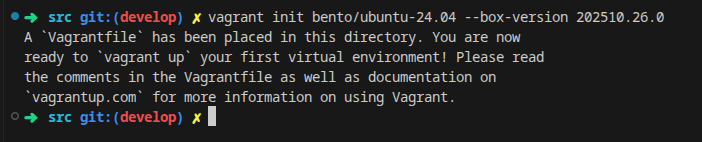

- В соответствии с требованиями задания настраиваем файл `Vagrantfile` для создания трех виртуальных машин:
  - **manager** (`192.168.56.10`, 2 CPU, 2048 MB RAM) — станция управления Ansible;
  - **node01** (`192.168.56.11`, 1 CPU, 1024 MB RAM) — узел для развертывания микросервисного стека (с пробросом портов `8081` и `8087` на хост);
  - **node02** (`192.168.56.12`, 1 CPU, 1024 MB RAM) — узел для веб-сервера Apache и СУБД PostgreSQL.

> ⚠ **Важное условие:** в соответствии с заданием, установка Docker через provision-скрипты Vagrant на этапе создания машин не производится. Вся провизия будет выполняться исключительно средствами Ansible.

Конфигурация `Vagrantfile`:

```ruby
# -*- mode: ruby -*-
# vi: set ft=ruby :

Vagrant.configure("2") do |config|
  config.vm.box = "bento/ubuntu-24.04"
  config.vm.box_version = "202510.26.0"

  config.vm.define "manager" do |node|
    node.vm.hostname = "manager"
    node.vm.network "private_network", ip: "192.168.56.10"
    
    node.vm.provider "virtualbox" do |vb|
      vb.memory = 2048
      vb.cpus = 2
    end
  end

  config.vm.define "node01" do |node|
    node.vm.hostname = "node01"
    node.vm.network "private_network", ip: "192.168.56.11"
    node.vm.network "forwarded_port", guest: 8081, host: 8081
    node.vm.network "forwarded_port", guest: 8087, host: 8087

    node.vm.provider "virtualbox" do |vb|
      vb.memory = 1024
      vb.cpus = 1
    end
  end

  config.vm.define "node02" do |node|
    node.vm.hostname = "node02"
    node.vm.network "private_network", ip: "192.168.56.12"

    node.vm.provider "virtualbox" do |vb|
      vb.memory = 1024
      vb.cpus = 1
    end
  end
end
```

- Запускаем виртуальные машины командой `vagrant up` и проверяем их состояние командой `vagrant status`:
  ```sh
  vagrant up
  vagrant status
  ```
  Все три виртуальные машины успешно созданы и запущены в VirtualBox (`running`).

> Запуск виртуальных машин и проверка статуса \
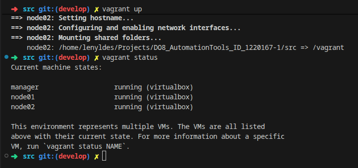

---

### 1.2. Подготовка manager как рабочей станции для Ansible

- Подключаемся к виртуальной машине `manager` по SSH:
  ```sh
  vagrant ssh manager
  ```

- Проверяем сетевую доступность управляемых узлов `node01` (`192.168.56.11`) и `node02` (`192.168.56.12`) по ICMP (протокол ping) через внутреннюю сеть:
  ```sh
  ping 192.168.56.11 -c 5
  ping 192.168.56.12 -c 5
  ```

> Проверка сетевой связности узлов с машины manager \
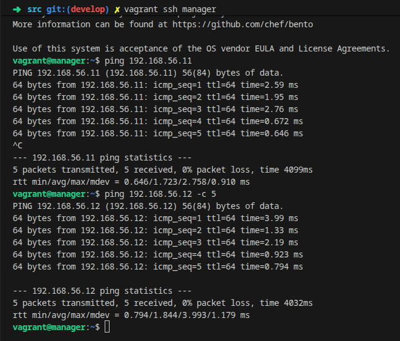

- Генерируем ключевую пару SSH (без парольной фразы `passphrase`):
  ```sh
  ssh-keygen
  ```

> Генерация SSH-ключа на машине manager \
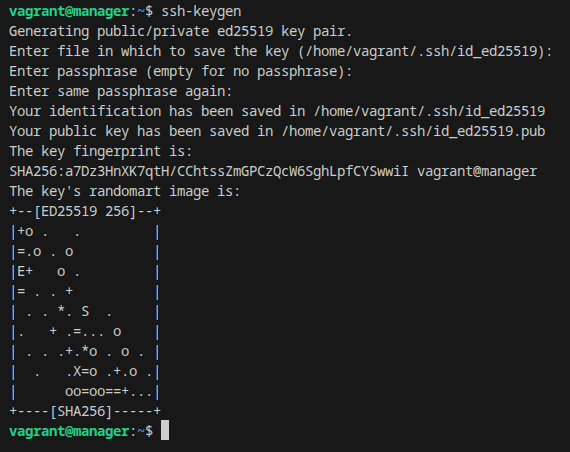

- Копируем публичный SSH-ключ на управляемые узлы `node01` и `node02` с помощью утилиты `ssh-copy-id` (пароль по умолчанию: `vagrant`):
  ```sh
  ssh-copy-id vagrant@192.168.56.11
  ssh-copy-id vagrant@192.168.56.12
  ```

> Копирование публичного ключа на узлы node01 и node02 \
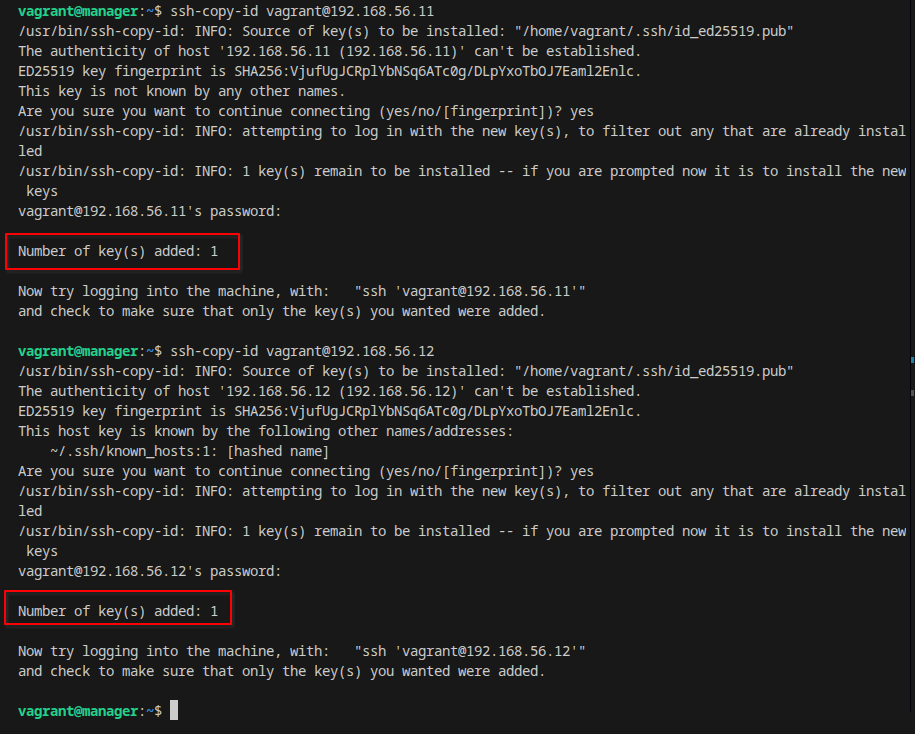

- Проверяем возможность успешного беспарольного подключения по SSH с `manager` к каждому из узлов:
  ```sh
  ssh vagrant@192.168.56.11
  logout
  ssh vagrant@192.168.56.12
  logout
  ```

> Проверка беспарольного SSH-подключения к узлам \
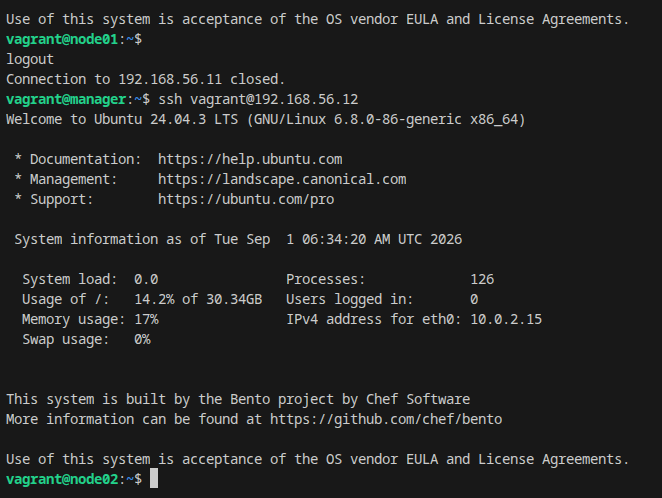

- **Перенос файлов проекта на manager:**
  По умолчанию Vagrant автоматически монтирует текущую рабочую директорию проекта хоста внутрь виртуальной машины по пути `/vagrant/`. Убеждаемся в наличии файлов с помощью команды `ls -la /vagrant/`:
  ```sh
  ls -la /vagrant/
  ```

> Проверка содержимого смонтированной директории /vagrant \
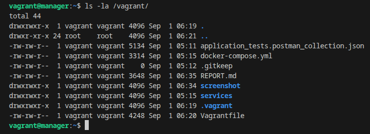

> **Справка: Способы передачи файлов на узел без общей папки (SCP)** \
> Если общие папки Vagrant отключены или файлы переносятся на удаленный сервер в продакшене, передача осуществляется с хоста через протокол `scp` следующими способами: \
> 1. **Через приватную сеть (по IP-адресу узла):** \
>    ```sh
>    scp docker-compose.yml vagrant@192.168.56.10:~/
>    scp -r services vagrant@192.168.56.10:~/
>    ```
> 2. **С использованием приватного ключа Vagrant через проброшенный порт SSH (`2222`):** \
>    ```sh
>    scp -i .vagrant/machines/manager/virtualbox/private_key -P 2222 docker-compose.yml vagrant@127.0.0.1:~/
>    scp -i .vagrant/machines/manager/virtualbox/private_key -P 2222 -r services vagrant@127.0.0.1:~/
>    ```

- Копируем файлы конфигурации и исходного кода микросервисов в домашний каталог пользователя `vagrant` на машине `manager`:
  ```sh
  cp /vagrant/docker-compose.yml ~/
  cp -r /vagrant/services ~/
  ls -la
  ```

> Копирование docker-compose.yml и исходного кода сервисов в домашнюю директорию manager \
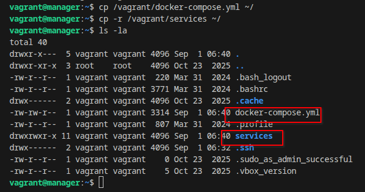

- **Установка Ansible на manager:**
  Обновляем индексы пакетов, устанавливаем пакетный менеджер `python3-pip` и устанавливаем актуальную версию `ansible`:
  ```sh
  sudo apt update && sudo apt install -y python3-pip
  pip install ansible --break-system-packages
  ```
- Проверяем корректность установки утилиты командой `ansible --version`:

> Проверка установленной версии Ansible \
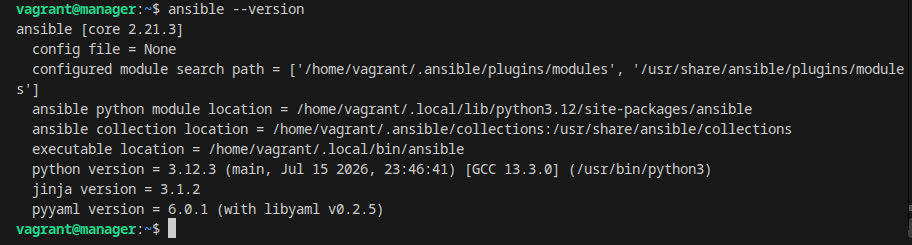

- **Настройка файла инвентаря (Inventory):**

> **Справка: Назначение и формат файла инвентаря (Inventory)** \
> **Inventory** — это реестр управляемых узлов (хостов), их IP-адресов, портов, параметров подключения и логических групп, с которыми взаимодействует Ansible. \
> Основные директивы: \
> • `ansible_host` — фактический IP-адрес или DNS-имя удаленного хоста; \
> • `ansible_user` — имя пользователя SSH (в нашем случае `vagrant`); \
> • `ansible_python_interpreter` — явный путь к исполняемому файлу Python на целевом хосте.

В директории `ansible` (впоследствии сохраненной как `src/ansible01`) создаем первоначальный файл `inventory.ini`:

```ini
[manager]
manager ansible_host=192.168.56.10 ansible_user=vagrant

[nodes]
node01  ansible_host=192.168.56.11 ansible_user=vagrant
node02  ansible_host=192.168.56.12 ansible_user=vagrant
```

- Выполняем проверку подключения к узлам через модуль `ansible.builtin.ping`:
  ```sh
  ansible nodes -i ./inventory.ini -m ansible.builtin.ping
  ```

> Первичная проверка подключения через модуль ansible.builtin.ping \
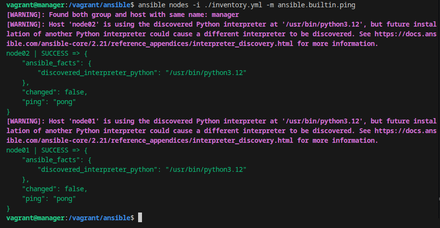

> **Разбор и устранение предупреждений (Warnings):** \
> 1. `[WARNING]: Found both group and host with same name: manager` \
>    **Причина:** совпадение имени группы `[manager]` и имени хоста `manager`. Ansible не может однозначно определить контекст вызова при обращении по имени. \
>    **Решение:** переименовать группу во множественное число — `[managers]`. \
> 2. `[WARNING]: Host is using the discovered Python interpreter at '/usr/bin/python3.12'...` \
>    **Причина:** автоматический поиск пути к Python при каждом запуске. Ansible рекомендует зафиксировать интерпретатор для обеспечения детерминированности. \
>    **Решение:** явно задать переменную `ansible_python_interpreter=/usr/bin/python3` в секции `[all:vars]`.

Финальный вид файла `inventory.ini`:

```ini
[managers]
manager ansible_host=192.168.56.10 ansible_user=vagrant

[nodes]
node01  ansible_host=192.168.56.11 ansible_user=vagrant
node02  ansible_host=192.168.56.12 ansible_user=vagrant

[all:vars]
ansible_python_interpreter=/usr/bin/python3
```

- Запускаем повторную проверку модуля `ping` и получаем чистый положительный ответ (`SUCCESS` / `"ping": "pong"`):

> Успешный запуск модуля ping без предупреждений \
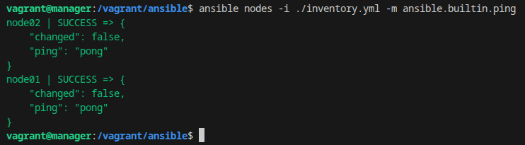

---

### 1.3. Написание первого плейбука Ansible и запуск микросервисов

- Создаем плейбук `playbook.yml`, предназначенный для удаленной настройки узла `node01` и развертывания на нем микросервисного приложения.
- Установка Docker Engine производится по официальной документации Docker (апстрим-репозиторий Docker CE) с использованием современных модулей `ansible.builtin.deb822_repository` и `ansible.builtin.get_url`.

> **Оптимизация передачи файлов: `ansible.builtin.copy` vs `ansible.builtin.unarchive`** \
> **Проблема:** При попытке передачи директории `services` с тысячами мелких файлов исходного кода Java/Maven с помощью модуля `ansible.builtin.copy` процесс передачи занимает длительное время (15–30 минут) и визуально "зависает". Для каждого отдельного файла модуль `copy` вычисляет контрольные суммы (хеши MD5/SHA256) на хосте и удаленной ноде, индивидуально упаковывает и передает каждый файл по протоколу SSH. \
> **Решение:** Упаковать исходный код в единый архив `services.tar.gz` на управляющей машине:
> ```sh
> tar -czf /vagrant/services.tar.gz -C /vagrant services
> ``` 
> А в плейбуке применить модуль `ansible.builtin.unarchive`, который передает архив одним быстрым потоком и распаковывает его локально на целевой машине за считанные секунды.

Листинг первого монолитного плейбука `playbook.yml`:

```yaml
---
- name: Deploy Microservices Stack on node01
  hosts: node01
  become: yes
  vars:
    docker_user: vagrant
  tasks:
    - name: Install prerequisites (ca-certificates, curl, python3, tar)
      ansible.builtin.apt:
        name:
          - ca-certificates
          - curl
          - python3-debian
          - tar
        state: present
        update_cache: yes

    - name: Create directory for Docker GPG key
      ansible.builtin.file:
        path: /etc/apt/keyrings
        state: directory
        mode: '0755'

    - name: Download Docker official GPG key
      ansible.builtin.get_url:
        url: https://download.docker.com/linux/ubuntu/gpg
        dest: /etc/apt/keyrings/docker.asc
        mode: '0644'

    - name: Add Docker apt repository (deb822 format)
      ansible.builtin.deb822_repository:
        name: docker
        types: [deb]
        uris: https://download.docker.com/linux/ubuntu
        suites: "{{ ansible_facts['distribution_release'] }}"
        components: [stable]
        signed_by: /etc/apt/keyrings/docker.asc
        state: present

    - name: Update apt cache after adding Docker repository
      ansible.builtin.apt:
        update_cache: yes

    - name: Install Docker packages
      ansible.builtin.apt:
        name:
          - docker-ce
          - docker-ce-cli
          - containerd.io
          - docker-buildx-plugin
          - docker-compose-plugin
        state: present

    - name: Add user to docker group
      ansible.builtin.user:
        name: "{{ docker_user }}"
        groups: docker
        append: yes

    - name: Start Docker daemon
      ansible.builtin.service:
        name: docker
        state: started
        enabled: yes

    - name: Create application directory
      ansible.builtin.file:
        path: /home/vagrant/app
        state: directory
        owner: vagrant
        group: vagrant 
        mode: '0755'

    - name: Copy docker-compose file
      ansible.builtin.copy:
        src: /vagrant/docker-compose.yml
        dest: /home/vagrant/app/docker-compose.yml
        owner: vagrant
        group: vagrant

    - name: Unarchive services on node01
      ansible.builtin.unarchive:
        src: /vagrant/services.tar.gz
        dest: /home/vagrant/app/
        owner: vagrant
        group: vagrant

    - name: Build and deploy microservices stack
      ansible.builtin.command:
        cmd: docker compose up -d --build
        chdir: /home/vagrant/app/
```

- Выполняем предварительную проверку синтаксиса и запускаем плейбук:
  ```sh
  ansible-playbook -i inventory.ini playbook.yml --syntax-check
  ansible-playbook -i inventory.ini playbook.yml
  ```
- Для проверки подключаемся к `node01` и убеждаемся, что все контейнеры приложения (PostgreSQL, RabbitMQ и 7 микросервисов) успешно собраны, запущены и находятся в статусе `Up`:
  ```sh
  ssh vagrant@192.168.56.11
  docker ps
  ```

> Проверка контейнеров \
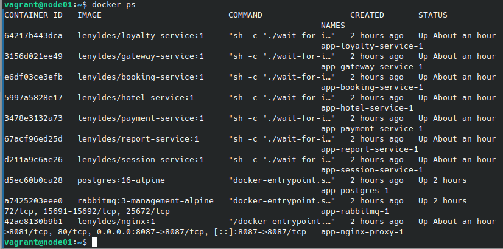
---

### 1.4. Тестирование микросервисного приложения через Postman

- Для автоматизированной проверки работоспособности развернутого микросервисного приложения запускаем заготовленную коллекцию тестов Postman с помощью консольного раннера **Newman** в Docker-контейнере:
  ```sh
  docker run --rm -v "$(pwd)":/etc/newman --network host postman/newman run /etc/newman/application_tests.postman_collection.json --env-var API_HOST=127.0.0.1
  ```
  где:
  - `--rm` — автоматическое удаление контейнера Newman после завершения тестов;
  - `-v "$(pwd)":/etc/newman` — монтирование рабочей директории с файлом коллекции в контейнер;
  - `--network host` — использование сетевого пространства хоста для доступа к проброшенным портам `8087` и `8081`;
  - `--env-var API_HOST=127.0.0.1` — передача переменной хоста для прямого обращения к API-шлюзу.

> Результаты выполнения тестов Postman через Newman \
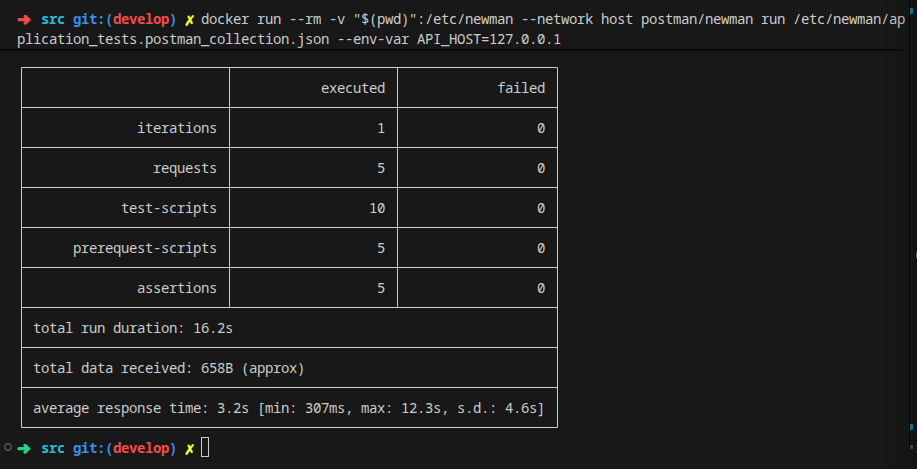

- **Итог тестирования:** все 5 запросов и 5 проверок (assertions) успешно пройдены (`failed: 0`), микросервисное приложение функционирует штатно.

---

### 1.5. Декомпозиция сценариев на роли Ansible (application, apache, postgres)

- Для повышения модульности, читаемости и переиспользуемости инфраструктурного кода декомпозируем монолитный плейбук на три отдельные роли Ansible:
  1. **`application`** — устанавливает Docker и развертывает микросервисное приложение через Docker Compose (назначается на `node01`);
  2. **`apache`** — устанавливает и запускает веб-сервер Apache HTTP Server (назначается на `node02`);
  3. **`postgres`** — устанавливает и запускает СУБД PostgreSQL, настраивает удаленный доступ, создает базу данных `testbd` с таблицей `Person` и наполняет ее тремя записями (назначается на `node02`).

- Файловая структура каталога `src/ansible01`:
  ```
  src/ansible01/
  ├── inventory.ini
  ├── playbook.yml
  └── roles/
      ├── apache/
      │   └── tasks/
      │       └── main.yml
      ├── application/
      │   ├── defaults/
      │   │   └── main.yml
      │   └── tasks/
      │       └── main.yml
      └── postgres/
          └── tasks/
              └── main.yml
  ```

#### 1. Роль `application`

- `roles/application/defaults/main.yml`:
  ```yaml
  docker_user: "{{ ansible_user }}"
  ```

- `roles/application/tasks/main.yml`:
  ```yaml
  ---
  - name: Install prerequisites (ca-certificates, curl, python3, tar)
    ansible.builtin.apt:
      name:
        - ca-certificates
        - curl
        - python3-debian
        - tar
      state: present
      update_cache: yes

  - name: Create directory for Docker GPG key
    ansible.builtin.file:
      path: /etc/apt/keyrings
      state: directory
      mode: '0755'

  - name: Download Docker official GPG key
    ansible.builtin.get_url:
      url: https://download.docker.com/linux/ubuntu/gpg
      dest: /etc/apt/keyrings/docker.asc
      mode: '0644'

  - name: Add Docker apt repository (deb822 format)
    ansible.builtin.deb822_repository:
      name: docker
      types: [deb]
      uris: https://download.docker.com/linux/ubuntu
      suites: "{{ ansible_facts['distribution_release'] }}"
      components: [stable]
      signed_by: /etc/apt/keyrings/docker.asc
      state: present

  - name: Update apt cache after adding Docker repository
    ansible.builtin.apt:
      update_cache: yes

  - name: Install Docker packages
    ansible.builtin.apt:
      name:
        - docker-ce
        - docker-ce-cli
        - containerd.io
        - docker-buildx-plugin
        - docker-compose-plugin
      state: present

  - name: Add user to docker group
    ansible.builtin.user:
      name: "{{ docker_user }}"
      groups: docker
      append: yes

  - name: Display reminder about re-login
    ansible.builtin.debug:
      msg: "User '{{ docker_user }}' added to docker group. You must log out and back in (or restart the session) for changes to take effect."

  - name: Start Docker daemon
    ansible.builtin.service:
      name: docker
      state: started
      enabled: yes

  - name: Подготовка директории
    ansible.builtin.file:
      path: /home/vagrant/app
      state: directory
      owner: vagrant
      group: vagrant 
      mode: '0755'

  - name: Копирование docker compose
    ansible.builtin.copy:
      src: /vagrant/docker-compose.yml
      dest: /home/vagrant/app/docker-compose.yml
      owner: vagrant
      group: vagrant

  - name: Распаковка сервисов на node01
    ansible.builtin.unarchive:
      src: /vagrant/services.tar.gz
      dest: /home/vagrant/app/
      owner: vagrant
      group: vagrant

  - name: Запуск сервиса
    ansible.builtin.command:
      cmd: docker compose up -d --build
      chdir: /home/vagrant/app/
  ```

#### 2. Роль `apache`

- `roles/apache/tasks/main.yml`:
  ```yaml
  ---
  - name: Установка apache
    ansible.builtin.apt:
      name: 
        - apache2
      state: present
      update_cache: yes

  - name: Запуск службы apache
    ansible.builtin.service:
      name: apache2
      state: started
      enabled: yes
  ```

#### 3. Роль `postgres`

> **Тонкость настройки удаленного доступа к PostgreSQL:** \
> По умолчанию после установки PostgreSQL слушает исключительно локальный сокет и интерфейс `localhost` (`127.0.0.1`), а файл аутентификации `pg_hba.conf` блокирует внешние сетевые подключения. При попытке подключиться с хост-машины возникает ошибка: \
> `psql: error: connection to server at "192.168.56.12", port 5432 failed: Connection refused` \

> **Решение средствами Ansible:**
> 1. Модулем `ansible.builtin.lineinfile` заменить параметр `listen_addresses = '*'` в файле `/etc/postgresql/16/main/postgresql.conf`; \
> 2. Модулем `ansible.builtin.lineinfile` добавить разрешающую запись `host all all 0.0.0.0/0 trust` в `/etc/postgresql/16/main/pg_hba.conf`; \
> 3. Перезапустить службу `postgresql` модулем `ansible.builtin.service`.

- `roles/postgres/tasks/main.yml`:
  ```yaml
  ---
  - name: Установка PostgreSQL
    ansible.builtin.apt:
      name: postgresql
      update_cache: yes

  - name: Запуск службы PostgreSQL
    ansible.builtin.service:
      name: postgresql
      state: started
      enabled: yes

  - name: Создаем тестовую БД
    become: yes
    ansible.builtin.shell: sudo -u postgres psql -tc "SELECT 1 FROM pg_database WHERE datname = 'testbd'" | grep -q 1 || sudo -u postgres psql -c "CREATE DATABASE testbd;"

  - name: Создаем таблицу Person
    become: yes
    ansible.builtin.shell: sudo -u postgres psql -d testbd -c "CREATE TABLE IF NOT EXISTS Person (id integer, name text);"

  - name: Добавляем значения
    become: yes
    ansible.builtin.shell: sudo -u postgres psql -d testbd -c "INSERT INTO Person (id, name) SELECT * FROM (VALUES (1, 'Ivan'), (2, 'Petya'), (3, 'Masha')) AS v(id, name) WHERE NOT EXISTS (SELECT 1 FROM Person);"

  - name: Разрешаем прослушивание всех сетевых интерфейсов
    ansible.builtin.lineinfile:
      path: /etc/postgresql/16/main/postgresql.conf
      regexp: '^#?listen_addresses\s*='
      line: "listen_addresses = '*'"

  - name: Разрешаем доступ клиентам в pg_hba.conf
    ansible.builtin.lineinfile:
      path: /etc/postgresql/16/main/pg_hba.conf
      line: "host all all 0.0.0.0/0 trust"

  - name: Перезапускаем службу PostgreSQL
    ansible.builtin.service:
      name: postgresql
      state: restarted
  ```

#### Главный плейбук `playbook.yml`

```yaml
---
- name: Deploy Miscorervice Stack
  hosts: node01
  become: yes
  roles:
    - application

- name: Deploy Web Server
  hosts: node02
  become: yes
  roles:
    - apache

- name: Deploy PostgreSQL Server
  hosts: node02
  become: yes
  roles:
    - postgres
```

- Выполняем запуск обновленного плейбука с ролями:
  ```sh
  ansible-playbook -i inventory.ini playbook.yml
  ```

> Выполнение плейбука с ролями application, apache и postgres \
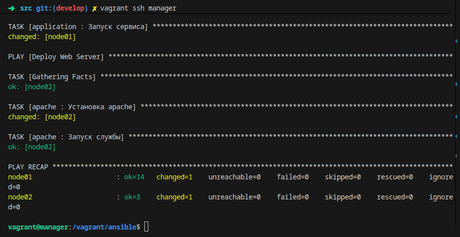

---

#### Проверка результатов работы ролей

1. **Проверка микросервисного приложения на `node01`:**
   Повторно запускаем тесты Newman с хоста:
   ```sh
   docker run --rm -v "$(pwd)":/etc/newman --network host postman/newman run /etc/newman/application_tests.postman_collection.json --env-var API_HOST=127.0.0.1
   ```

> Повторный успешный прогон тестов Newman \
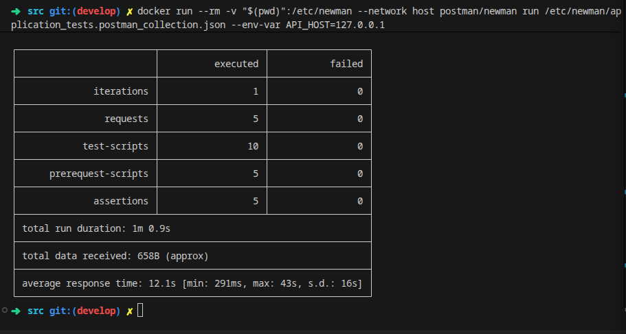

2. **Проверка веб-сервера Apache на `node02`:**
   Выполняем HTTP-запрос к `node02` (`192.168.56.12`) с хостовой машины:
   ```sh
   curl -sI http://192.168.56.12
   ```
   Получен ответ `HTTP/1.1 200 OK`, веб-страница успешно открывается в браузере.

> Проверка доступности Apache HTTP Server с хоста \
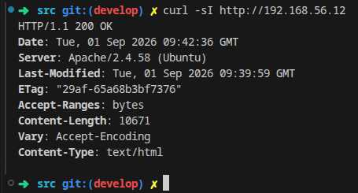

3. **Проверка СУБД PostgreSQL на `node02`:**
   - Локальная проверка внутри узла `node02`:
     ```sh
     sudo -u postgres psql -d testbd -c "SELECT * FROM Person;"
     ```

> Локальная выборка записей из таблицы Person на node02 \
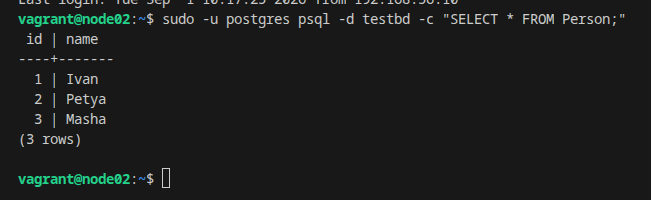

   - Проверка удаленного подключения к PostgreSQL с хостовой машины через Docker-контейнер `postgres:16-alpine`:
     ```sh
     docker run --rm -it postgres:16-alpine psql -h 192.168.56.12 -U postgres -d testbd -c "SELECT * FROM Person;"
     ```
     Запрос успешно возвращает содержимое таблицы `Person` с тремя тестовыми записями (`Ivan`, `Petya`, `Masha`).

> Успешное удаленное подключение к PostgreSQL и выборка данных с хоста \
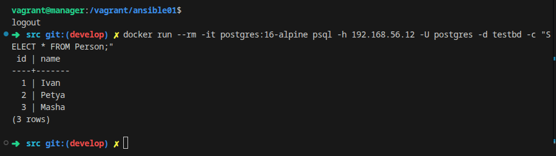

---

## Part 2. Service Discovery

### 2.1. Написание конфигурационных файлов для Consul (Server и Client)

- Чтобы настроить Service Discovery и управлять сетевой связностью через Service Mesh, используют конфиги в формате HCL (HashiCorp Configuration Language).
- По заданию подготовили два файла:
  - `consul_server.hcl` — конфиг для агента в режиме сервера;
  - `consul_client.hcl` — конфиг для клиентских агентов (`api` и `db`).
- Файлы лежат в директории `src/consul01/`.

- **Установка Consul на хост-систему (для локальной валидации конфигураций):** \
  Ставим официальный дистрибутив HashiCorp Consul по инструкции:
  ```sh
  wget -O - https://apt.releases.hashicorp.com/gpg | sudo gpg --dearmor -o /usr/share/keyrings/hashicorp-archive-keyring.gpg
  echo "deb [arch=$(dpkg --print-architecture) signed-by=/usr/share/keyrings/hashicorp-archive-keyring.gpg] https://apt.releases.hashicorp.com $(grep -oP '(?<=UBUNTU_CODENAME=).*' /etc/os-release || lsb_release -cs) main" | sudo tee /etc/apt/sources.list.d/hashicorp.list
  sudo apt update && sudo apt install -y consul
  ```

#### 1. Конфигурационный файл сервера (`consul01/consul_server.hcl`)

```hcl
server = true
bootstrap_expect = 1
datacenter = "dc1"
data_dir   = "/opt/consul"
log_level  = "INFO"
bind_addr = "0.0.0.0"
client_addr = "0.0.0.0"
advertise_addr = "{{ GetInterfaceIP \"eth1\" }}"
ui_config {
    enabled = true
}
```

- **Что делают параметры сервера:**
  - `server = true` — включает режим сервера: агент участвует в консенсусе Raft, хранит каталог сервисов, управляет состоянием Service Mesh и обрабатывает RPC-запросы;
  - `bootstrap_expect = 1` — говорит кластеру, что ожидается 1 сервер. Это нужно, чтобы при первом запуске автоматически выбрать лидера Raft и собрать кворум (у нас в инфраструктуре один сервер Consul);
  - `datacenter = "dc1"` — имя датацентра: так все узлы и сервисы объединяются в одно сетевое пространство;
  - `data_dir = "/opt/consul"` — папка, где сервер хранит данные: логи Raft, снэпшоты, метаданные каталога;
  - `log_level = "INFO"` — уровень детализации логов Consul;
  - `bind_addr = "0.0.0.0"` — адрес для внутренних протоколов кластера (Serf LAN и RPC на порту `8300`). `0.0.0.0` значит «слушать все интерфейсы»;
  - `client_addr = "0.0.0.0"` — адрес для клиентских подключений: HTTP API (порт `8500`), DNS (`8600`) и веб‑интерфейса. `0.0.0.0` делает сервис доступным и с хоста, и с удалённых узлов;
  - `advertise_addr = "{{ GetInterfaceIP \"eth1\" }}"` — IP, который сервер сообщает другим узлам для связи. Макрос `{{ GetInterfaceIP "eth1" }}` автоматически берёт IP интерфейса приватной сети Vagrant (`192.168.56.x`) — это важно для маршрутизации внутри виртуалок;
  - `ui_config { enabled = true }` — включает встроенный веб‑интерфейс Consul (на порту `8500`) — удобно смотреть список сервисов, узлов и политики Service Mesh.

#### 2. Конфигурационный файл клиента (`consul01/consul_client.hcl`)

```hcl
server = false
datacenter = "dc1"
data_dir   = "/opt/consul"
advertise_addr = "{{ GetInterfaceIP \"eth1\" }}"
bind_addr = "0.0.0.0"
client_addr = "0.0.0.0"
retry_join = ["192.168.56.10"]
ports {
    grpc = 8502
}
```

- **Что делают параметры клиента:**
  - `server = false` — агент работает как клиент: не хранит базу Raft, а перенаправляет RPC‑запросы на сервер и проверяет работоспособность сервисов локально;
  - `datacenter = "dc1"` — тот же датацентр, что и у сервера: так узлы объединяются в один кластер;
  - `data_dir = "/opt/consul"` — рабочая папка для кэша и локальных данных клиента;
  - `advertise_addr = "{{ GetInterfaceIP \"eth1\" }}"` — динамически берёт IP интерфейса `eth1`, чтобы анонсировать его в gossip‑протоколе;
  - `bind_addr = "0.0.0.0"` — слушает Serf/Gossip на всех сетевых адаптерах;
  - `client_addr = "0.0.0.0"` — открывает локальный HTTP/gRPC API для приложений и sidecar‑прокси;
  - `retry_join = ["192.168.56.10"]` — список IP серверов Consul, к которым клиент пытается подключиться при старте. Если сервер недоступен, клиент будет регулярно повторять попытки;
  - `ports { grpc = 8502 }` — открывает порт gRPC (`8502`) — он нужен для связки Consul с sidecar‑прокси **Envoy** в Service Mesh (Consul Connect).

#### 3. Проверка синтаксиса и валидация конфигурации

- Проверяем конфиги утилитой `consul validate`:
  ```sh
  consul validate ./consul01/consul_server.hcl
  consul validate ./consul01/consul_client.hcl
  ```

> Валидация конфигурационных файлов Consul \
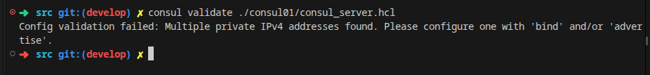

> **Справка: почему валидатор ругается на макросы сетевых интерфейсов** \
> При запуске `consul validate` на хосте может появиться предупреждение: \
> `Config validation failed: Multiple private IPv4 addresses found. Please configure one with 'bind' and/or 'advertise'.` \
> \
> **В чём дело и почему это нормально:** 
> 1. В конфиге используется шаблон `advertise_addr = "{{ GetInterfaceIP \"eth1\" }}"`: он берёт IP интерфейса `eth1` через шаблонизатор Go.  
> 2. На хостовой ОС интерфейса `eth1` нет, поэтому шаблон возвращает пустую строку.  
> 3. Если `advertise_addr` пустой, Consul пытается сам выбрать приватный IP из всех доступных адаптеров. Когда их несколько (локальная сеть, Docker bridge `172.17.0.1`, адаптеры гипервизора), валидатор предупреждает, что не может однозначно выбрать адрес.  
> 4. В виртуалках Vagrant интерфейс `eth1` — это статический адаптер приватной сети (`192.168.56.0/24`). В целевой среде шаблон корректно подставит нужный IP для каждой машины, и предупреждение пропадёт.

---

### 2.2. Создание виртуальных машин для Service Discovery

- Перед тем как развернуть новую топологию, удаляем старые виртуальные машины (`manager`, `node01`, `node02`). По заданию нужны четыре специализированных узла:
  ```sh
  vagrant destroy
  ```

> Удаление ранее созданных виртуальных машин командой `vagrant destroy` \
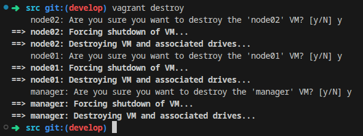

> **Справка: зачем обязательно делать `vagrant destroy`** \
> Если поменять имена ВМ в `Vagrantfile`, но не удалить старые, Vagrant потеряет связь с ними. В VirtualBox эти машины останутся как «сироты» (*orphaned VMs*): будут занимать память и держать сетевые интерфейсы. Из‑за этого в подсети `192.168.56.0/24` возникнут конфликты IP‑адресов — лучше убрать старые ВМ заранее.

- **Параметры создаваемых виртуальных машин:**

| Имя ВМ | Hostname | Приватный IP | vCPU | RAM | Проброс портов (Guest → Host) | Назначение |
| :--- | :--- | :--- | :---: | :---: | :---: | :--- |
| **consulServer** | `consulServer` | `192.168.56.10` | 1 | 1024 MB | `8500 → 8500` | Сервер Consul и веб‑интерфейс (Consul UI) |
| **api** | `api` | `192.168.56.11` | 1 | 1024 MB | `8082 → 8082` | Микросервис отелей (Hotels Service API) |
| **manager** | `manager` | `192.168.56.12` | 1 | 1024 MB | — | Станция управления Ansible |
| **db** | `db` | `192.168.56.13` | 1 | 1024 MB | — | База данных PostgreSQL (`hotels_db`) |

- Конфигурация обновлённого файла `Vagrantfile`:

```ruby
Vagrant.configure("2") do |config|
  config.vm.box = "bento/ubuntu-24.04"
  config.vm.box_version = "202510.26.0"

  config.vm.define "consulServer" do |node|
    node.vm.hostname = "consulServer"
    node.vm.network "private_network", ip: "192.168.56.10"
    node.vm.network "forwarded_port", guest: 8500, host: 8500
    
    node.vm.provider "virtualbox" do |vb|
      vb.memory = 1024
      vb.cpus = 1
    end
  end

  config.vm.define "api" do |node|
    node.vm.hostname = "api"
    node.vm.network "private_network", ip: "192.168.56.11"
    node.vm.network "forwarded_port", guest: 8082, host: 8082

    node.vm.provider "virtualbox" do |vb|
      vb.memory = 1024
      vb.cpus = 1
    end
  end

  config.vm.define "manager" do |node|
    node.vm.hostname = "manager"
    node.vm.network "private_network", ip: "192.168.56.12"

    node.vm.provider "virtualbox" do |vb|
      vb.memory = 1024
      vb.cpus = 1
    end
  end

  config.vm.define "db" do |node|
    node.vm.hostname = "db"
    node.vm.network "private_network", ip: "192.168.56.13"

    node.vm.provider "virtualbox" do |vb|
      vb.memory = 1024
      vb.cpus = 1
    end
  end
end
```

- Запускаем стенд командой `vagrant up`, затем проверяем, что все четыре машины поднялись, через `vagrant status`:
  ```sh
  vagrant up
  vagrant status
  ```

> Проверка статуса запущенных виртуальных машин кластера \
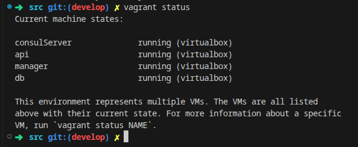

- На хостовой машине проверяем, что порты `8500` (Consul UI) и `8082` (Hotels API) действительно проброшены и слушают соединения — для этого используем `ss`:
  ```sh
  ss -tulpn | grep -E '8500|8082'
  ```
  
  Оба порта в состоянии `LISTEN` на `0.0.0.0` — значит, с хоста можно зайти и в Consul UI, и в API сервиса.

> Проверка проброшенных портов на хостовой машине с помощью ss \
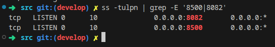

### 2.3. Настройка ролей Ansible (Consul Server/Client, PostgreSQL, Hotels Service)

- По заданию нужно подготовить Ansible-сценарии для развёртывания компонентов Service Discovery и Service Mesh на созданных виртуальных машинах.
- Все конфиги, плейбуки и роли лежат в каталоге `src/ansible02/`.

#### 1. Структура проекта `src/ansible02/`

```
src/ansible02/
├── inventory.ini
├── playbook.yml
└── roles/
    ├── install_consul_server/
    │   ├── handlers/
    │   │   └── main.yml
    │   └── tasks/
    │       └── main.yml
    ├── install_consul_client/
    │   ├── files/
    │   │   ├── api_service.hcl
    │   │   ├── db_service.hcl
    │   │   ├── consul-envoy-holel.service
    │   │   └── consul-envoy-db.service
    │   ├── handlers/
    │   │   └── main.yml
    │   └── tasks/
    │       └── main.yml
    ├── install_db/
    │   └── tasks/
    │       └── main.yml
    └── install_hotels_service/
        └── tasks/
            └── main.yml
```

- **Файл инвентаря (`ansible02/inventory.ini`):**

```ini
[api_servers]
api  ansible_host=192.168.56.11 ansible_user=vagrant

[db_servers]
db ansible_host=192.168.56.13 ansible_user=vagrant

[consul_servers]
consul_server ansible_host=192.168.56.10 ansible_user=vagrant

[consul_clients]
api
db

[all:vars]
ansible_python_interpreter=/usr/bin/python3
```

- **Главный плейбук (`ansible02/playbook.yml`):**

```yaml
---
- name: Установка Consul Server
  hosts: consul_servers
  become: yes
  roles:
    - install_consul_server

- name: Установка Consul Client
  hosts: consul_clients
  become: yes
  roles:
    - install_consul_client

- name: Установка базы данных
  hosts: db_servers
  become: yes
  roles:
    - install_db

- name: Установка сервиса отелей
  hosts: api_servers
  become: yes
  roles:
    - install_hotels_service
```

---

#### 2. Подготовка управляющей машины (manager) и проверка связности

- На управляющей ВМ `manager` настраиваем SSH-ключи для беспарольного доступа ко всем целевым узлам (`consulServer`, `api`, `db`) и проверяем сетевую доступность через модуль `ansible.builtin.ping`:
  ```sh
  ansible -i /vagrant/ansible02/inventory.ini all -m ping
  ```

> Проверка сетевой связности узлов с помощью модуля ping \
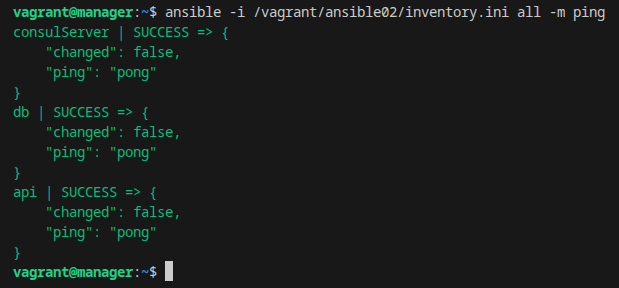

Все узлы ответили `SUCCESS` (`"ping": "pong"`) — среда готова к развёртыванию ролей.

---

#### 3. Архитектура взаимодействия компонентов Service Mesh (Consul + Envoy)

> **Справка: как работают Service Discovery и проксирование Envoy** \
> В традиционной архитектуре микросервис жёстко привязан к IP-адресу базы данных. В архитектуре **Service Mesh** приложение изолировано от деталей физической топологии сети:
> ```text
> [ Машина "api" ]                                  [ Машина "db" ]
> +---------------------+                           +--------------------+
> |  Java-приложение    |                           |  PostgreSQL        |
> |  (Сервис отелей)    |                           |  (База данных)     |
> +----------+----------+                           +---------^----------+
>            | 1. Запрос на localhost:5432                    | 4. Доставка в БД
>            v                                                |
> +----------+----------+                           +---------+----------+
> |  Envoy Proxy        |==== 3. Зашифрованный =====> Envoy Proxy        |
> |  (порт 5432)        |        mTLS-туннель       |                    |
> +----------^----------+                           +--------------------+
>            | 2. Резолв адреса "db"
>            v
> +---------------------+
> | Consul Server       |
> | (Каталог сервисов)  |
> +---------------------+
> ```
> 
> **Поток трафика по шагам:**
> 1. Java-приложение обращается к локальному хосту: `POSTGRES_HOST=127.0.0.1`, `PORT=5432`.
> 2. Локальный sidecar-прокси **Envoy** на машине `api` перехватывает подключения на порту `5432`.
> 3. Через постоянный gRPC-канал (порт `8502`, протокол xDS) Envoy запрашивает у Consul актуальный физический адрес сервиса `db`.
> 4. Consul возвращает IP-адрес `192.168.56.13`.
> 5. Envoy на узле `api` устанавливает защищённый mTLS-туннель к удалённому Envoy на узле `db`.
> 6. Envoy на машине `db` расшифровывает входящий пакет и передаёт его локальному PostgreSQL.
> 
> **Взаимодействие Consul Client и Envoy на одном узле:**
> - **Порт gRPC 8502:** Consul Client работает как control-plane сервер xDS для Envoy, в реальном времени передавая маршруты и TLS-сертификаты.
> - **Файлы описания сервисов (`/etc/consul.d/*.hcl`):** сообщают Consul Client о локальных приложениях и необходимых им исходящих соединениях (`upstreams`).
> - **Команда запуска `consul connect envoy -sidecar-for=<service>`:** Consul запускает процесс Envoy и динамически передаёт ему сгенерированную конфигурацию — ручная правка конфигов Envoy не требуется.

---

#### 4. Роль `install_consul_server`

Роль устанавливает и инициализирует сервер Consul на узле `consulServer` (`192.168.56.10`):
- Ставит системные утилиты (`curl`, `wget`, `gpg`, `ca-certificates`, `tar`);
- Добавляет официальный GPG-ключ и apt-репозиторий HashiCorp;
- Устанавливает пакет `consul`;
- Копирует конфиг `/vagrant/consul01/consul_server.hcl` в `/etc/consul.d/consul_server.hcl`;
- Запускает и включает systemd-службу `consul`.

- Развёртываем роль на сервере Consul:
  ```sh
  ansible-playbook -i inventory.ini playbook.yml --limit consul_servers
  ```

> Развёртывание роли install_consul_server на узле consulServer \
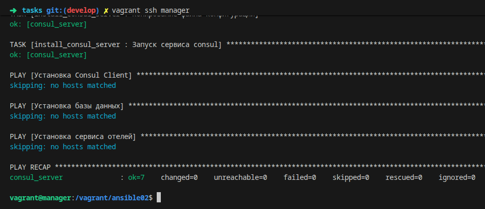

---

#### 5. Роль `install_consul_client`

Роль настраивает клиентских агентов Consul и sidecar-прокси Envoy на машинах `api` (`192.168.56.11`) и `db` (`192.168.56.13`).

- **Файлы регистрации сервисов:**
  - `roles/install_consul_client/files/db_service.hcl` (для узла `db`):
    ```hcl
    service {
        name = "db"
        port = 5432
        connect {
            sidecar_service {}
        }
    }
    ```
  - `roles/install_consul_client/files/api_service.hcl` (для узла `api`):
    ```hcl
    service {
        name = "hotel-service"
        port = 8082
        connect {
            sidecar_service {
                proxy {
                    upstreams = [
                        {
                            destination_name = "db"
                            local_bind_port = 5432
                        }
                    ]
                }
            }
        }
    }
    ```

- **systemd-юниты для Envoy:**
  - `roles/install_consul_client/files/consul-envoy-db.service`:
    ```ini
    [Unit]
    Description=Consul Envoy Sidecar
    After=consul.service
    Requires=consul.service

    [Service]
    ExecStart=/usr/bin/consul connect envoy -sidecar-for=db
    Restart=always
    User=root

    [Install]
    WantedBy=multi-user.target
    ```
  - `roles/install_consul_client/files/consul-envoy-holel.service`:
    ```ini
    [Unit]
    Description=Consul Envoy Sidecar
    After=consul.service
    Requires=consul.service

    [Service]
    ExecStart=/usr/bin/consul connect envoy -sidecar-for=hotel-service
    Restart=always
    User=root

    [Install]
    WantedBy=multi-user.target
    ```

- Запускаем установку на клиентских узлах:
  ```sh
  ansible-playbook -i inventory.ini playbook.yml --limit consul_clients
  ```

> Развёртывание роли install_consul_client на узлах api и db \
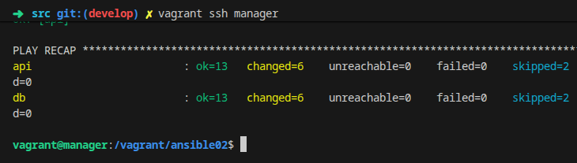

---

#### 6. Проверка состояния кластера Consul и каталога сервисов

- Подключаемся к `consulServer` и проверяем состав кластера командой `consul members`:
  ```sh
  consul members
  ```
  Все три узла (`consulServer`, `api`, `db`) объединены в кластер датацентра `dc1` и находятся в статусе `alive`.

> Состав кластера Consul командой consul members \
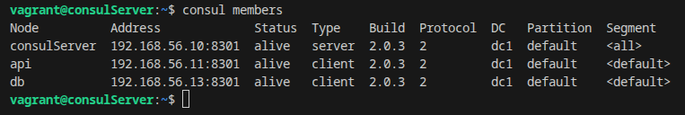

- Проверяем каталог зарегистрированных сервисов командой `consul catalog services`:
  ```sh
  consul catalog services
  ```
  В каталоге видны сервисы `consul`, `db`, `db-sidecar-proxy`, `hotel-service` и `hotel-service-sidecar-proxy` — все сервисы и их sidecar-прокси зарегистрированы корректно.

> Каталог зарегистрированных сервисов в Consul \
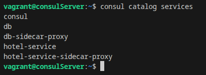

---

#### 7. Диагностика и устранение несовместимости версий Envoy

- При первом запуске службы `consul-envoy` на целевых узлах она падала с ошибкой:
  ```sh
  sudo systemctl status consul-envoy
  ```

> Ошибка при первом запуске службы consul-envoy \
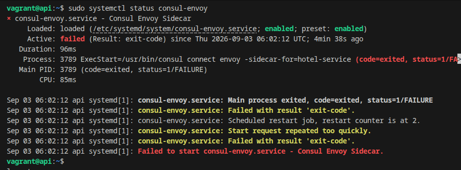

> **Анализ причины сбоя (Envoy Version Compatibility):** \
> В системном журнале `journalctl -u consul-envoy.service -n 30 --no-pager` обнаружена ошибка: \
> `Sep 03 06:02:12 api consul[3789]: Envoy version 1.39.x is not supported. If there is a reason you need to use this version of envoy use the ignore-envoy-compatibility flag...` \
> \
> Согласно официальной матрице совместимости HashiCorp:
> 
> | Версия Consul | Поддерживаемые версии Envoy |
> | :--- | :--- |
> | **Consul 2.0.x CE** | **1.38.x, 1.37.x, 1.35.x** |
> 
> Ранее мы скачали банарник Envoy версии `1.39.x`, который не поддерживается текущей версией Consul. \
> **Решение:** в роли `install_consul_client` настроить явную загрузку проверенного бинарного релиза **Envoy v1.38.4** (`https://github.com/envoyproxy/envoy/releases/download/v1.38.4/envoy-1.38.4-linux-x86_64`) в `/usr/bin/envoy`.

- После обновления Envoy службы `consul-envoy` успешно запустились и работают в статусе `active (running)`:

  1. **На машине `api`:**

> Проверка статуса службы consul-envoy на узле api \
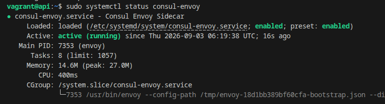

  2. **На машине `db`:**

> Проверка статуса службы consul-envoy на узле db \
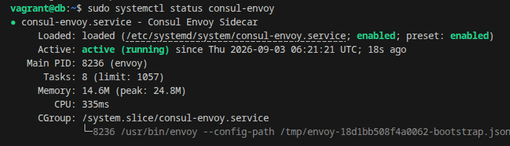

- Проверяем на узле `api`, что Envoy открыл локальный слушающий порт `5432` для перенаправления запросов к базе данных:
  ```sh
  ss -tulpn | grep 5432
  ```
  Вывод подтверждает: локальный адрес `127.0.0.1:5432` в состоянии `LISTEN`, обслуживается процессом `envoy`.

> Проверка локального порта 5432 Envoy на машине api \
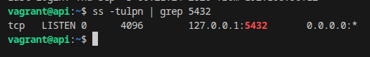

---

#### 8. Развертывание базы данных PostgreSQL (роль install_db)

- В Части 1 мы создавали базу и пользователя через `psql` с помощью `ansible.builtin.shell`. Теперь переходим на декларативные модули из коллекции `community.postgresql` — это даёт идемпотентность и более чистую конфигурацию.

- **Конфигурация задач роли (`roles/install_db/tasks/main.yml`):**

```yaml
---
- name: Установка PostgreSQL и зависимостей
  ansible.builtin.apt:
    name:
      - postgresql
      - python3-psycopg2    # Драйвер Python для работы модулей community.postgresql
      - acl                 # Управление правами доступа для безопасной работы become_user
    update_cache: true

- name: Запуск службы PostgreSQL
  ansible.builtin.service:
    name: postgresql
    state: started
    enabled: true

- name: Создание БД hotels_db
  community.postgresql.postgresql_db:
    name: hotels_db
    state: present
  become: true
  become_user: postgres

- name: Установка пароля для пользователя postgres
  community.postgresql.postgresql_user:
    name: postgres
    password: "postgres"
  become: true
  become_user: postgres
```

> **Что важно учесть в роли `install_db`:** 
> 1. **Декларативное управление через `community.postgresql` вместо `shell`:** \
> Модули `postgresql_db` и `postgresql_user` гарантируют идемпотентность: при повторных запусках плейбука база и пользователь не пересоздаются, а Ansible только проверяет состояние — без лишних изменений и ошибок `database already exists`. 
> 
> 2. **Зависимость `python3-psycopg2`:** \
> Модули управления PostgreSQL написаны на Python и выполняются на целевом хосте (`db`). Для работы нужен низкоуровневый адаптер `psycopg2`. Если не установить системный пакет `python3-psycopg2` заранее, роль упадёт с ошибкой `psycopg2 is required for this module`. 
> 
> 3. **Пакет `acl` при использовании `become_user`:** \
> При переключении на системного пользователя (`become_user: postgres`) Ansible копирует временные файлы модулей в `/tmp`. Чтобы `postgres` имел доступ к файлам, созданным под `vagrant`/`root`, нужна поддержка POSIX ACL. Без пакета `acl` Ansible либо предупредит о небезопасных правах (`Failed to set permissions on the temporary files...`), либо прервется с отказом в доступе. 
> 
> 4. **Peer-аутентификация через `become_user: postgres`:** \
> По умолчанию PostgreSQL на Debian/Ubuntu использует локальную аутентификацию `peer` через Unix-сокет (`/var/run/postgresql/`). `become_user: postgres` позволяет выполнять административные операции с полными привилегиями без передачи паролей и без правки `pg_hba.conf`.

- Запускаем роль на узле `db`:
  ```sh
  ansible-playbook -i inventory.ini playbook.yml --limit db_servers
  ```

- Проверяем, что база `hotels_db` создалась на виртуальной машине `db`:
  ```sh
  sudo -u postgres psql -l
  ```
  В списке должна появиться `hotels_db` с владельцем `postgres` и кодировкой `UTF8`.

> Проверка созданной базы hotels_db в PostgreSQL \
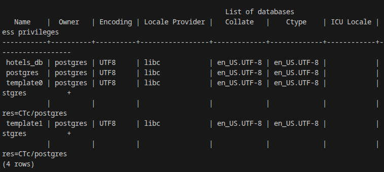

#### 9. Развертывание сервиса отелей (роль `install_hotels_service`)

- Последняя роль — сборка и деплой Java-микросервиса `hotel-service` на узле `api` (`192.168.56.11`).

> **Что делает роль `install_hotels_service`:**
> 1. **Установка JDK 21 и Maven:** \
> Для компиляции и запуска сервиса на целевой машине ставятся системные пакеты `openjdk-21-jdk` и `maven` через модуль `ansible.builtin.apt`.
>
> 2. **Копирование исходников микросервиса:** \
> Исходники приложения копируются из общей директории `/vagrant/services/hotel-service/` в рабочую папку `/home/vagrant/app/hotel-service/` с правами владельца `vagrant:vagrant` и маской `0755`.
>
> 3. **Глобальные переменные окружения (`/etc/environment`):** \
> Переменные подключения к базе данных добавляются в `/etc/environment` модулем `ansible.builtin.lineinfile`:
> - `POSTGRES_HOST="127.0.0.1"` — **ключевая идея Service Mesh:** приложение ходит на локальный loopback, где порт перехватывается прокси Envoy;
> - `POSTGRES_PORT="5432"`;
> - `POSTGRES_DB="hotels_db"`;
> - `POSTGRES_USER="postgres"`;
> - `POSTGRES_PASSWORD="postgres"`.
>
> 4. **Идемпотентная сборка jar-архива:** \
> Сборка выполняется через модуль `ansible.builtin.command` командой `./mvnw package -DskipTests`. Флаг `-DskipTests` пропускает интеграционные тесты при сборке артефакта, а параметр `creates: /home/vagrant/app/hotel-service/target/hotel-service-0.0.1-SNAPSHOT.jar` исключает повторную пересборку, если файл уже существует.
>
> 5. **Запуск службы через systemd (`hotels.service`):** \
> Прямой запуск `java -jar` через Ansible заблокировал бы выполнение плейбука, поэтому процесс оформлен как systemd-юнит `/etc/systemd/system/hotels.service`:
> ```ini
> [Unit]
> Description=Hotels API Service
> After=network.target consul-envoy.service
> Requires=consul-envoy.service
>
> [Service]
> User=vagrant
> WorkingDirectory=/home/vagrant/app/hotel-service
> EnvironmentFile=/etc/environment
> ExecStart=/usr/bin/java -jar /home/vagrant/app/hotel-service/target/hotel-service-0.0.1-SNAPSHOT.jar
> Restart=always
>
> [Install]
> WantedBy=multi-user.target
> ```
> Параметры `After` и `Requires` гарантируют запуск приложения строго после инициализации sidecar-прокси Envoy, а `EnvironmentFile` обеспечивает чтение глобальных переменных.

- Запускаю деплой роли `install_hotels_service` на узле `api`:
  ```sh
  ansible-playbook -i inventory.ini playbook.yml --limit api_servers
  ```

> Деплой роли install_hotels_service на узле api \
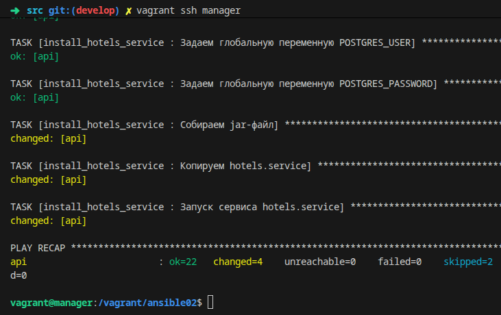

- **Диагностика ошибки первого запуска (status=200/CHDIR):**
  - При первой проверке статуса службы `sudo systemctl status hotels.service` процесс упал с кодом:
    ```
    Process: 16243 ExecStart=... (code=exited, status=200/CHDIR)
    ```
  - Логи через `journalctl -u hotels.service -n 50 --no-pager` показали причину:
    ```
    hotels.service: Changing to the requested working directory failed: No such file or directory
    ```
  - В файле `hotels.service` рабочая директория была задана как `WorkingDirectory=/home/vagrant/hotel-service` вместо правильного пути `/home/vagrant/app/hotel-service`.
  - После исправления пути и перезапуска службы через `systemctl daemon-reload && systemctl restart hotels.service` приложение успешно запустилось.

- Проверяю статус службы `hotels.service`:
  ```sh
  sudo systemctl status hotels.service
  ```
  Служба в состоянии `active (running)`.

> Проверка активного статуса службы hotels.service \
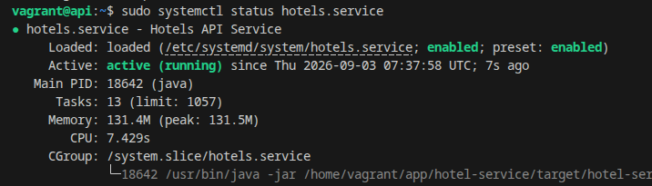

- Проверяю, что порт `8082` слушается процессом Java на узле `api`:
  ```sh
  ss -tulpn | grep 8082
  ```
  Порт `8082` открыт и обслуживается процессом `java`.

> Проверка прослушивания порта 8082 процессом Java \
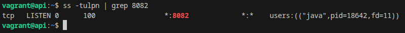

---

### 2.4. Тестирование CRUD-операций сервиса отелей и проверка Service Discovery

- Итоговая проверка стенда состоит из трёх этапов:
  1. Тестирование CRUD-операций микросервиса через Postman с хостовой машины.
  2. Проверка узлов и сервисов в Consul Web UI.
  3. Проверка Service Discovery при динамической смене IP-адреса узла базы данных.

#### 1. Тестирование CRUD-операций через Postman

- Запросы к API отелей отправляются с хостовой машины через проброшенный порт `8082` (`http://10.52.173.173:8082`).

- **Шаг 1. Авторизация и получение токена (`GET /api/v1/hotels/authorize`):**
  - Отправляю запрос с базовой авторизацией `Basic Auth`.
  - В ответе — статус `200 OK`, из заголовка `Authorization` достаю JWT-токен (`Bearer eyJhbGciOi...`).

> Получение токена авторизации в Postman \
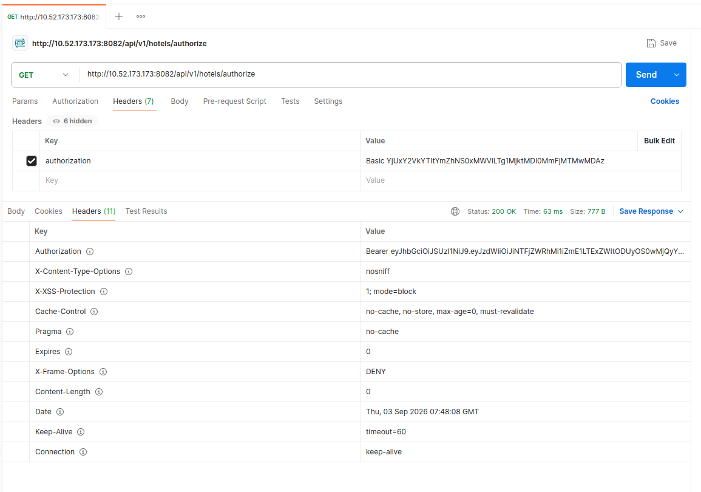

- **Шаг 2. Чтение списка отелей (`GET /api/v1/hotels`):**
  - Отправляю запрос, добавив полученный токен в заголовок `Authorization`.
  - Сервис вернул `200 OK` и список из трёх отелей (`Hotel 1`, `Hotel 2`, `Hotel 3`) — значит, Java-приложение успешно подключается к PostgreSQL через прокси Envoy.

> Чтение списка существующих отелей \
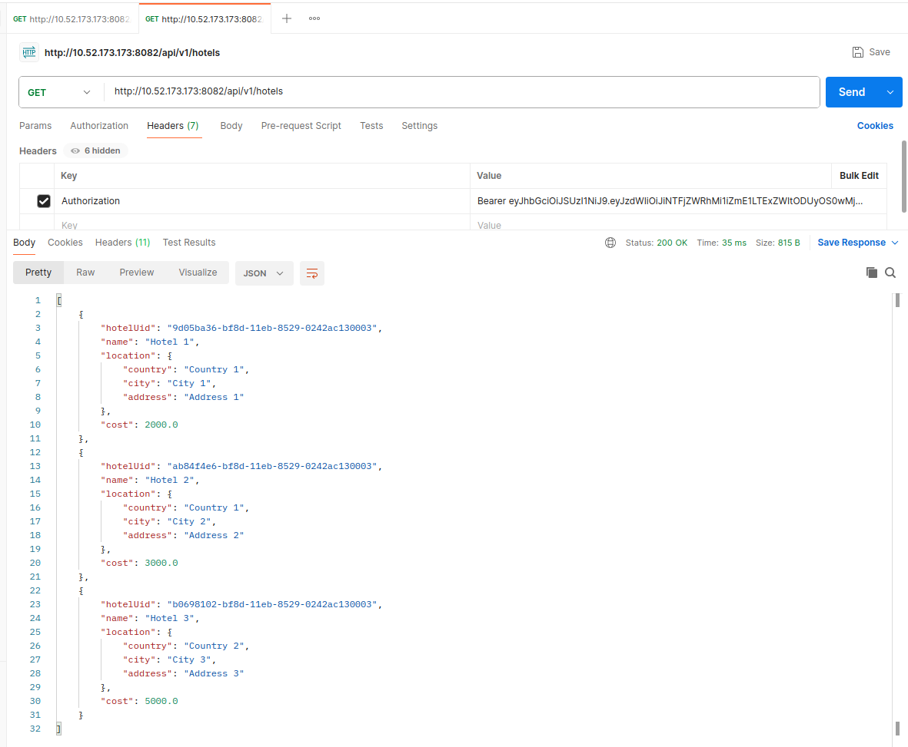

- **Шаг 3. Создание нового отеля (`POST /api/v1/hotels`):**
  - Отправляю POST-запрос с JSON-описанием отеля:
    ```json
    {
      "name": "TEST HOSTEL",
      "location": {
        "country": "Country 1",
        "city": "City 1",
        "address": "Ansible Street 42"
      }
    }
    ```
  - Сервис обработал запрос, вернул `201 Created` и указал ссылку на созданный ресурс в заголовке `Location`.

> Создание нового отеля через POST-запрос \
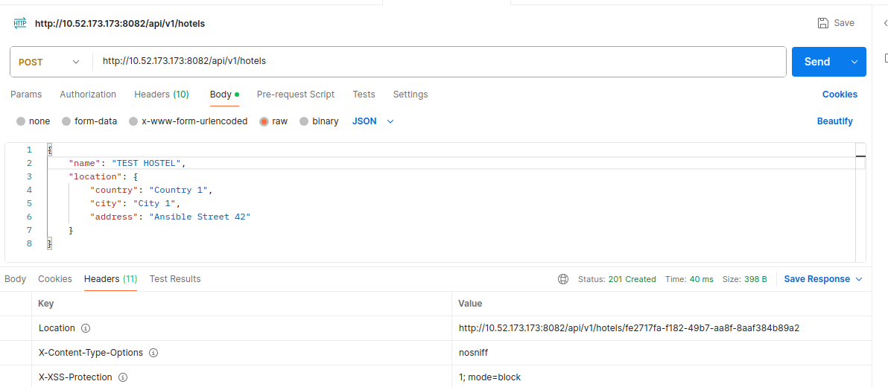

- **Шаг 4. Проверка добавленного объекта (`GET /api/v1/hotels`):**
  - Повторно отправляю GET-запрос за полным каталогом отелей.
  - В ответе со статусом `200 OK` появился созданный объект `TEST HOSTEL`.

> Проверка обновлённого списка отелей с добавленным объектом \
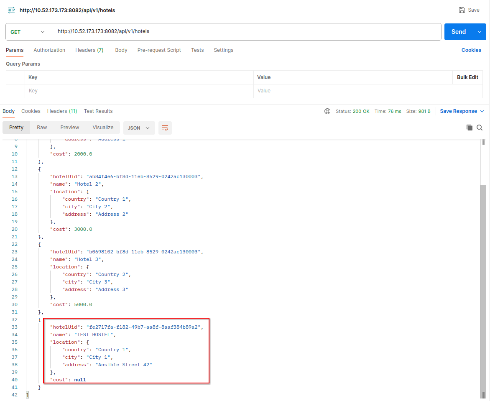

---

#### 2. Проверка узлов и сервисов в Consul Web UI

- Открываю в браузере консоль Consul по адресу `http://10.52.173.173:8500`:
  - На вкладке **Nodes** отображаются все три виртуальные машины (`consulServer`, `api`, `db`) со здоровым статусом в датацентре `dc1`. Узел `consulServer` помечен как `Leader`.
  - На вкладке **Services** зарегистрированы сервисы `db` и `hotel-service`, а также их sidecar-прокси (`db-sidecar-proxy` и `hotel-service-sidecar-proxy`).

> Состояние узлов кластера в веб-интерфейсе Consul UI \
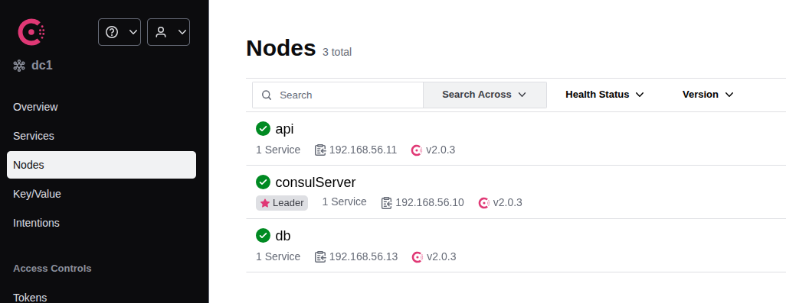

---

#### 3. Эксперимент: проверка Service Discovery при смене IP-адреса базы данных

- Чтобы наглядно показать, что микросервис не зависит от физической топологии сети, меняю IP-адрес ноды с базой данных — без каких-либо изменений в конфигурации приложения.

- **Шаг 1. Фиксация исходного IP-адреса базы в каталоге Consul:**
  - С хостовой машины отправляю запрос к HTTP Catalog API Consul:
    ```sh
    curl -s http://10.52.173.173:8500/v1/catalog/service/db | jq .
    ```
  - В выводе видно, что сервис `db` привязан к адресу `192.168.56.13`.

> Исходный адрес сервиса базы данных в каталоге Consul \
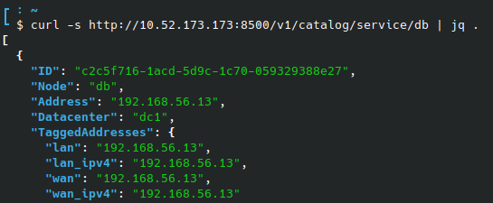

- **Шаг 2. Смена IP-адреса узла базы данных:**
  - Подключаюсь по SSH к виртуальной машине `db`, меняю IP-адрес интерфейса `eth1` с `.13` на `.99` и перезапускаю Consul и Envoy:
    ```sh
    # Меняю IP сетевого интерфейса eth1 с .13 на .99
    sudo ip addr flush dev eth1
    sudo ip addr add 192.168.56.99/24 dev eth1
    sudo ip link set eth1 up

    # Перезапускаю Consul и Envoy на узле базы данных
    sudo systemctl restart consul consul-envoy
    ```

- **Шаг 3. Проверка автоматического обновления адреса в каталоге Consul:**
  - С хостовой машины снова запрашиваю информацию о сервисе `db`:
    ```sh
    curl -s http://10.52.173.173:8500/v1/catalog/service/db | jq .
    ```
  - Поле `"Address"` автоматически обновилось на `192.168.56.99`. Consul мгновенно зафиксировал перемещение базы и через gRPC xDS-канал (порт `8502`) передал новый маршрут в Envoy на машине `api`.

> Автоматическое обновление сетевого адреса сервиса базы данных в каталоге Consul \
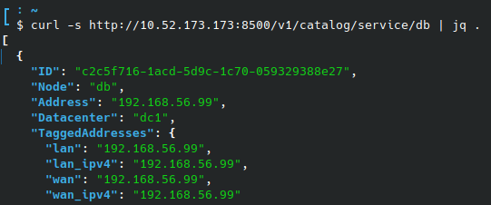

- **Шаг 4. Проверка доступности API отелей без перезапуска сервиса:**
  - С хостовой машины отправляю запрос в Postman:
    ```
    GET http://10.52.173.173:8082/api/v1/hotels
    ```
  - Сервер возвращает `200 OK` и полный список отелей — без ошибок.

> Проверка успешного выполнения запроса после миграции адреса базы данных \
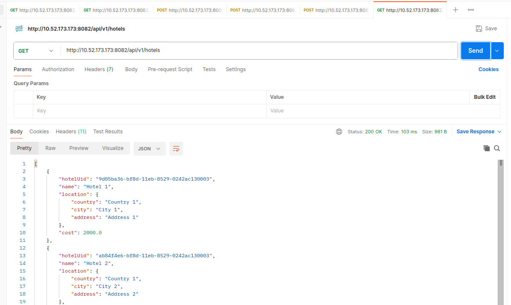

> **Итоги эксперимента:**
> 1. Java-приложение на узле `api` не перезапускалось и продолжало ходить на неизменный локальный адрес `127.0.0.1:5432`.
> 2. Обнаружение нового адреса `192.168.56.99` и динамическое перенаправление зашифрованного mTLS-трафика выполнила связка Consul и Envoy в реальном времени.
> 3. Service Discovery и Service Mesh полностью изолируют прикладной уровень от изменений сетевой инфраструктуры.
